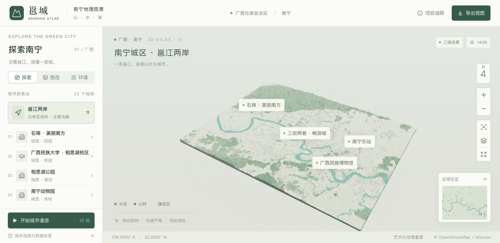
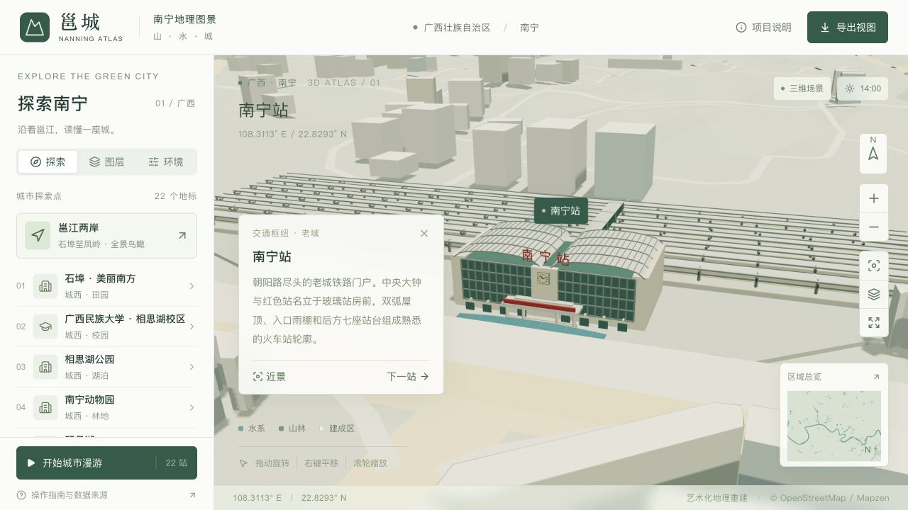
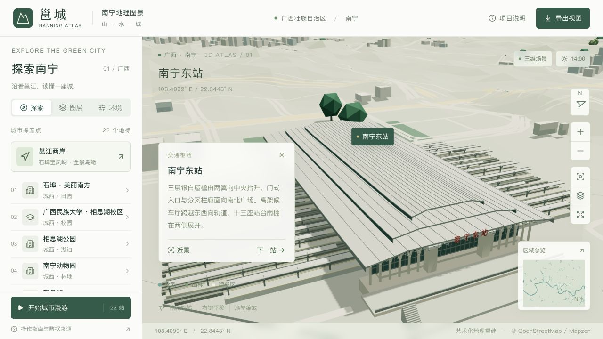

<div align="center">

# 邕城 · Nanning City Atlas

**在浏览器里，走近南宁的山水与街区。**

基于公开地理数据与 Blender 建模的三维城市沙盘，支持地标探索、城市漫游与昼夜切换。

[在线游览](https://wcqqq1214.github.io/nanning-city-atlas/) · [数据来源](docs/DATA_SOURCES.md) · [设计说明](docs/DESIGN.md) · [验收记录](docs/VALIDATION.md)


</div>



## 一座可以探索的三维邕城

项目覆盖南宁约 **37 × 28 km** 的城区与周边，西至石埠，包含相思湖、老城、青秀山和五象新区。青绿色邕江贯穿纸瓷白建筑与深浅绿色山林，打开网页即可游览，无需地图密钥或后端服务。

| OSM 建筑轮廓 | 程序化补充建筑 | 城市探索点 | 独立地标模型 |
| :---: | :---: | :---: | :---: |
| **6,035 个** | **13,882 栋** | **22 处** | **17 个** |

> 基于 2026-09-08 的 OpenStreetMap 快照。项目为艺术化地理重建，补充建筑的位置与高度为示意。

## 游览体验

| 功能 | 可以做什么 |
| --- | --- |
| **地标探索** | 通过菜单与地图标记访问 22 个探索点，15 个建筑地标提供近景入口。 |
| **城市漫游** | 自动在地标间切换，手动操作地图或选择地标会暂停。 |
| **自由视角** | 旋转、平移、缩放，切换俯视、倾斜、正北和全景视角，支持缓慢环绕与全屏。 |
| **光照与画质** | 选择晨光、日间、日落、夜色及自动、流畅、精细画质。 |
| **图层与高度** | 分别开关建筑、树木、道路桥梁、水面和地名标注，调整整体竖向比例。 |
| **截图与移动端** | 导出当前城市画面为 PNG（不含菜单与 HTML 标注）；手机提供菜单抽屉与可收起的地标介绍。 |

鼠标左键旋转、右键平移、滚轮缩放；触屏单指旋转、双指平移／缩放。手机自动选择轻量模型，也可手动切换画质。

探索点涵盖相思湖、三街两巷、南湖、青秀山、国际会展中心、南宁大桥、广西文化艺术中心与两座铁路车站等。完整名单见 [地标目录](data/landmarks.json)。

<details>
<summary>查看更多场景预览</summary>

以下为仓库中的建模预览，网页效果以在线游览为准。

| 广西文化艺术中心 | 广西体育中心 |
| --- | --- |
|  |  |

| 南宁站 | 南宁东站 |
| --- | --- |
|  |  |

</details>

## 技术与资源

| 技术 | 用途 |
| --- | --- |
| **Three.js** | 浏览器三维场景、相机交互、光照与地图标记。 |
| **Blender** | 城市与地标建模，保留可编辑源文件。 |
| **React + TypeScript** | 中文地图界面、响应式菜单与交互状态。 |
| **vinext + Vite** | 本地开发、生产构建与静态导出。 |
| **OpenStreetMap + Mapzen Terrarium** | 建筑轮廓、道路、水系、林地与地形的数据基础。 |
| **GLB + Draco** | 压缩精细与轻量两档模型，解码器随站点托管。 |

- [Blender 源文件](blender/nanning-city.blend)：可编辑的城市场景与地标模型。
- [模型资源](public/models/)：约 8.53 MB 的精细模型与 6.01 MB 的轻量模型。
- [场景数据](public/data/)：高程、裁剪后的地理数据库、地标与地图元数据。

网页运行时只向自己的站点请求数据和模型。

## 本地运行

建议使用 **Node.js 24**，与仓库 CI 保持一致。仓库已包含预生成模型，浏览项目无需安装 Blender。

```sh
git clone https://github.com/wcqqq1214/nanning-city-atlas.git
cd nanning-city-atlas
npm ci
npm run dev
```

打开终端输出的 Local 地址，默认是 `http://localhost:3000`。

### 检查与静态构建

```sh
npm run typecheck
npm run lint
node --experimental-strip-types --test scripts/test-tap-gesture.mjs
npm run build:pages
```

静态构建产物生成于 `out/`，默认使用当前仓库的项目子路径。本地按根目录预览：

```sh
PAGES_BASE_PATH='' npm run build:pages
python3 -m http.server --directory out 8080
```

访问 `http://localhost:8080`。`out/` 是生成产物，不提交到源代码分支。

推送到 `main` 后，[GitHub Actions](.github/workflows/pages.yml) 自动检查、构建并部署。Fork 后需在 **Settings → Pages → Source** 选择 **GitHub Actions**。

模型重建流程见 [建模说明](docs/MODELING.md)。

## 数据来源与精度

- **建筑与地标**：缺失高度采用估算值，程序化建筑用于补充街区；地标经过简化，部分适当放大以便辨识。
- **地形与水面**：Mapzen Terrarium 高程经过重采样、竖向夸张及岸线局部处理，不代表工程高程。
- **植被与光照**：树位与连片树冠为示意，模拟光照不对应实时天气或严格天文日照。

不能用于测绘、导航、洪水模拟或建筑尺寸量测。详细依据见 [数据来源](docs/DATA_SOURCES.md)。

## 文档导航

| 文档 | 内容 |
| --- | --- |
| [数据来源](docs/DATA_SOURCES.md) | 地理数据、坐标来源、补充建筑与精度边界。 |
| [设计说明](docs/DESIGN.md) | 界面、交互、视觉风格与功能设计。 |
| [手机体验](docs/MOBILE.md) | 轻量模型、渲染策略、测试方法与诊断入口。 |
| [建模说明](docs/MODELING.md) | 数据准备、Blender 重建流程与项目结构。 |
| [验收记录](docs/VALIDATION.md) · [打磨建议](docs/POLISH.md) | 验证结果、已知限制与后续取舍。 |

## 许可与署名

| 内容 | 许可／署名 |
| --- | --- |
| 代码 | [MIT](LICENSE) |
| 地理数据库及衍生数据库 | ODbL 1.0，**© OpenStreetMap contributors** |
| 高程数据及衍生模型 | 保留上游归属要求，见 [第三方署名](ATTRIBUTION.md) |
| Draco 解码器 | [Apache 2.0](public/draco/LICENSE.txt) |

代码许可不覆盖第三方地理数据。重新分发模型、Blender 场景、渲染图或地理数据时，请保留 [OSM 与高程数据署名](ATTRIBUTION.md)。
