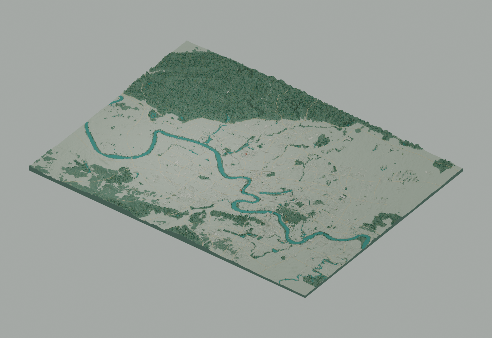

# 邕城 · Nanning City Atlas

**[在线体验 · GitHub Pages](https://wcqqq1214.github.io/nanning-city-atlas/)** · [部署记录](https://github.com/wcqqq1214/nanning-city-atlas/actions/workflows/pages.yml)

以真实公开地理数据为骨架，用 **Three.js + Blender** 复现广西南宁城区的山、水与城市空间。青绿色邕江贯穿浅色城市体块，保留南湖、青秀山、路网、滨江绿地与主要地标的地理关系。

项目范围约 **37 × 28 km**：`108.12°–108.48° E / 22.70°–22.95° N`。城西扩至石埠，包含相思湖、罗文、北部高新区与更多南部城区。面积约为原范围的 3.2 倍；这是城区的艺术化地理重建，不是全市行政区域的精密数字孪生。



*Blender 离线场景渲染；网页另含交互菜单与地图标注。*

## 本地运行

需要 Node.js 22.13+，已提交预生成模型，浏览项目无需安装 Blender，也无需地图 API key。

```bash
npm ci
npm run dev
```

打开终端打印的本地地址，默认是 `http://localhost:3000`。

```bash
npm run typecheck
npm run lint
node --experimental-strip-types --test scripts/test-tap-gesture.mjs
npm run build
npm start
```

生产构建使用 Vinext / Vite。`npm run build` 保留 Cloudflare Workers 适配；`npm run build:pages` 导出 GitHub Pages 所需的纯静态文件。GitHub 中保留完整项目、锁文件、地图数据、Blender 源文件与生成脚本。

## GitHub Pages 部署

公开访问地址：**https://wcqqq1214.github.io/nanning-city-atlas/**

仓库使用 [.github/workflows/pages.yml](.github/workflows/pages.yml) 自动部署。推送到 `main` 后，GitHub Actions 安装锁定依赖、执行类型、lint 与点触交互测试、静态导出并发布 `out/`。无需后端、地图密钥或额外部署 token，模型与 Draco 解码器随站点一同托管。

Fork 后，在仓库 **Settings → Pages → Build and deployment → Source** 选择 **GitHub Actions**，再运行 `Deploy GitHub Pages` 工作流。部署路径由 Pages 配置自动传入，支持项目子目录和站点根目录。

```bash
# 生成当前仓库对应子目录的静态包
npm run build:pages

# 在本地按根目录预览静态导出
PAGES_BASE_PATH='' npm run build:pages
python3 -m http.server --directory out 8080
```

第二种方式访问 `http://localhost:8080`。`out/` 是生成产物，不提交到源代码分支。

## 可以做什么

| 菜单 | 行为 |
| --- | --- |
| 探索 | 全景鸟瞰；访问 21 个探索点，覆盖石埠、相思湖、罗文、老城、校园、文化场馆、天际线、山林、桥梁与交通枢纽 |
| 图层 | 独立开关建筑、树木、道路桥梁、水面、地名标注 |
| 环境 | 06:00–22:00 模拟光照、晨光/日间/日落/夜色预设、0.5–2.0 倍整体竖向调整、自动/流畅/精细画面选择 |
| 视角 | 俯视/倾斜视角、缓慢环绕、正北朝向、放大缩小、全景复位、全屏 |
| 地标近景 | 14 个建筑地标配置近景入口；重点细化会展中心花瓣与台阶、大桥斜拱与吊杆、艺术中心格栅云棚 |
| 城市漫游 | 每 6.5 秒切换一站；手动操作地图或选择地标会暂停 |
| 导出视图 | 导出当前 WebGL 城市画面为 PNG（不含页面菜单与 HTML 标注） |
| 项目说明 | 操作指南、范围、精度说明、来源及许可 |

鼠标左键旋转、右键平移、滚轮缩放；触屏单指旋转、双指平移/缩放。聚焦地图后可用方向键平移、`+` / `−` 缩放、`Home` 复位。菜单与地标支持键盘访问；系统减少动态效果偏好会关闭环绕和水面动画。

## 手机体验

自动模式会为手机与节省流量偏好选择轻量模型；也可在“环境 → 画面偏好”手动切换。轻量版文件减少 56.4%，三角形减少 59.8%，保留全部建筑、道路、水面和地标。场景按空间分组，近景时剔除视野外的组。

流畅模式关闭实时阴影、限制动画最高 30 fps，并在画面静止时停止重复绘制。自动模式在持续低帧率时降低渲染像素比例；精细模式保留用户选择。手机提供 44 px 主要触控按钮、焦点受控的菜单抽屉、可收起的地标介绍与横屏布局。

实际手机 GPU、发热与蜂窝网络表现仍需真机验证；桌面窄屏模拟不代表手机性能测试。测试方法与诊断入口见 [手机体验说明](docs/MOBILE.md)。

## 视觉风格

**青绿城市沙盘**：纸瓷白建筑、青玉色水面、深浅绿色低面数山林，黄铜色屋顶与朱红色桥拱作为局部识别色。镜头采用可旋转的倾斜鸟瞰，底座以切片方式呈现地形，界面保持清晰、安静的地图工作台结构。

详细设计与功能说明见 [设计说明](docs/DESIGN.md)。

## 21 个城市探索点

城西新增：石埠 · 美丽南方、罗文 · 广西艺术学院、广西民族大学 · 相思湖校区、相思湖公园、南宁动物园、明月湖。

原有：三街两巷 · 畅游阁、人民公园 · 镇宁炮台、广西大学 · 汇学堂、广西博物馆、南湖公园、地王大厦、国际会展中心、华润大厦、南宁东站、广西民族博物馆、南宁孔庙、青秀山 · 龙象塔、南宁大桥、广西文化艺术中心、亭子码头。

其中 14 个点有独立的简化地标模型，其余 7 个以公开地图中的校园、湖泊、绿地和周边街区为主体。每个点配置独立的镜头距离；探索菜单、地图标记和漫游使用同一份 [地标目录](data/landmarks.json)。目录中的坐标来源及近似方式见 [数据说明](docs/DATA_SOURCES.md)。

近景细节、城西扩区与手机轻量模式已完成；后续取舍见 [打磨建议](docs/POLISH.md)。

## 数据与精度

- 6,035 个 OSM 建筑轮廓；缺少建筑高度时采用估算值。
- 4,557 栋程序化补充建筑，只在公开地图的建设用地区域内生成，并避让水面、公园、道路和已有建筑。旧西边界以外共有 1,551 个建筑要素。
- 10,398 个道路片段；精细版显示 10,986 棵树，流畅版显示 2,747 棵树。
- 390 × 294 高程网格，来自 20 张 z12 Mapzen Terrarium 瓦片；原始瓦片采样尺度约 35 m，显示采样约 95 m。流畅版地形沿两个网格方向各降低一半采样密度。
- 地形初始高差放大 3 倍，建筑高度初始放大 1.55 倍。环境面板的高度滑杆在此基础上缩放整个场景的竖向比例。
- 水面被统一到显示高度，水下地形与低位岸线做了可视化处理。模拟光照不对应实时天气或严格天文日照。
- 地标轮廓由 Blender 简化建模；部分地标相对于真实尺寸适当放大，便于沙盘辨识。

不能用于测绘、导航、洪水模拟或建筑尺寸量测。完整数据说明与归属见 [数据来源](docs/DATA_SOURCES.md) 和 [ATTRIBUTION.md](ATTRIBUTION.md)。

## Blender 重建流程

需要 Blender 4.5+（本项目使用 Blender 5.2.1）与 Python 3.9+。

```bash
python3 -m venv work/venv
source work/venv/bin/activate
pip install -r scripts/requirements.txt
python3 scripts/fetch_geodata.py
python3 scripts/prepare_geodata.py
npm run models:build
```

`data/region.json` 统一定义范围。`fetch_geodata.py` 按范围检查 OSM 缓存，范围变化后自动重新获取；高程瓦片按编号复用。重新获取 OSM 时请在 `work/geodata/` 中有针对性地删除对应缓存，勿在调试时高频请求公共 Overpass 服务。

数据与模型检查：

```bash
python3 scripts/validate_assets.py
```

输出：

- `blender/nanning-city.blend`：可编辑场景，包含具名地形、建筑、树木、水面、桥梁、地标、相机与灯光。
- `public/models/nanning-city.glb`：7.47 MB 的 Draco 精细模型。
- `public/models/nanning-city-mobile.glb`：3.26 MB 的 Draco 轻量模型，保留完整建筑、道路、水系及地标。
- `public/data/terrain.json`、`geography.json`：高程与裁剪后的地理数据库。
- `public/data/landmarks.json`、`overview.json`：网页加载的轻量元数据。

坐标约定：准备阶段 X 向东、Y 向北，每单位 100 m；Blender Z 向上；glTF 导出后 Three.js X 向东、Y 向上、Z 向南。使用城区中心处的局部等距近似投影，输入坐标统一为 WGS84。

## 项目结构

```text
app/                 中文地图界面与响应式样式
data/region.json      范围配置
data/landmarks.json   地标目录、来源与镜头配置
lib/city/scene.ts     Three.js 渲染、光照、镜头、标记与资源清理
lib/city/webmcp.ts    可选 WebMCP 地标与环境工具
blender/             可编辑 .blend、场景生成与地标造型脚本
scripts/             数据下载、裁剪、补充建筑与模型检查
public/data/         可再利用的地理数据与地图元数据
public/models/       压缩 GLB
public/draco/        随项目提供的 Draco 解码器，无第三方运行时请求
docs/               设计、数据与验证说明
```

网页运行时只向自己的站点请求数据和模型。地图数据来源服务只在离线重建时使用。

## 许可

代码采用 [MIT](LICENSE)。地图数据库为 © OpenStreetMap contributors，遵循 [ODbL 1.0](https://opendatacommons.org/licenses/odbl/1-0/)。高程数据与衍生模型保留上游归属要求；代码许可不覆盖第三方地理数据。Draco 解码器采用 Apache 2.0，见 `public/draco/LICENSE.txt`。
