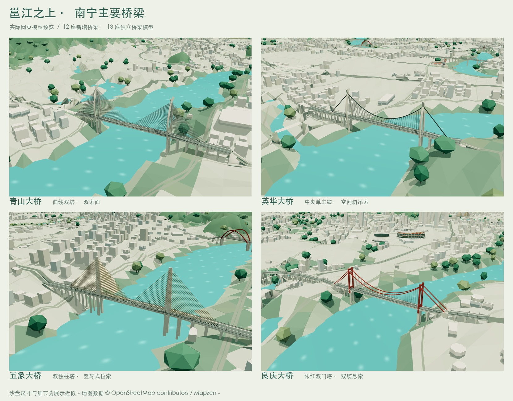
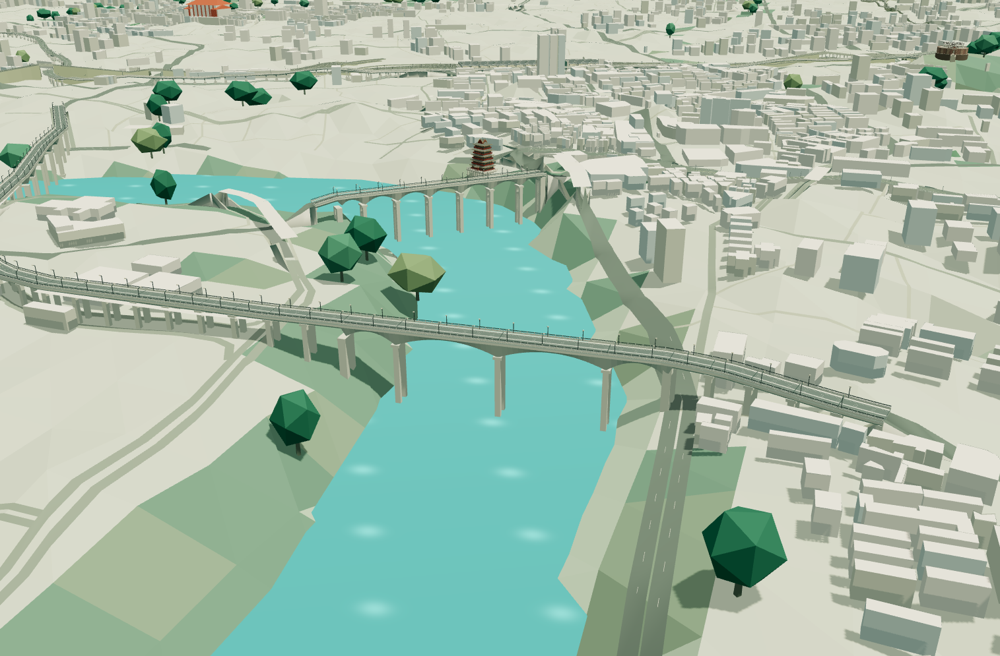

# 邕江主要桥梁精细建模

本轮在已有南宁大桥模型之外新增 13 座独立桥梁，共 14 座。桥梁可从地标目录进入近景，随「道路桥梁」图层显示或隐藏。

| 桥梁 | 模型保留的辨识特征 |
| --- | --- |
| 南宁大桥 | 已有曲线桥面、非对称外倾双钢箱拱与斜吊杆 |
| 清川大桥 | 四跨连续梁、变高度梁底、双柱墩与引桥 |
| 中兴大桥 | 桥面下的连续混凝土拱孔与腹柱 |
| 永和大桥 | 中承式双桁拱、四管弦杆、斜腹杆、横撑与吊杆 |
| 北大桥 | 四跨连续箱梁与弯曲引桥 |
| 邕江大桥 | 七孔悬臂箱梁、双柱墩、步道与栏杆 |
| 桃源大桥 | 66 + 120 + 120 + 66 m 连续箱梁、墩顶加厚梁体与西侧弯曲引桥 |
| 凌铁大桥 | 连续两跨下承式拱、横撑与竖直吊杆 |
| 白沙大桥 | 独塔双索面斜拉结构、双孔主跨、北岸弯曲引桥 |
| 葫芦鼎大桥 | 125 + 230 + 125 m 连续刚构主桥、墩顶加厚梁体 |
| 英华大桥 | 羊角编钟形双塔、中央单主缆、向两侧展开的斜吊索 |
| 五象大桥 | 两座中央独柱能量塔、竖琴式平行拉索 |
| 良庆大桥 | 朱红色双门塔、双主缆、竖直吊索与锚碇 |
| 青山大桥 | 壮乡头巾意象的曲线双塔、不对称塔冠与双索面 |





## 数据与精度

平面中心线由 2026-09-08 OSM 快照中的成对车行道按弧长重采样、取中线生成，替换 28 段旧桥面。白沙大桥仅拼接四段跨江主线，保留南侧分岔匝道；葫芦鼎两旁辅桥仍使用原道路几何。桃源大桥在快照中没有道路名称，以经桥位与接线核对的两条主线索引显式纳入，保留独立辅道与匝道；准备与验证脚本同时检查原始名称和地理数据哈希。本轮未细化所有市郊公路桥与铁路桥。

主跨中心依据现有水面与中心线交集定位。参考资料给出主跨长度，地图提供桥位；桥宽、竖向夸张、塔冠曲面、附属构件间距、引桥墩位和锚碇尺寸均为展示近似。中兴大桥的分跨参数仅为拱桥外观示意。模型不包含施工图级的基础、钢筋和节点连接细节，也不用于结构验算。

资料之间存在表述差异时，以更具体的结构说明和实景为依据。例如五象大桥部分百科摘要误写为独塔，模型采用实景中的双独柱塔。没有将南宁白沙大桥与柳州白沙大桥混用。

参考资料及字段来源保存在 [bridges-source.json](../data/bridges-source.json)：

- [广西档案馆：邕江大桥](https://www.gxdag.org.cn/show/142/3548)：七孔、双柱墩和主桥尺度。
- [福州大学：钢管混凝土拱桥桥例简介](https://siberc.fzu.edu.cn/__local/6/6F/29/7C1CCAEDC24D9BB28E4EFA81912_4886B803_FCC7B.pdf?e=.pdf)：永和大桥的中承式桁拱与净跨。
- [中铁四局：青山大桥建设纪实](https://www.crec4.com/content-1931-18036-1.html)：双塔斜拉桥、430 m 主跨及头巾意象。
- [中铁四局：英华大桥建设](https://www.ctcecc.com/content-472-16746-1.html)：单索面斜吊索、羊角编钟形主塔。
- [南宁市桥梁检测基本情况明细表存档](https://qxb-img-osscache.qixin.com/bid/2eb2836f9c8d05cfdb2e3ef882c019c9.pdf)：清川、北大、桃源、凌铁、葫芦鼎等桥的结构与分跨。
- [白沙大桥健康监测项目](https://gcjs.ggzyjy.weihai.cn/wz/PortalQDManage/ShareResources/CorpAchievementInfo?keyValue=1d1f6727-db25-4d6b-b04b-453d7f9cc965)：独塔双索面、双孔主跨。

## 重建与验证

```sh
work/venv/bin/python scripts/prepare_bridges.py
work/venv/bin/python scripts/prepare_forest_canopy.py --stage all
work/venv/bin/python scripts/prepare_ground_roads.py --capture
npm run models:build
work/venv/bin/python scripts/validate_bridges.py
```

桥梁准备脚本更新自身的地标条目，不修改其他地标。林冠计划依赖完整地标目录，因此新增地标后需重新准备。地面道路计划也依赖目录，需重新捕获已有模型边界；新增桥梁的桥头高度在城市构建阶段参与道路接坡。桥梁计划校验地理数据与来源配置哈希，防止旧中心线用于新地图。

完整模型与轻量模型使用相同桥面、桥墩、塔、拱、缆索主体；轻量模型降低栏杆采样并省略路灯。附属构件使用 18-bit Draco 坐标精度以保留窄线条。新增主体与附属构件有独立面数预算，未放宽既有地标的面数约束；桃源大桥主体、附属构件分别限定在 2 万三角面内，原 12 座桥梁仍沿用原预算。

`validate_bridges.py` 检查来源哈希、桥位偏移、主跨长度、目录锚点、道路图层父子关系，以及实际解码后的有限坐标、退化面比例和两档主体一致性。`render_bridges.py` 生成独立桥梁构件预览，不修改 `.blend`；预览水面用于结构检查，城市中的地形与周边以实际网页为准。

桃源大桥补齐后，以 `db929a0` 已提交代码加本次桥梁数据在隔离目录重建；整城资源验证与 `npm run build:pages` 通过，网页检查覆盖两档近景和道路图层开关。输出共 14 座主要桥梁、36 个地标，精细模型 16,381,124 字节，轻量模型 11,796,560 字节。隔离构建避免了同目录进行中的高架建模修改，未覆盖其源代码。
