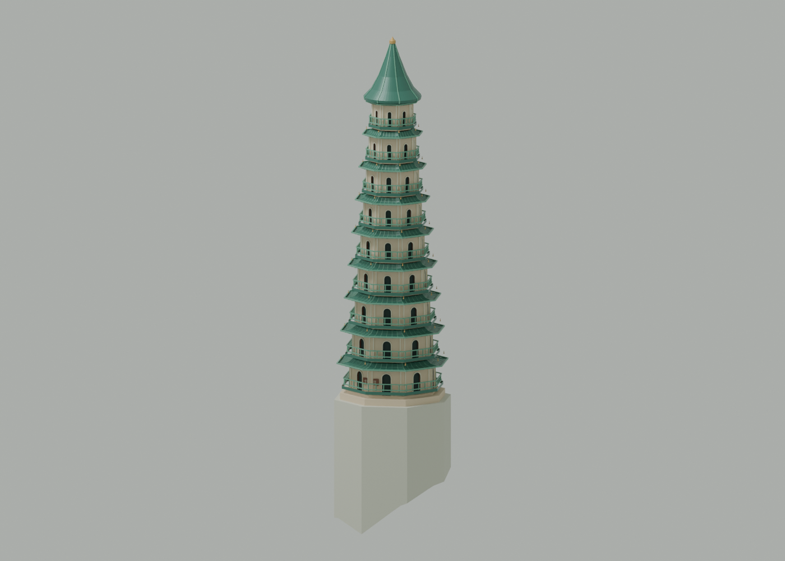
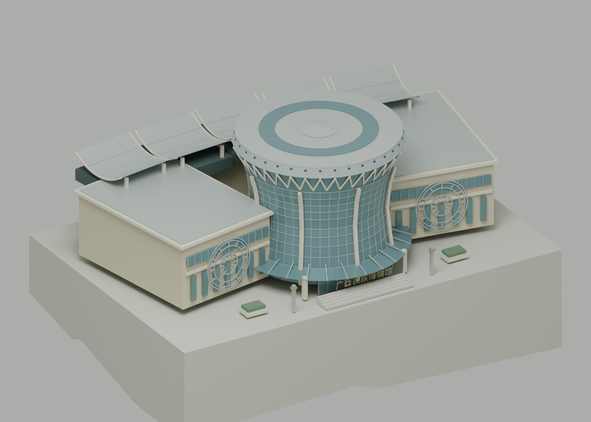
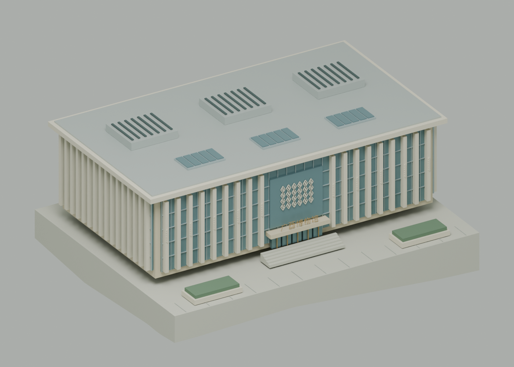

# 龙象塔与两座广西博物馆

替换 `qingxiu`、`ethnic-museum` 和 `gx-museum` 的简化体块，保留原有地标选择、近景和漫游入口。用户所说的“龙虎塔”暂按现有地图中的青秀山龙象塔处理，未另增同名地点。

## 建筑细节

- **青秀山龙象塔**：九层收分八角塔身、暖色墙面、内凹拱窗与门洞、绿釉瓦重檐、翘角瓦脊、环绕栏杆、小型檐铃、曲线攒尖塔顶和塔刹。窗洞由独立墙片和进深侧壁构成，未使用黑色贴图代替全部细节。
- **广西民族博物馆**：收腰玻璃铜鼓主体、八条弧形宽肋、鼓沿 V 形桁架、环形屋顶、弧形入口雨棚、汉字招牌、台阶、倾斜两翼展厅及铜鼓纹饰；后部五片浅凹银色屋盖围合开放庭院。
- **广西博物馆**：横向展厅、深挑檐、连续竖向浅色格栅、玻璃幕墙分格、入口壮锦纹样、汉字招牌、台阶、屋顶采光窗与设备百叶、前庭花池。

模型保留沙盘原有水平预留范围和展示性放大：龙象塔八角包络半径 0.4995 单位；广西博物馆基座 2.35 × 1.8 单位；民族博物馆基座 3.5 × 2.4 单位。建筑细节根据照片重建，尺寸、分格数量和装饰经过概括，不是测绘或施工模型。民族博物馆周边民族村落、广西博物馆室内展厅等不在此次外观范围内。

两档模型共享完整地标网格。支承面按详细版与轻量版显示地形的上界设置，基座侧壁下延到地形中；在城市中，基座局部被起伏地形遮挡，边坡处保留可见的挡土侧壁。没有修改原始 DEM 或既有道路实体。圆形封盖采用中心辐射三角面，三处地标使用 18 位位置量化，避免细小塔顶封盖在 Draco 压缩后退化。

## 来源与边界

位置依据仓库 OSM 快照，提取记录保存在 `data/cultural-landmarks-source.json`（© OpenStreetMap contributors，ODbL 1.0）：

- [龙象塔建筑](https://www.openstreetmap.org/way/243217636)。该记录的 `building:levels=6` 与现存塔外观资料不一致，九层塔身采用景区资料和实景照片。
- [广西博物馆建筑](https://www.openstreetmap.org/way/476559327)。
- [广西民族博物馆园区](https://www.openstreetmap.org/way/1006681820)。此轮廓是园区用地，不能当作主馆建筑的测绘轮廓。

外观参考：

- [青秀山景区：龙象塔](https://www.qxsfjq.com/Introduction.html?Title=%E9%BE%99%E8%B1%A1%E5%A1%94&bindStyle=list&columnId=47&fy=2&type=2)：景点名称与塔体资料；结合日间实景辨识八角层檐、绿色瓦面和拱窗。
- [新华社：广西民族博物馆航拍图](https://www.xinhuanet.com/20240826/d41814bcc32d4b7b99a099e7501b9456/c.html)：铜鼓主体、两翼展厅、后部屋盖及庭院布局。
- [广西文化和旅游厅：广西博物馆](https://wlt.gxzf.gov.cn/ggfw/whcscx/t10074795.shtml)：建筑地域风格及场馆资料。
- [中建八局：广西博物馆改扩建](https://m.thepaper.cn/baijiahao_20106166)：扩建关系、竖向立面与壮锦装饰的公开工程介绍。

公开照片仅用于观察，没有打包进资产或制作照片贴图。汉字与纹样使用自行绘制的线段网格，重建不依赖系统字体、远程图片或在线接口。

## 重建与验证

```bash
npm run models:build
work/venv/bin/python scripts/validate_cultural_landmarks.py
work/venv/bin/python scripts/validate_assets.py
blender --background --python-exit-code 1 --python blender/render_cultural.py
npm run build:pages
```

专用校验读取两档实际 Draco 导出，检查 OSM 位置、唯一地标节点、有限顶点、非退化三角面、材质、九层塔窗、预留道路范围和两档细节一致性。地形检查将导出的地形三角面裁切到地标占地范围，计算线性面的最高点，以检查支承面是否被地形穿过。三处模型的共享外观净增约 0.60 MB，整城文件预算相应调整为精细版 21 MB、轻量版 16 MB，其他几何预算保持原值。

## 本次验证记录

- 专用检查通过：龙象塔 45,932 面、广西民族博物馆 21,022 面、广西博物馆 14,218 面；两档网格相同，无压缩退化面，全部位于道路预留范围内。两档地形均未穿过支承面。
- 两档 GLB 为 20,909,700 / 15,702,436 字节，Blender 源文件及三张预览同步更新；静态构建与 Python 语法检查通过。浏览器检查三处选择、近景及流畅画质切换，最终页面无控制台错误。
- 修改前后按节点和材质逐一比较 Draco 数据，除三处文化地标外，详细版 247 个、轻量版 244 个网格的压缩内容全部相同；道路、地形、植被及其他地标没有变化。
- **全局校验未全绿**：已有的跨画质面数断言在 `MinzuAvenue_3_1` 失败。临时按民族大道专用校验允许各档接缝差异后，后续道路覆盖检查又在 `validate_ground_roads.py` 的 `Export left a broad hole in paved coverage` 断言失败。临时修改已撤回；道路网格和道路计划均与修改前一致，这两项作为既存道路校验问题保留，没有为通过检查放宽道路阈值。

## 建模预览

| 龙象塔 | 广西民族博物馆 | 广西博物馆 |
| --- | --- | --- |
|  |  |  |
