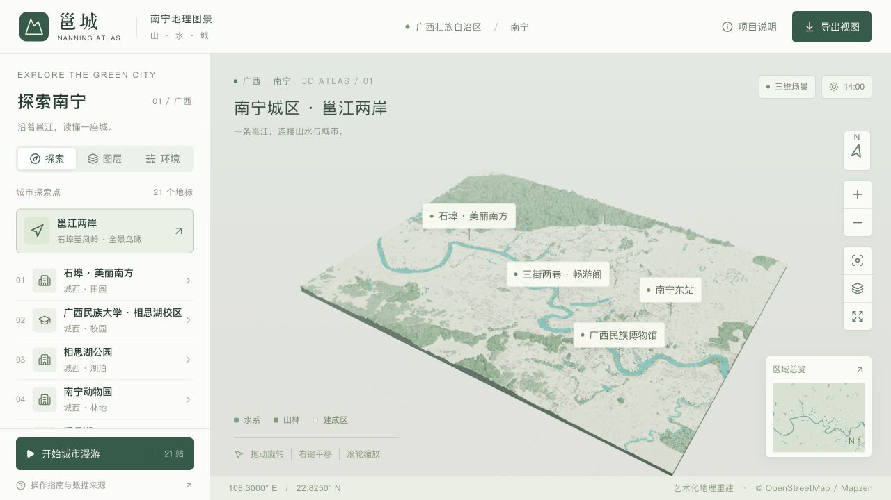
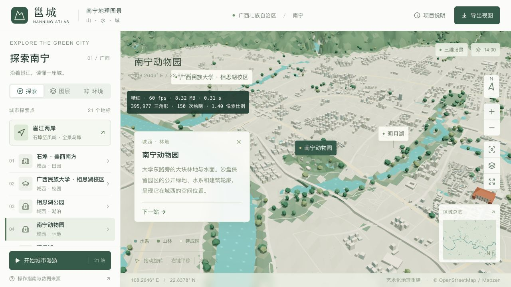
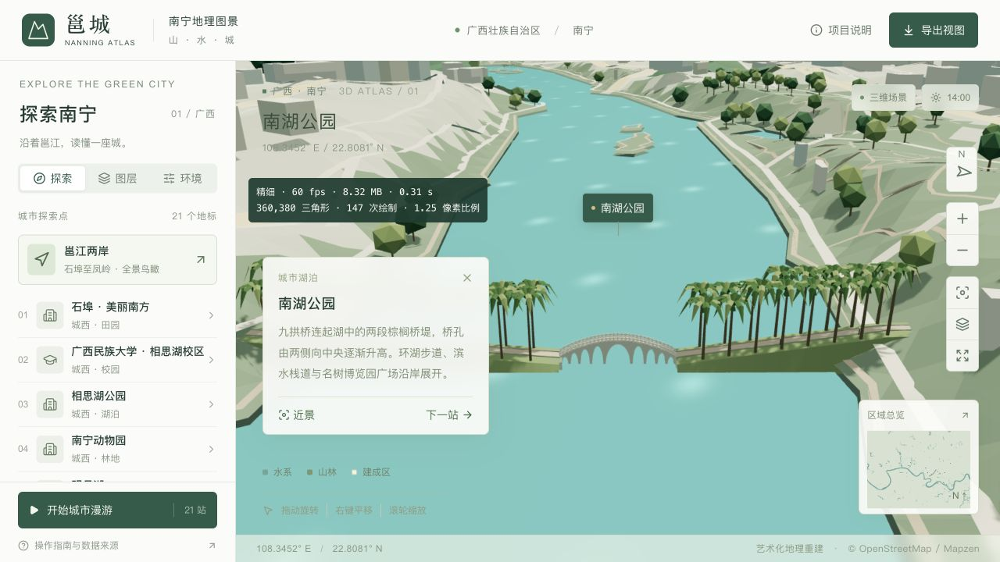
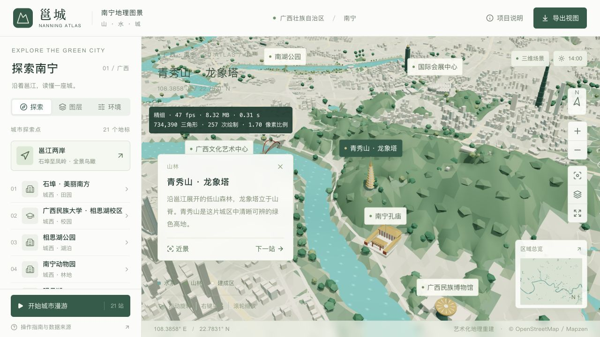
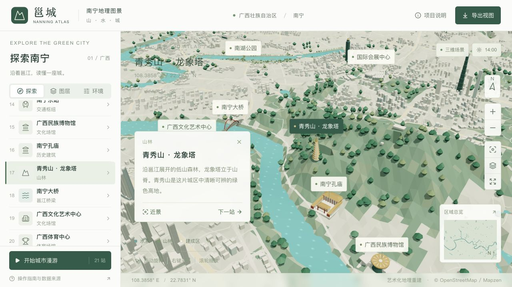
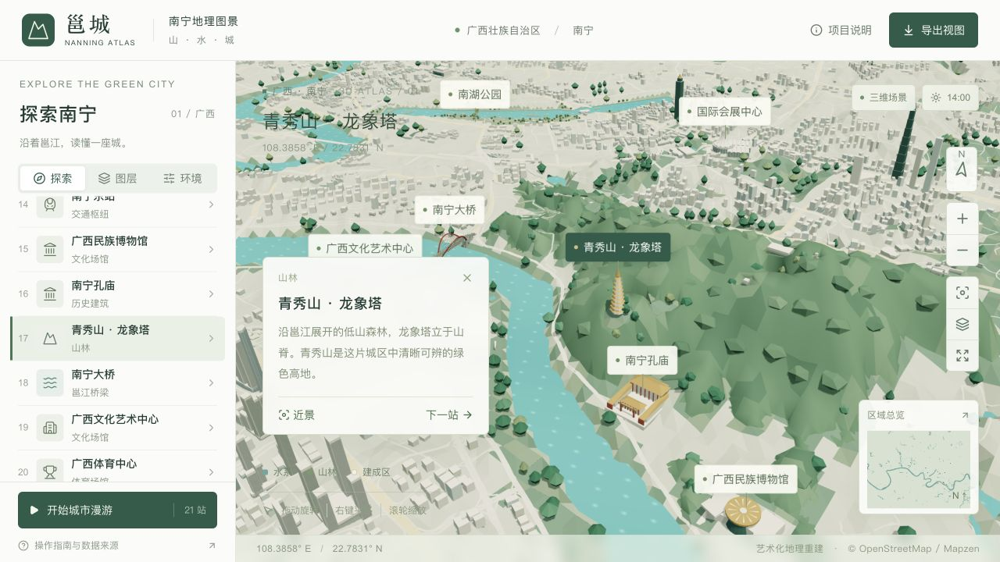

# 城市树木与郊区树林

全市普通树统一采用简化阔叶冠；青秀山的连片树冠已推广到当前场景内的已标注林地。普通树、森林树冠和南湖园林植被一起响应“林木植被”开关。

## 范围与分批推广

沿用 2026-09-08 城市 OSM 快照的 192 条 natural=wood / landuse=forest 记录，其中 191 条与当前场景相交。未扩大地图边界，也没有把一般公园、草坪或绿色高地自动当成森林。原始数据保存在 [forest-source.json](../data/forest-source.json)，生成计划位于 [forest-plan.json](../data/forest-plan.json)。

| 批次 | 实际树冠覆盖 | 精细 / 流畅表面三角形 | 精细 / 流畅冠簇 |
| --- | ---: | ---: | ---: |
| 青秀山 qingxiu | 4.1253 km² | 2,455 / 1,435 | 60 / 30 |
| 其他城区与近郊 nearby | 39.1350 km² | 25,316 / 15,160 | 94 / 47 |
| 北部外围林地 all | 170.6196 km² | 49,081 / 17,096 | 234 / 117 |
| 合计 | **213.8799 km²** | **76,852 / 33,691** | **388 / 194** |

每一批先减去前序已处理林地，防止重复关系和重叠多边形造成重复绘制。原始林地并集约 221.92 km²；树冠保留内环，避让水面、道路、所有建筑及庭院、地标空地和南湖独立园林区域。极小碎片沿用单树表现。

生成器支持按 qingxiu → nearby → all 逐级扩大范围；当前交付包含三批。每次扩大或更新数据都须重新运行模型预算与几何检查。这是数据和模型的分批生成流程，网页仍一次加载所选画质的完整 GLB。

## 单树与成片树林

- 常规单树：精细版从原来的 51 个三角形降为 30 个；流畅版从 16 个降为 8 个，使用更粗的宽冠。保留原始位置和确定性的颜色序列，分别贴合两档地形。
- 林内：7,600 棵示意树由连续覆盖代替，精细版保留 3,361 棵常规单树，流畅版保留原有抽样中的 865 棵。数量减少不代表删掉真实森林。
- 林缘：保留清楚的独立树冠。外围林地降低冠簇密度，每个冠簇为 20 个三角形；流畅版保留一半冠簇，并用单色表面与光照表现起伏。
- 南湖：83 棵阔叶树共用简化冠形；36 棵棕榈保留九片下垂叶的轮廓，减少叶片分段和细小树干装饰。两档都保留这些园林树木，并从地标主体拆入植被图层。

树冠表面分别沿两档实际地形三角面裁剪。按约 8 km 网格分组以便视野剔除，共享顶点与法线，减少导出时重复的三角面角点；林木开关与整体高度缩放继续适用。当前没有按距离动态切换的 LOD。

## 相对青秀山样例版的变化

| 全场景 | 青秀山样例版 | 当前 | 变化 |
| --- | ---: | ---: | ---: |
| 精细版三角形 | 1,493,210 | 1,112,089 | −25.52% |
| 流畅版三角形 | 814,927 | 802,458 | −1.53% |
| 精细版文件 | 9,996,852 字节 | 8,316,688 字节 | −16.81% |
| 流畅版文件 | 5,794,056 字节 | 5,793,128 字节 | 基本持平 |

两档仍在原有 10 MB / 5.8 MB 下载预算内。流畅版空间用于扩大连续森林覆盖，不能把精细版的降幅套用于手机性能。类型检查、lint、5 项点触测试、地理与模型资产验证、静态构建均通过；未进行手机真机帧率或发热测试。

资产检查覆盖三批林地的边界、内环、道路/水面/建筑避让、重复覆盖、树木替换范围、两档坡面净空、分区网格与植被图层归属。几何坐标保留至 0.001 m，覆盖检查使用 0.002 m 的舍入包络，而非随林区大小放大的面积容差；这不是地图源数据的测量精度。

与样例版逐网格比较，其他地标、建筑、道路、水面和地形的 Draco 数据保持一致。南湖的 5,853 项建筑、桥梁和步道生成操作一致；变化限于植被拆分、冠形与棕榈细节。桌面预览已核对全景、青秀山、城西动物园、南湖近景、画质切换与植被开关。截图中的即时帧率不是性能基准。

## 预览

| 城西树林 | 南湖园林植被 |
| --- | --- |
|  |  |

青秀山当前效果：

## 重新生成

使用项目的 Shapely / NumPy / mapbox-earcut 环境：

~~~sh
# 地理数据更新时，prepare_geodata 同时保留对应的林地源数据
work/venv/bin/python scripts/prepare_geodata.py
# 也可选择 --stage qingxiu 或 --stage nearby
work/venv/bin/python scripts/prepare_forest_canopy.py --stage all
blender --background --python-exit-code 1 --python blender/build_city.py
work/venv/bin/python scripts/validate_assets.py
~~~

仅调整冠形时可直接重建模型；调整林地范围、地形、道路、建筑或地标数据后须重建计划。构建时检查全部相关输入文件的指纹，防止错用旧计划。生成代码在 [prepare_forest_canopy.py](../scripts/prepare_forest_canopy.py)，共享树形在 [vegetation.py](../blender/vegetation.py)，连续树冠在 [forest_canopy.py](../blender/forest_canopy.py)。

## 最初样例留档

以下图片保留最初青秀山试验前后的对比，非当前全市版本：

| 最初改造前 | 青秀山样例 |
| --- | --- |
|  |  |
