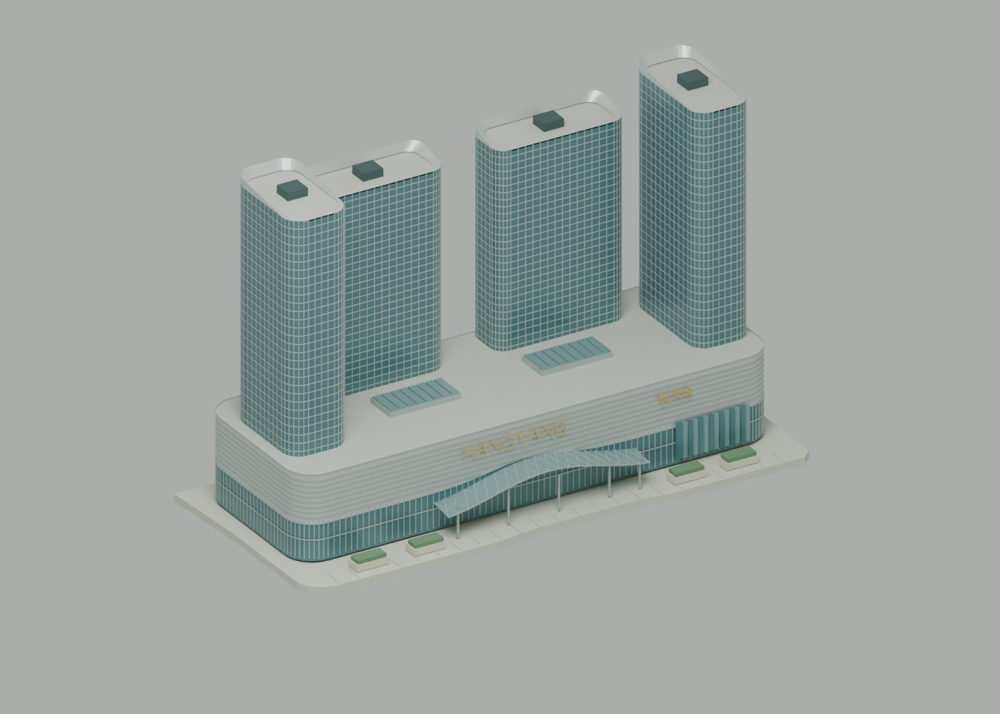
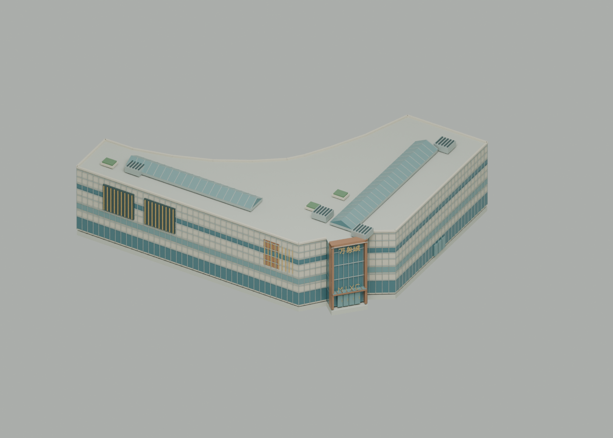

# 会展航洋城与万象城

新增两个独立地标 `hangyang` 与 `mixc`，可从城市建筑分类选中、进入近景并参与漫游。两档 GLB 使用相同商场网格，保留可编辑 Blender 源模型。

## 外观与范围

- **会展航洋城**：银色船形裙楼、连续水平金属线条、波浪形玻璃雨棚、东端折线玻璃、四座圆角玻璃塔楼、幕墙分格、斜升屋冠、中英文几何招牌、屋顶采光窗及南侧花池。塔楼位置依据四处 OSM 建筑轮廓。
- **万象城**：保留商业建筑弯折、内凹的平面；主入口位于西北侧斜向转角，玻璃门厅、铜色门框、中英文招牌和雨棚沿转角朝外，两侧玻璃接回浅色分格幕墙。屋顶设两条采光窗、设备百叶及小型绿化。东侧华润大厦和南侧华润 B、C 座继续使用原有模型。

水平位置使用仓库保留的 WGS84 / OSM 数据；每场景单位为 100 米。裙楼与塔楼高度、幕墙分格、入口和屋顶细节按公开照片做展示性近似，不是测绘模型，也不包含商场室内、实时店铺或品牌广告。高度延续城市沙盘的视觉夸张：航洋裙楼约 0.51 单位、塔楼最高约 1.92 单位，万象城主体约 0.64 单位。

地形高差通过平整场地与沿地面延伸的基座处理，支承面取两档实际显示地形的上界，避免低分辨率地形穿过商场。原始 DEM、湖岸以及民族大道主线不因模型而改变。普通建筑按实际相交轮廓替换，商场边界和入口外挑区域显式进入普通道路避让计划。

## 周边地面起伏的原因

重采样前近景中的高台和折坡来自显示地形与基座处理：高程约每 95 米采样一次，地形高差固定放大 3 倍；轻量版再以约 190 米网格绘制。商场没有采用类似会展中心的局部场地整平，而是将基座抬到两档地面中的最高位置，使低侧露出较高挡土侧壁。

对实际 GLB 地形三角面的裁切测量显示，精细版航洋占地内的显示高差约 0.420 场景单位，万象城约 0.710 单位；万象城基座低侧最多露出约 0.735 单位。这些数值包含三倍高程夸张和简化网格误差，不能当作真实街面高差。正确的后续改进是对商业地块做局部整平并平滑接入周边，同时重新计算道路与建筑的贴地高度；仅抬高建筑只能避免穿模，不能解决街面过度起伏。2026-09-11 随全城地形重采样完成修复：显示网格改为约 60 / 120 m，地形倍率降至 1.35，商场占地及缓冲场地进行局部整平，外围平滑过渡；所有道路高度重新计算。中间导出的两档地形均确认商场占地内无高差，完整重建和校验流程见 [地形重采样](TERRAIN_RESAMPLING.md)。

## 依据

平面来源保存在 `data/malls-source.json`，采用城市已有 OSM 快照（© OpenStreetMap contributors，ODbL 1.0）：

- [会展航洋城用地](https://www.openstreetmap.org/way/651998761)；[商场建筑](https://www.openstreetmap.org/way/1482525422)；塔楼 way 1482525421、822320620、1516356770、1516356769。
- [华润万象城建筑](https://www.openstreetmap.org/way/974187256)。

外观参考：

- [迈丘设计：南宁航洋国际购物中心景观设计](https://www.metrostudio.cn/m/workInfo.aspx?id=653)：流线建筑与海洋主题的设计说明。
- [天霸设计：会展航洋城立面改造分析](https://www.sohu.com/a/234408031_99972147)：船形金属立面、波浪雨棚和东端折线玻璃的外观描述。
- [视界视觉：The Mixc 南宁万象城](https://www.csvisul.com/tplist_show.php?id=30)：铜色入口框架、玻璃挑檐、分格幕墙及标识的实景照片。
- [字工场：南宁万象城标识工程](https://www.fgzgc.com/projects/nnwxcs.html)：铝板幕墙和灰金色标识的施工说明。

照片只用于观察，未嵌入模型或作为贴图分发；招牌由可编辑线段网格绘制，重建不依赖系统字体或图片下载。

## 重建与验证

```bash
work/venv/bin/python scripts/prepare_malls.py
work/venv/bin/python scripts/prepare_forest_canopy.py --stage all
work/venv/bin/python scripts/prepare_ground_roads.py --capture
```

商场轮廓改变后需要按 [道路实体流程](ELEVATED_ROADS.md) 重新生成道路输入及两档实体，然后运行：

```bash
npm run models:build
blender -b --python blender/render_malls.py
work/venv/bin/python scripts/validate_malls.py
work/venv/bin/python scripts/validate_assets.py
```

`validate_malls.py` 检查数据哈希、凹形屋顶覆盖、道路避让范围、相邻华润塔楼保留，以及两档实际解码后的顶点、三角面、材质和模型范围。

实际导出校验通过：航洋城 22,967 个三角面，万象城 5,342 个三角面，两档均完整保留；未发现压缩后退化三角面或越出预备避让范围的顶点。主入口方位回归检查确认万象城高处铜色门框位于西北斜角，旧的正立面入口导出会被该检查拒绝。TypeScript、ESLint 和 GitHub Pages 构建通过，并在浏览器检查了地标选择、近景和画质切换。

## 建模预览

| 会展航洋城 | 万象城 |
| --- | --- |
|  |  |
