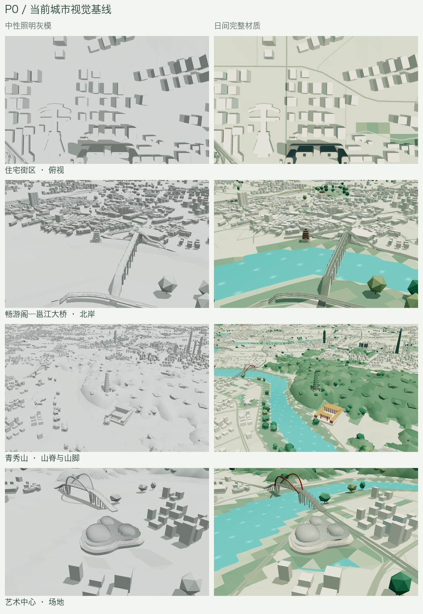
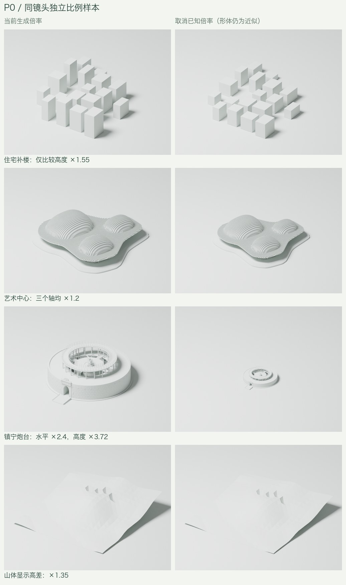

# P0：城市结构视觉与比例基线

日期：2026-09-12。起始城市资产来自 `73edbb7`；本阶段完成检查工具、资源冻结、浏览器固定镜头和独立比例样本。正式 `.blend`、两档 GLB、地理与地形数据未改变。

## 查看与复现

运行 `npm run dev`，打开 `/inspect/`。例如：

```text
http://localhost:3000/inspect/?view=residential&material=clay&quality=detail
http://localhost:3000/inspect/?view=waterfront&material=lit&hour=14&quality=smooth
```

预设包含全景、住宅斜视/俯视、滨水斜视/低斜视、青秀山、艺术中心、镇宁炮台。坐标独立于地标包围盒，后续模型体量变化不会自动移动相机。画布固定 1280 × 800、像素比 1、水面时间 0，隐藏标注、关闭环绕和漫游。页面滚动不改变画布尺寸。

- **灰模**：统一不透明灰材质、中性日间照明，无夜间光晕或雾，检查形体及阴影。
- **基础颜色**：使用无光照基础材质，保留原始颜色、贴图和顶点颜色，检查颜色分布；水面使用固定青绿色。
- **完整光照**：恢复原始材质与夜景程序，可切换日间、日落、夜间。完整光照沿用两档原有阴影差异。
- **保存镜头链接**：保存实际相机位置、观察目标、FOV、画质、材质、时间和网页高度倍率；重新打开后恢复。
- **导出参数 JSON**：记录上述参数、有效照明时间、资源版本、字节、地形/建筑倍率和诊断信息。
- **导出画面 PNG**：导出 1280 × 800 画布，不含检查工具界面。



完整原始截图与逐镜头 JSON 保存在 `work/urban-structure/inspection/`，不进入版本控制；[浏览器记录](urban-structure-baseline/browser.json) 保存了全部 59 份参数摘要。56 张场景截图覆盖 8 个视角 × 2 档 × 3 种材质，以及滨水/艺术中心两档的日落与夜间补充画面。

## 比例样本

独立运行现有艺术中心和炮台生成器，分别设为当前与中性倍率；普通住宅使用冻结数据中与地块相交的 18 个足印及源高度；山体使用冻结的显示高程局部切片。每一对使用完全相同的相机、投影、光照和画布。样本均在独立平坦参考地面上渲染，生成 4 个可编辑 `.blend` 与 8 张图片。



| 样本 | 当前倍率 | 中性样本 | 解释边界 |
| --- | --- | --- | --- |
| 普通住宅补楼 | 高度 1.55 | 高度 1 | 足印和原先估计高度未校准，排列未改变 |
| 艺术中心 | XYZ 均 1.2 | XYZ 均 1 | 源码 `point()` 同时放大三个轴，并非只放大平面；基础的固定净空仍保留 |
| 镇宁炮台 | XY 2.4、主体高度 2.4 × 1.55 = 3.72 | XY/Z 主体倍率均 1 | 源码尺寸仍为照片解释；固定基础净空不等同主体倍率 |
| 青秀山局部高差 | 1.35 | 1 | 相对局部最低点归零，沿用条件化 DSM；不是裸地实测模型 |

中性样本仅取消已知展示倍率，不代表恢复了真实建筑或地形。尤其不能把这些离开实际场地的灰模当作 P4 已完成校准。几何数量、范围、输入指纹和相机见 [比例样本记录](urban-structure-baseline/scales.json)。

## 从实际画面得到的后续检查位置

1. **住宅试点**：俯视能清楚辨认独立矩形补楼与相邻航洋建筑群。源码确认逐楼随机高度；当前形体适合用组团排列和公共空地对照。18 栋是与 OSM 地块相交数量，其中只有 15 栋中心在地块内，P1 必须明确跨界旧楼清理范围。
2. **畅游阁—邕江大桥**：灰模中桥头接坡、道路侧面与岸上平台之间缺乏连续的滨水层次，P2 应以此处的实际断面和支承关系为检查对象。尚未测量并判定每一处穿插或净空。
3. **青秀山与艺术中心周边**：日间画面能看到岸线附近较大的三角形边界；P2/P3 应检查岸线裁切与局部地形衔接。单独增加水面效果不会改变这些几何边界。
4. **地标倍率**：炮台取消叠加放大后在同镜头中显著缩小；艺术中心的变化更温和。P4 应结合有来源的轮廓与实际场地决定倍率，不统一套用一个缩放值。

## 已执行验证

- `npm run typecheck`、`npm run lint`、`git diff --check` 通过。
- `node --test scripts/test-inspection.mjs scripts/test-assets.mjs scripts/test-tap-gesture.mjs scripts/test-area-highlight.mjs`：12 项通过。包含镜头参数无精度损失往返、非法镜头回退、材质恢复与临时材质释放，以及原有缓存/点触/区域高亮行为。
- `npm run build:pages` 通过，导出首页与 `/inspect/`。构建仍有现有 Vite 配置兼容和较大代码块提示。
- 开发浏览器检查：59 份记录、56 张基线截图，灰模→颜色→夜景→灰模切换正常；静止灰模相隔 1.4 秒的两张截图逐字节相同；保存链接后恢复相机，坐标差小于 `1e-10` 场景单位；两档模型与普通首页加载通过，控制台错误 0。
- 静态子路径检查：在 `/nanning-city-atlas/` 下完成 13 份参数记录，同样通过材质切换、镜头恢复、两档模型及首页加载，控制台错误 0。见 [静态部署检查](urban-structure-baseline/deployment.json)。
- 在静态子路径实际点击 PNG 导出，验证文件为 226,372 字节、1280 × 800 PNG，见 [画面导出检查](urban-structure-baseline/export-check.json)。
- Blender 5.2.1：四组样本生成成功，网格验证无需修复、顶点有限，同一组当前/中性样本三角面数量一致。图片已实际查看。
- 冻结的两档 GLB 与公开资产大小、SHA-256 一致，仍为 25,236,380 / 17,270,232 字节。见 [资产清单](urban-structure-baseline/assets.json)。

浏览器为本机 HeadlessChrome 153、1440 × 1140 页面视口与固定 1280 × 800 渲染画布。截图模式静止后停止重复绘制，记录中的 0 fps 表示静止；加载时间包含本机缓存影响，不作为冷启动或手机真机性能承诺。此阶段未做连续操作帧时间与真机温升测试。

项目采用 vinext；`/_next/mcp` 返回 404，环境无 agent-browser，使用项目检查与 Playwright 驱动已安装 Chrome 完成运行验证。检查工具源码指纹见 [工具哈希](urban-structure-baseline/tool-hashes.json)。

## 重建命令

资产冻结目录不能覆盖。后续版本应换一个新名称：

```sh
python3 scripts/capture_city_baseline.py --output work/urban-structure/baseline-NEW --freeze-assets
npm install --prefix work/urban-structure/browser --no-audit --no-fund playwright
PLAYWRIGHT_MODULE_PATH="$PWD/work/urban-structure/browser/node_modules/playwright" node scripts/check-inspection.mjs
blender --background --python-exit-code 1 --python blender/render_scale_baseline.py -- --baseline work/urban-structure/baseline-NEW --output work/urban-structure/scales
```

`CITY_BASE_URL` 可指向静态站点子路径；`CITY_CHECK_OUTPUT` 设置记录目录；`CITY_CHECK_VIEW=arts` 可只做一个视角的部署抽查。其他平台可用 `BROWSER_EXECUTABLE` 指定 Chrome 路径。完整固定视角回归默认覆盖全部预设。

本阶段对应 [完整优化计划](URBAN_STRUCTURE_PLAN.md) 的 P0；P1–P5 继续按原范围实施。
