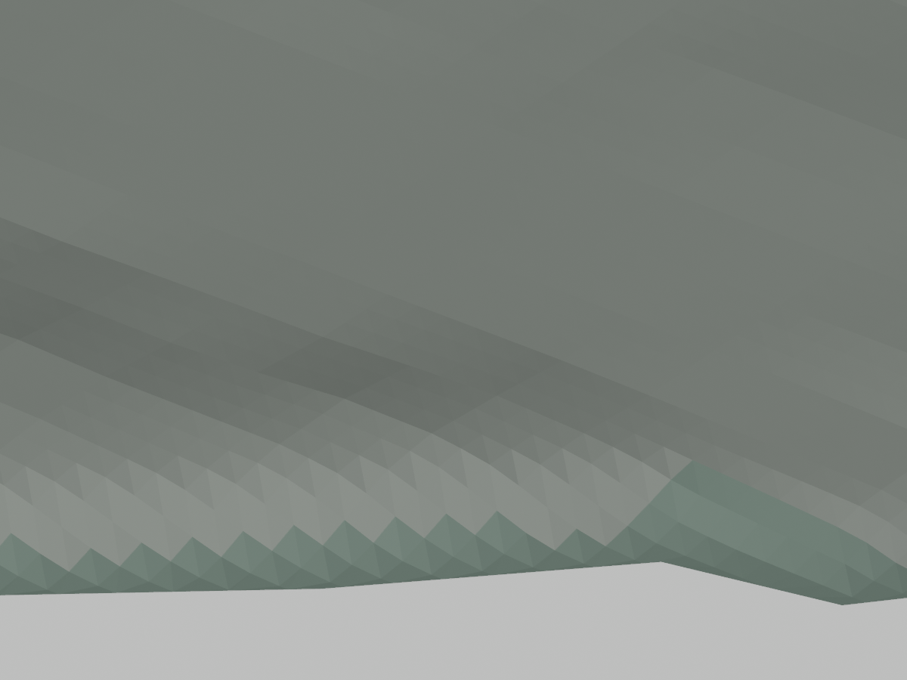
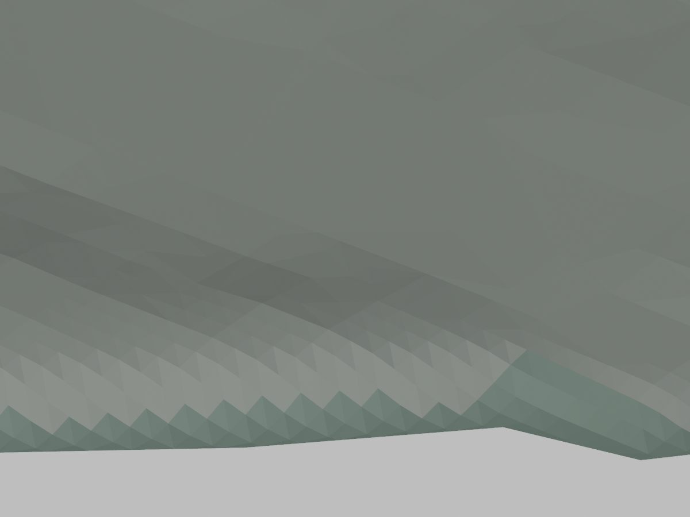

# P5：几何预算试算与接受条件

## 当前候选：共享位置编码与运行时法线（2026-09-13）

在完整 P5 候选上新增可选 `scripts/pack_flat_surfaces.py`：仅将角点法线与实际三角面法线相差不超过 0.5° 的地形面转换为共享位置编码，其他特殊法线、退化面、材质和三角面均保留。解码后位置不再量化；独立 `scripts/check_flat_surfaces.py` 对整城按材质逐面检查位置、绕序、数量、层级及显式法线，两档通过。建筑也做了试算，但没有达到净节省门槛，实际保持原载荷。

| 当前完整候选 | 精细档 | 流畅档 |
| --- | --- | --- |
| 编码前字节 | 30,229,144 | 22,409,844 |
| 编码后字节 | 26,603,076 | 19,180,388 |
| 减少字节 | 3,626,068 | 3,229,456 |
| 距原上限仍超出 | 603,076 | 1,180,388 |
| 全部三角面（保持） | 3,628,457 | 2,537,016 |
| 转换为共享位置的面 | 651,513 | 266,544 |

直接省略法线的初版在精细档出现阴影条纹。Three.js 的阴影顶点代码在缺少 `NORMAL` 时采用零法线偏移；浏览器内单变量关闭 `normalBias` 后，龙门对照平均像素通道差从 2.6213 降至 0.0062，确认了该兼容问题。没有更改正式场景的 `normalBias=0.08`。

`lib/city/flat-surface-normals.ts` 现在只为缺失法线的面在加载后展开共享位置并恢复面法线，保持 GPU 上逐面的阴影偏移；原有特殊法线不改。两个运行时回归用例和两个编码分类/绕序用例通过，全量类型检查及受影响文件 lint 通过。修复后重新保存四个镜头、两档、灰模/日间的 32 张截图（16 组同条件对照），无浏览器错误；已查看精细龙门恢复图，新增条纹消失，其平均像素通道差为 0.0095。此方法主要节省传输字节，运行时会恢复法线与展开布局，不能据此声称 GPU 顶点或显存下降。

青秀山湖岸同设备、1280×800、DPR1、禁用浏览器 HTTP 缓存的 ABBA 短测已完成，每档前后各两次。精细加载为 957.5/941.7 ms → 773.4/819.4 ms，流畅为 925.1/1102.6 ms → 875.6/1005.4 ms。八次 3.5 秒拖动的 P95 为 16.7–16.8 ms，均无超过 50 ms 的帧或页面错误；该视角精细绘制调用 328 → 329，流畅保持 200。结果描述本次本地 Chrome 短测，不是全城、真机手机或公网加载承诺，也不能单独证明显存与长期帧率改善。

候选在 `work/urban-structure/p5/full-city-review/budget-reduction/flat-buildings-candidate`，正式资产未替换。文件和非基础设施面数预算仍失败，且尚未组合林冠修复、减面、完整依赖检查及最终日夜验收；32 张截图不能证明整项 P5 完成。代码、完整几何审计、失败/修复对照和当前验证保存在[编码与减面证据](urban-structure-quality/reservoirs/flat-codec/manifest.json)。

同一份当前原生流畅地形另做了误差受限减面：20 cm / 2° 候选从 316,384 降至 267,494 面，减少 48,890 面，独立覆盖、材质边界、原顶点及高度/法向审计通过；1 m / 2° 试算只进一步减少 13,478 面，尚未独立验收，未选择较大误差作为正式标准。二者均未与编码或林冠候选组合，不能把各自节省直接累计到上表。

## 完整组合的初次预算核算

2026-09-13 完整候选已经导出，预算实测未通过：

| 项目 | 精细档 | 流畅档 |
| --- | --- | --- |
| GLB 实际字节 | 30,229,144 | 22,409,844 |
| 文件上限 | 26,000,000 | 18,000,000 |
| 超出字节 | 4,229,144 | 4,409,844 |
| 全部三角面 | 3,628,457 | 2,537,016 |
| 非基础设施三角面 | 1,756,512 | 1,141,670 |
| 非基础设施上限 | 1,650,000 | 1,000,000 |

新增 `inspect_glb_budget.py` 按实际 GLB bufferView 盘点编码载荷，共享载荷只计一次，不把节点实例数当作重复存储。水库地形、水面和专用结构合计约 4.112/4.100 MB；东南相连水域地形单网格约 1.240/1.236 MB。它们是当前完整资产中的载荷，不等于相对 P4 的净增量。后续应同时处理地形减面、编码成本和林冠重切增量，保持岸线、地形支承和两档预算；当前没有接受降低位置精度或放宽预算的方案。见[完整候选、建筑检查与失败范围](URBAN_STRUCTURE_QUALITY.md#完整候选导出建筑检查与林冠失败2026-09-13)。

2026-09-13 最新实测：恢复八组水库外围 3,542 个零修复权重的原网格单元后，同范围地形/原生主干道路 GLB 降至 13,946,872 / 10,328,428 字节，分别减少 3,975,492 / 4,104,728 字节；地形净减 85,314 / 106,566 面。原生、压缩和 64 张同机位对照通过当前范围验证。恢复原网格的内部插值变化已单列，完整城市仍须满足 26 MB / 18 MB 及分项面数预算。 见[本轮实现、对照与剩余范围](URBAN_STRUCTURE_RESERVOIRS.md#无恢复区域原网格保留2026-09-13)。

2026-09-13 专用结构进展：生产跨水结构每档 672 面，独立实际 GLB 19,492 / 19,496 字节。另盘点 3,484 个可评估恢复原网格的非恢复区域单元，触及 113,558 个密集面；尚未修改几何，不能计入实际节省。完整 26 MB / 18 MB 预算继续保持。见[来源与当前验收](URBAN_STRUCTURE_RESERVOIRS.md#玲珑湖专用结构生产接入2026-09-13)。


2026-09-13 当前组合进展：八组水库的生产地形/岸墙合计每档 215,208 面。含原生主要道路的地形上下文为 17,922,364 / 14,433,156 字节，尚缺完整建筑、植被和道路细节；不能据此判定完整 26 MB / 18 MB 预算通过。应继续减少无收益的替换网格及编码成本，并以完整城市实际产物验收。见[共同运行时](URBAN_STRUCTURE_RESERVOIRS.md#多水库共同运行时与依赖重建2026-09-13)。


2026-09-13 当前进展：玲珑湖湖岸每档 7,834 面，独立 GLB 273,164 / 272,492 字节；跨水结构 672 面、19,236 字节。湖岸包含被替换区域，不能把独立文件大小直接作为整城净增。完整 26 MB / 18 MB 预算仍待整城导出。见[玲珑湖来源与验收](URBAN_STRUCTURE_RESERVOIRS.md#玲珑湖独立湖岸与跨水结构2026-09-13)。


2026-09-13 当前东南连接候选：每档 102,415 面，实际 GLB 精细 3,739,340 / 流畅 3,709,012 字节，原生和解码接口检查通过、顶点偏移为零。该组替代此前失败的东南候选；这些字节包含旧区域的替换几何，不能相加作为整城净增。完整 26 MB / 18 MB 预算仍待组合导出验收。见[相接水面闭合与隔岸邻水保持](URBAN_STRUCTURE_RESERVOIRS.md#相接水面闭合与隔岸邻水保持2026-09-13)。

2026-09-13 邻池补齐：龙门与西侧池塘两个已通过独立检查的新候选，每档分别 20,950 / 8,651 面；精细合计 1,090,908 字节、流畅合计 1,083,700 字节。东南候选仅完成导出，完整岸边检查失败，其 3,108,540 / 3,080,096 字节不计为已验收资产。局部 5 m 水面细化增加连接区几何，远处仍为 30 m；全部独立体积均包含待替换区域，不代表整城净增或预算通过。见[本轮统计和失败范围](URBAN_STRUCTURE_RESERVOIRS.md#邻池补齐连接处细化与接入检查2026-09-13)。

2026-09-13 邻水新候选：龙门、西侧池塘及东南湖区三组每档共 48,474 面，其中陆地 40,294 面；实际 GLB 合计精细 1,778,108 / 流畅 1,765,920 字节，压缩顶点偏移为零。这是替代旧三组的独立补片体积，既不能直接累加到旧六组总量，也不能作为整城净增。五个新增受影响邻水界面和可见折面仍待处理，最终预算未通过。见[逐组结果](URBAN_STRUCTURE_RESERVOIRS.md#八个邻水候选与共享岸边分段2026-09-13)。

2026-09-13 新增七座陆上坝的六组独立候选，每档合计 82,911 面（其中陆地 73,245 面），GLB 总计精细 3,064,608 / 流畅 3,041,116 字节。为消除分材质量化造成的共享边缘重叠，水库节点关闭位置量化，实际顶点偏移归零；位置量化关闭前后原生数组完全保持。这些独立补片包含要替换的基础区域，并非整城净增，当前不能认定预算通过。详见[逐组体积、验证与待接入范围](URBAN_STRUCTURE_RESERVOIRS.md#其余八坝的源岸线与六组地形候选2026-09-13)。

状态：预算优化未正式接入。2026-09-13 已新增通过原生几何审计的逐点简化候选，见下节。本文记录已执行的试算及其局限，不代表正式模型已经减面。原文件及分项预算保持不变；P5 的内洞、复杂轮廓、四类模板、场地和滨水推广仍须完成。

天雹已进入隔离城市地形生成器：实际上下文中每档水库地形/岸墙 31,521 面采用独立分组，压缩对应检查通过；城市原生水面循环使用五个目标水位。全城地形上下文不是完整城市资产，场坪/接路/减面尚待组合，不能据此认定 26 MB / 18 MB 预算通过。见[最新接入与范围](URBAN_STRUCTURE_RESERVOIRS.md#天雹共享地形与城市生成器接入2026-09-13)。

天雹独立水库/坝体候选每档含 28,777 个地形面、483 个水面和 2,744 个岸边墙三角面，共 32,004 面；实际 GLB 为 921,252 / 911,584 字节，采用独立节点 30 位位置精度并通过解码检查。这包含整个约 11.65 km² 的矩形补片，不能直接当作整城净增量；对应原地形、水面和三座坝楼尚未在完整城市中删除，最终减面及预算仍待组合核算。见[水库模型与验证](URBAN_STRUCTURE_RESERVOIRS.md#天雹两档地形与专用坝体候选2026-09-13)。

此前三处源岸线恢复使水面从 8,953 增为 9,068 面，净增 115 面；实际独立水面 GLB 为 162,684 字节。修复支承缺口并恢复两栋源足印后，独立建筑为 1,918 栋 / 77,781 面 / 680,652 字节。上述是独立导出的实测体积，不是整城净增量；完整预算仍待道路、接路、地形减面及特殊结构组合后核算。见[岸线、实际支承与压缩记录](URBAN_STRUCTURE_SHORELINES.md)。

2026-09-13 完整足印放置的独立建筑导出为 1,916 个候选、77,662 个三角面、679,816 字节，含全部 19 个模板体量与 126 个院落开口。该文件采用独立检查材质，包含正式可见性筛选前的建筑，不含地形、道路和植被；不能把它直接当作整城净增量。来源、实际压缩对应与 1,873 个可见候选的上下游体量对照见[建筑放置记录](URBAN_STRUCTURE_QUALITY.md#建筑放置与道路一致性2026-09-13)。岸线恢复、水坝与其他场地处理后仍需重新核算。

最新连续挡土带把基础场坪增加 204 面；接路叠合后，每档最终支承为 4,150 面，相对上一轮净增 316 面，道路仍为 330 面。独立土体+接路 GLB 为 138,272 / 137,916 字节；全城地形+接路上下文为 6,174,636 / 2,459,156 字节，相对上一轮增加 9,004 / 8,744 字节。上述上下文不含完整城市，仍需最终整城预算验收。见[连续挡土带的实际验证](URBAN_STRUCTURE_GRADING.md#连续挡土过渡2026-09-13)。

2026-09-13 接路实际替换在既有 2,184 面场坪基础上，每档净增 1,650 面土体和 330 面道路（260 面铺装、70 面侧壁）。独立土体+接路 GLB 为 129,316 / 129,172 字节，包含整个新支承补片，不能把该值直接计为整城净增。完整地形+接路上下文为 6,165,632 / 2,450,412 字节，同样不是完整城市模型。最终预算须用实际全城产物核算；此前减面运行时会合并地形分组，与接路的独立分组组合仍待修正和验证。见[接路替换与压缩证据](URBAN_STRUCTURE_GRADING.md#接路替换与共用采样2026-09-13)。

2026-09-13 的隔离 P5 接入新增仓储场坪：原生精细/流畅地形分别净增 2,056 / 2,152 面。为保护接缝，整块补片单独分组并采用 30 位位置压缩，比原 18 位上下文分别增加 40,340 / 41,712 字节。这只是局部编码方案的实际对照，不是整城净增量，见[场坪记录](URBAN_STRUCTURE_GRADING.md)。新地理依赖与场坪改变了原生地形，旧 20 cm 减面计划不能直接复用；最终预算须基于新原生面重新生成计划、保留场坪分组，再核对正式两档 GLB。

## 2026-09-13：误差受限的逐点简化候选

新增 `scripts/prepare_terrain_reduction.py`，从实际原生三角网移除单一材质、拓扑完整的内部顶点。边界、材质分界、竖直/陡峭面和有投影重叠的原始面均受保护。每次只重新三角化该顶点周围的一圈面，保留边界上的共线顶点，并检查替换前后的覆盖。

保留下来的每个顶点仍使用原始 XYZ；由于连线改变，三角形内部的插值高程可以变化。每次替换均对照**最初输入**检查全部三角面交叠顶点的高度差及法向夹角，避免把上一次简化结果当成误差基准。5、10、20 cm 是三档显示几何试算上限，均未成为正式资产的已验收误差标准。

| 流畅档候选 | 原三角面 | 新三角面 | 减少 | 实测最大高程差 | 实测最大法向夹角 |
| --- | ---: | ---: | ---: | ---: | ---: |
| 5 cm | 214,385 | 196,839 | 17,546 | 0.049999 m | 1.9871° |
| 10 cm | 214,385 | 188,253 | 26,132 | 0.099910 m | 1.9960° |
| 20 cm | 214,385 | 179,861 | 34,524 | 0.199947 m | 2.0000°（未超 2°） |

三个候选均通过独立 `scripts/check_terrain_reduction.py` 复核。它先验证未改原面索引与实际几何、材质逐项一致，再单独审计完整替换区，而不是根据误差大小丢弃面。边界和材质分界的拓扑一致，替换区内无新增重叠，高度场覆盖及材质面积差为零；新旧区域相交面积约 1e-10 m²，属于数值舍入量级。竖直面及原有多高度叠合面保留。详见 [5 cm](urban-structure-quality/budget/vertex-5cm-audit.json)、[10 cm](urban-structure-quality/budget/vertex-10cm-audit.json)、[20 cm](urban-structure-quality/budget/vertex-20cm-audit.json) 审计。

新增 12 项解析/反例测试通过，覆盖平地、累计误差、内部峰值、材质边界、水域洞、竖直墙、共线边界、原始重叠、法向限制，以及独立检查器拒绝伪造来源、覆盖缺口和超限高程。入口为 `scripts/test_terrain_vertex_removal.py`。原有七项地形审计测试继续保留。

同时新增显式 `blender/reduced_surface.py`：几何输出与高度查询读取同一组替换三角面，范围外返回空值供调用方使用原采样器。该模块没有自动启用任何计划；调用方仍须核对来源/画质并删除对应旧面。四项采样器测试通过，另对三档候选全部替换三角面的顶点与重心分别检查 49,656 / 61,892 / 61,428 个点，最大浮点误差小于 4e-11 m。5 cm 和 20 cm 候选重复生成逐字节一致。

5 cm 与 20 cm 候选各生成八张同机位灰模/基础材质预览，围绕各自最大高程误差位置，包含俯视和斜视；本次已查看两组斜视前后对照，未见这两个视角中的新增缺口或边界变形。预览仅显示局部地形，没有建筑、道路或最终 Draco 压缩，不能替代城市验收。





20 cm 档可作为下一步接入试验的候选：若先仅计入当前建筑挤出估计，流畅档非基础设施面数约为 `991859 + 33810 - 34524 = 991145`，仍须加入场坪/滨水等实际净增量。10 cm 档只剩约 462 个面可供其他新增，5 cm 档仍超出仅建筑部分的预算。

下一步须将简化后三角面与最终地面采样统一，保护或重算道路、园路、楼脚和林冠接触；在 P5 新地理/场地数据完成后重新生成候选，并验证精细档、实际压缩模型、图层/画质切换及性能。不能把当前以 P4 地形生成的数组直接套用到变化后的地形，也不能提前将上述预估记为正式预算通过。

```sh
work/venv/bin/python scripts/prepare_terrain_reduction.py \
  --input work/urban-structure/p5/budget/native-smooth/original.npz \
  --tolerance-meters .2 \
  --output work/urban-structure/p5/budget/vertex-smooth-20cm.npz
work/venv/bin/python scripts/check_terrain_reduction.py \
  --before work/urban-structure/p5/budget/native-smooth/original.npz \
  --after work/urban-structure/p5/budget/vertex-smooth-20cm.npz \
  --tolerance-meters .2 \
  --output work/urban-structure/p5/budget/vertex-smooth-20cm-audit.json
work/venv/bin/python scripts/test_terrain_vertex_removal.py
```

候选、来源指纹、重复生成和预览记录见 [逐点简化证据](urban-structure-quality/budget/vertex-evidence.json)。正式地理/地形、两档 GLB 和 `.blend` 仍与 P4 基线一致。

## 显式接入、压缩与共享采样验证（2026-09-13）

已把城市、道路预处理和原生捕获的地形生成统一到 `blender/terrain_mesh.py`。不传简化计划时，两档地形数组和调色随机数状态均与重构前一致，见[生成一致性](urban-structure-quality/budget/generation-parity.json)。传入 `--terrain-reduction-plan` 时，先验证来源文件及原生三角面哈希，再启用对应档位的替换表面；捕获和验证预处理临时停用替换，避免候选递归成为自身输入。

原生来源清单仅包含决定地形的地理、高程、地标、山体、岸线、铁路切坡等输入。已解析道路、桥高和林冠属于下游，不纳入该数据清单，以免道路重建反过来使上游计划失效。生成源码仍严格绑定；后续源码或地理输入变化后必须重新捕获和生成计划，不能手工更新哈希。

| 实际检查 | 结果 | 范围 |
| --- | --- | --- |
| 独立地形 Draco 导出 | 减少 34,524 面、194,600 字节 | 同一独立导出器前后对照，不是整城净节省 |
| 保留的 164,504 个原生面 | 顶点一致；角点法向最大差约 0.0071° | 法向差来自 Blender 自定义法向存储 |
| 当前运行入口压缩检查 | 179,861 面一一对应；最大顶点偏移 0.02667 m，角点法向差 0.2104° | 材质与绕序保持 |
| 实际共享采样 | 61,428 点与生成面高度最大差小于 3×10⁻¹¹ m | 精细档采样变化为 0，调色随机状态不变 |
| 道路预处理入口 | 精细/流畅地形 636,419 / 179,861 面 | 已包含原生铁路、民族大道和桥梁上下文；未包含最终地面道路 |

证据：[独立导出审计](urban-structure-quality/budget/isolated-export-audit.json)、[运行入口](urban-structure-quality/budget/runtime-v2-report.json)、[实际解码](urban-structure-quality/budget/runtime-v2-compressed-audit.json)、[道路上下文](urban-structure-quality/budget/runtime-road-context-report.json)。验证时计划为 `work/urban-structure/p5/budget/runtime-plan-smooth-v2.json.gz`；这是绑定当时源码的历史检查点，后续建筑消费端修改已使其来源哈希过期。

共享采样检查还发现一个旧采样边界问题：青秀山湖岸的原生顶点经过 float32 存储后，XY 移动约 0.105 mm，落入旧山体采样的水域空洞，继而回退到较低的全城粗网格。该点与旧采样的差约 80.74 m，不能解释为地形简化变形；原生前后几何差仍按独立叠合限制在 20 cm 内。保留[边界探测记录](urban-structure-quality/budget/sampler-probe.json)，后续要按实际显示地面检查建筑、园路和植被，不能据此宣称全城贴地已修复。

本轮重新运行 6 项计划、5 项压缩对应及 4 项采样测试。五个正式地理/地形/模型文件仍与 P4 基线一致，见[正式资产哈希](urban-structure-quality/budget/formal-assets-after-runtime.json)。P5 场地、道路依赖、完整导出、浏览器与性能验收仍待完成。

## 需要腾出的空间

P4 流畅档非基础设施面数为 991,859，上限严格小于 1,000,000。当前可见建筑候选基础挤出净增约 33,810，尚未计入新增场地及滨水。因此仅建筑部分就至少需要减少 25,670 个旧三角面；不能把到排他上限的 8,141 当成可全部用完的余量。

仓储接路候选的场地补片还需计算相对旧地形的净增量。预算必须根据最终导出计数验收，候选生成器的统计只用于排除不可行方案。

## 地形角度合并：当前候选不接入

新增 `blender/audit_planar_budget.py` 生成只读候选。先对 P4 流畅 GLB 的地形试算，再通过 `blender/capture_native_terrain.py` 执行生产生成器的地形语句，捕获压缩前 Blender 网格。捕获保留生产地形材料、南湖、滨水、青秀山和炮台细化；不执行城市导出或写入正式 `.blend`。

原生捕获共有 214,385 个三角面，与 P4 流畅地形总量一致。以下角度单位为弧度；原生试算还禁止 dissolve 操作直接删除边界顶点，但这个操作参数本身不能证明几何边界正确。

| 原生候选角度 | 候选三角面 | 减少 | 判断 |
| --- | ---: | ---: | --- |
| 0.0001 | 214,345 | 40 | 节省不足；未进行该档完整叠合审计 |
| 0.001 | 207,547 | 6,838 | 节省不足，且新增局部重叠 |
| 0.01 | 192,489 | 21,896 | 节省不足，且新增局部重叠 |

原生输入非竖直三角面之间存在约 2.145 m² 的成对投影重叠；两候选分别增至约 6.105 / 33.383 m²。这里是成对重叠面积之和，不是重叠区域的并集面积，也不等同于可见缺陷面积。输入本身有多个高度叠在同一 XY 的局部区域，暂不能把整体逐面对比最大值解释为减面误差。候选新增覆盖约 0.051 / 0.108 m²；原覆盖损失仅数值舍入量级。详细记录见 [0.001 审计](urban-structure-quality/budget/native-audit-0.001.json)和 [0.01 审计](urban-structure-quality/budget/native-audit-0.01.json)。

## 修正审计中的误判

最初直接对压缩模型所有前后三角面叠合。P4 压缩地形与自身比较时也得到约 13.675 m 的最大成对高度差和约 9,415 m² 的成对材质差面积。因此这两个数不能作为简化造成的损失，也不能据此声称 P4 存在同等规模的视觉缺陷。压缩接缝、竖向结构及原有投影叠合需分别检查。

`scripts/audit_terrain_reduction.py` 现在：

- 对每个三角面交叠多边形的全部顶点求两仿射高度面的差，避免随机采样遗漏内部峰值。
- 分别检查前、后网格自身叠合；同 XY 存在不同高度时，将高程误差和材质误差字段置为空，并明确标记结果有歧义，保留成对差值作为诊断信息。
- 使用前后覆盖的真正并集求增减面积，避免重复三角面的面积掩盖缺口。
- 显式报告不参与高度场比较的竖直/退化面；该审计不能替代竖向墙面、法向、最终压缩或依附物检查。

七项解析测试已通过：同平面换对角线、内部峰值、增减覆盖、材质变化、竖直面排除、多高度自叠合和重复覆盖掩盖缺口。测试入口为 `scripts/test_terrain_reduction.py`。

## 曲线构件连接：仅完成上限盘点

另对艺术中心、会展中心、畅游阁、体育中心的独立生成器捕获梁端点，按相同半径/材质和两个连接分段分组。减少重复封口的理论上限分别为 3,480、1,696、2,424、976 个三角面，总计 8,576。盘点使用独立模型默认参数，尚未构造连续截面、证明封口不可见或验证正式城市位置，不能计入可用预算。

该量级不足以单独覆盖 P5，暂不将它实现为默认全城规则。下一步需要针对可见曲面和重复几何，先建立位置/轮廓误差及法向约束，再测量实际收益；任何合并均须保留庭院、平台、材料边界、P1–P4 样板与可独立开关的图层。

## 复现

```sh
/opt/homebrew/bin/blender --background --factory-startup \
  --python blender/audit_planar_budget.py -- \
  --native-profile smooth --preserve-boundary-vertices \
  --angles .0001 .001 .01 \
  --output work/urban-structure/p5/budget/native-smooth
work/venv/bin/python scripts/audit_terrain_reduction.py \
  --before work/urban-structure/p5/budget/native-smooth/original.npz \
  --after work/urban-structure/p5/budget/native-smooth/angle-0.001.npz \
  --output work/urban-structure/p5/budget/native-smooth/audit-0.001.json
work/venv/bin/python scripts/test_terrain_reduction.py
```

同一目录不要并行运行多个捕获。原始数组、中间候选和日志保存在 `work/urban-structure/p5/budget/`；原生捕获源码/输入指纹与重复生成记录见 [试算证据](urban-structure-quality/budget/evidence.json)。正式城市依赖重建、两档模型减面、浏览器检查和性能验收尚未执行。

## 南湖采样整城组合（2026-09-13）

新的 `nanhu-staging` 两档原始完整 GLB 为 **30,332,036 / 22,509,060 字节**，分别超出既有文件预算 4,332,036 / 4,509,060 字节。这个组合已重建地面与道路依赖，但尚未组合共享位置编码及地形减面；不能使用旧编码候选的字节数作为它的实际结果。

两代最终接路原生地形逐数组相同，精细 726,496 面、流畅 316,384 面，材质和法线也相同。这使此前 20 cm / 2° 减面试验具备几何复用依据；仍需重新生成最终来源绑定，并检查道路支承、林冠净空和实际压缩模型。

## 林冠边界修复后的完整候选预算（2026-09-13）

`conforming-integration` 已完成完整重建，实际模型为 30,323,164 / 22,504,852 字节。对该批应用共享位置与按需恢复平面法线编码后，精细/流畅分别为 **26,697,100 / 19,275,392 字节**，节省 3,626,064 / 3,229,460 字节，仍超出 26,000,000 / 18,000,000 门槛 **697,100 / 1,275,392 字节**。两档独立整城几何、材质归属、层级和法线检查通过；旧批次的浏览器/连续操作结果不能作为本组合的验收。

精细档最终接路地形新增 20 cm / 2° 减面试算：726,496 → 665,336 面，减少 61,160 面；独立检查最大高程偏差 0.199973584 m，最大法向偏差 1.999977852°，边界和材质接缝保持。候选尚未接入道路、采样器或完整模型；不能将其直接计为正式减面收益。

实际压缩林冠检查发现量化破坏边缘与净空，现已进入更高精度的完整重建。新精度会改变文件成本，以上编码数字仅描述已冻结的旧候选；需要对最终精度、林冠、地形减面和完整道路组合重新核算，文件与分项面数预算仍未通过。证据见[本批归档](urban-structure-quality/reservoirs/canopy-export-precision/manifest.json)和[林冠精度诊断](URBAN_STRUCTURE_CANOPY.md#实际压缩林冠与地形边界精度2026-09-13)。

## 新精度实际成本与后续减面试算（2026-09-13）

新精度完整 GLB 为 **40,060,964 / 25,829,140 字节**；对这一批重新应用共享位置编码后，为 **28,317,628 / 19,871,620 字节**。两档整城位置、材质、层级及法线独立对应检查通过，仍超出文件预算 2,317,628 / 1,871,620 字节。完整精度模型的浏览器记录不等于压缩后组合的最终运行时验收。

修复 `check_flat_surfaces.py` 对连续编码步骤的兼容性：保留先前已无显式法线的面，再单独检查本轮新转换面的法线误差；四项测试包含拒绝修改旧平面位置和错误转换自定义法线。实际连续编码候选通过独立整城检查。将此编码扩展到道路/铁路的试算只节省 4,236 字节，收益不足，未接入。

对冻结候选按现有校验器规则盘点，非基础设施三角面为 1,785,003 / 1,175,050，分别超出 135,003 / 175,050 面。此前 20 cm 减面候选即使全部计入，仍分别超出 73,843 / 126,160 面；这些只是组合前的算术对照，不能作为正式预算。

新增基于当前精度流水线最终接路地形的流畅档 **50 cm / 5°** 独立试算，316,384 → 252,804 面，减少 63,580 面，独立连续误差、原始顶点、边界和材质接缝检查通过；最大法向误差 4.998567427°。这不是已接受的视觉误差标准，尚未进行采样器、道路支承、浏览器和压缩组合验收，不能直接替换正式地形。即使计入此减面，按前述冻结盘点仍差约 111,470 面。

另对冻结原生地标进行了共面合并的面数探测，仅减少 5,138 面，尚无几何/视觉接受证据，未生成替换城市或推广此方案。后续应继续检查主要网格的细分与保护边界，不能把这些小收益当作预算已解决。[盘点、候选与验证证据](urban-structure-quality/reservoirs/precision-complete/manifest.json)已保存。
