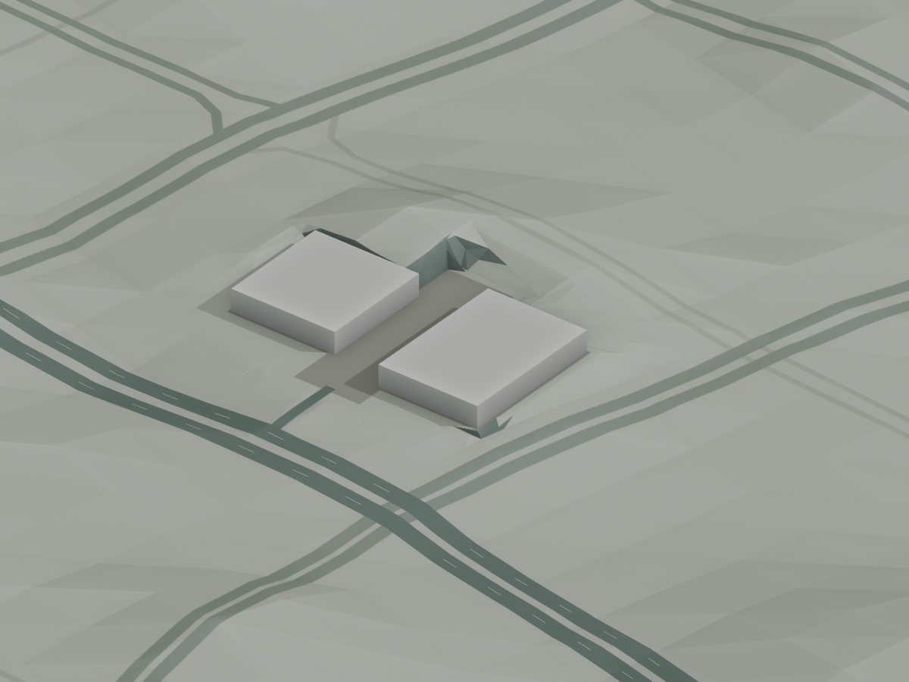
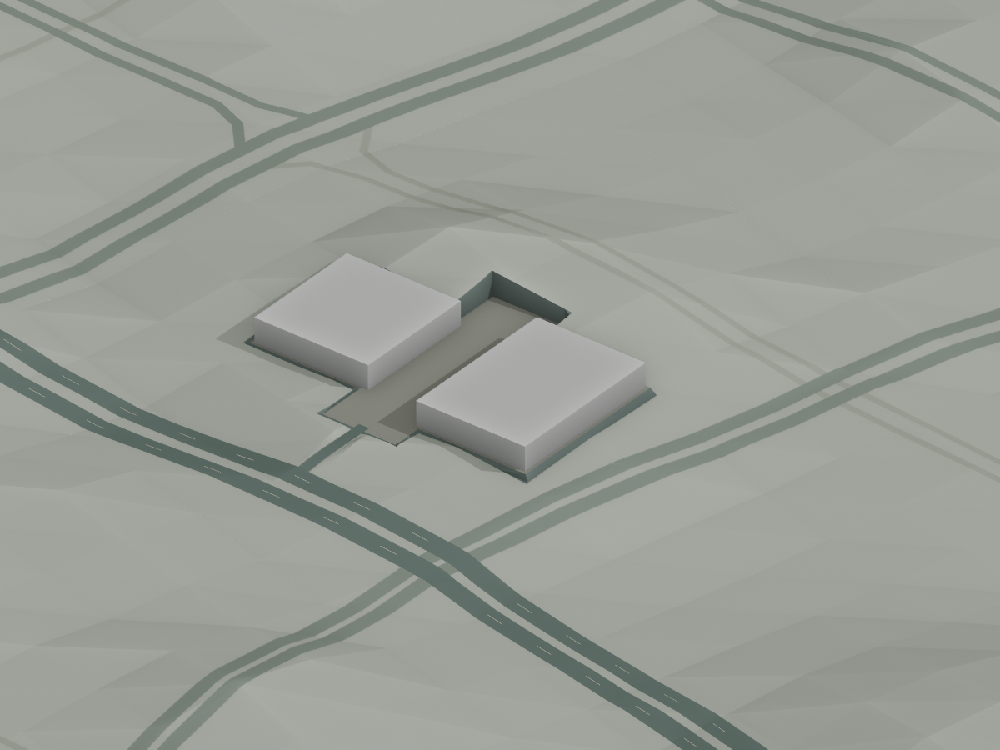
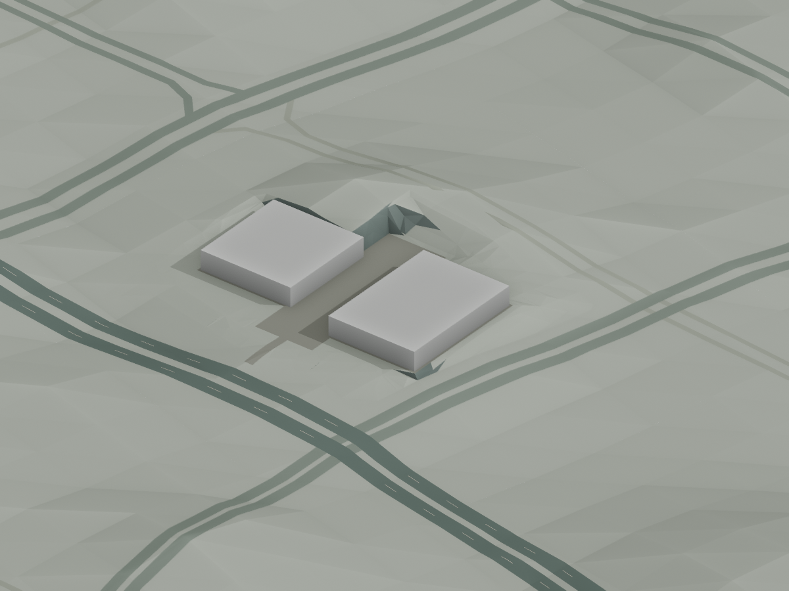
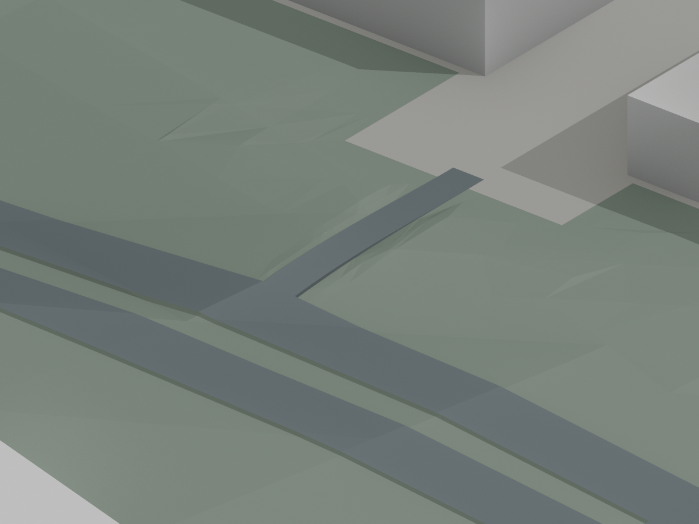
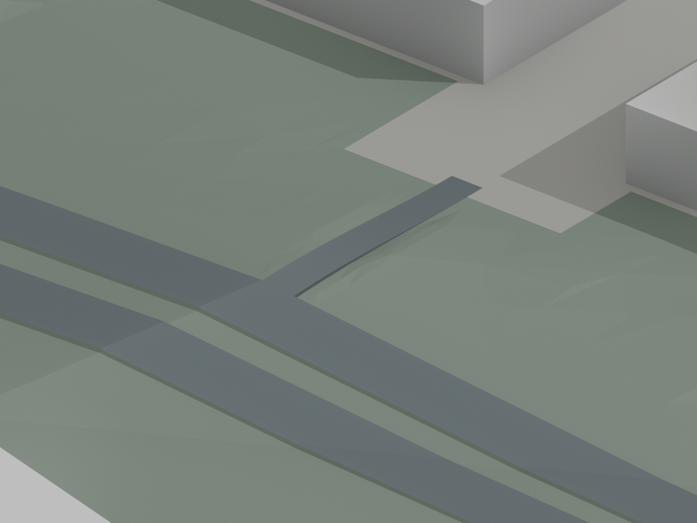
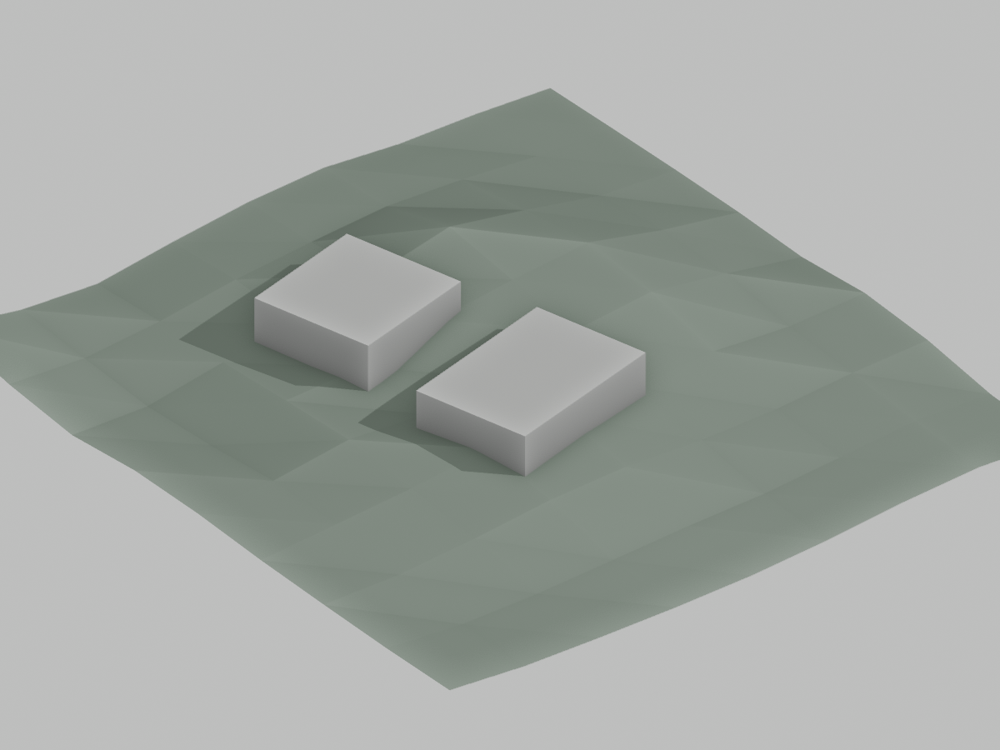
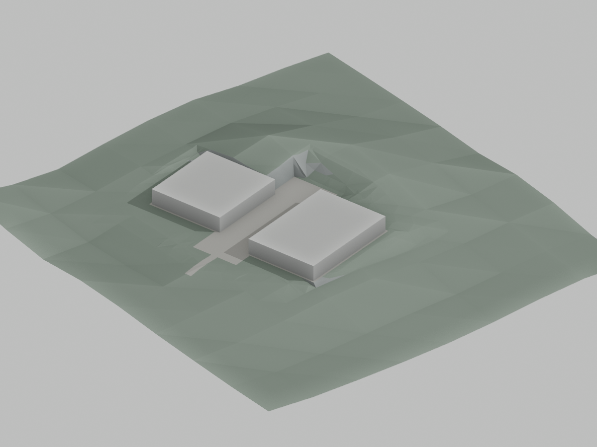
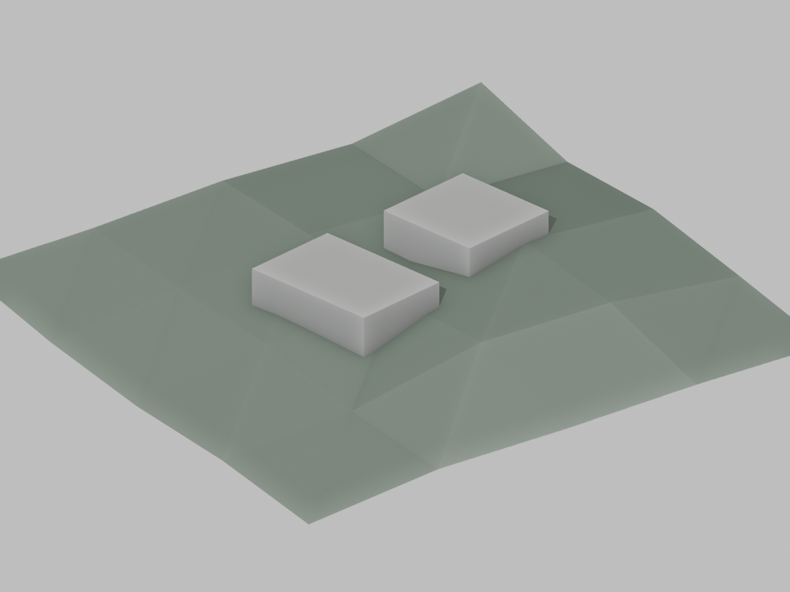
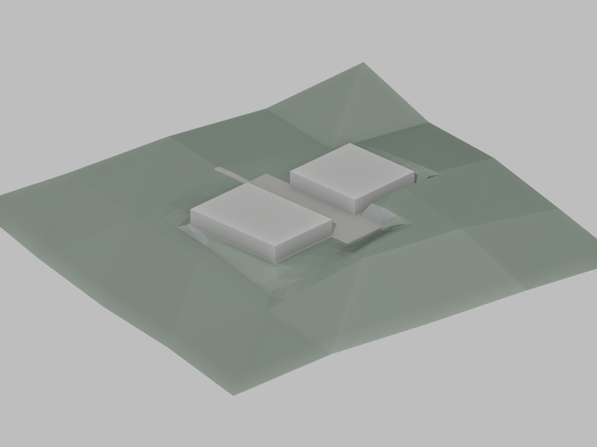

# P5：仓储场坪与过渡地形候选

状态：场坪与接路已通过隔离 P5 实际地形替换、城市/林冠共用采样及两档 Draco 检查；道路依赖已重新生成。主生成器的显式入口已接入代码，完整 P5 城市构建和正式资产替换尚未完成。本项属于 P5 地形规则推广；其他用途场地、临水建筑、滨水扩展、预算优化与整体验收仍须继续。

## 连续挡土过渡（2026-09-13）

上一轮实际导出预览中的尖角主要来自凹形场坪转角：距离混合高度与逐三角面坡度选材共同产生了零碎挡土面。准备器现支持明确的 `retainingWidthMeters`，本样板采用估计 3 m 宽度，在场坪外形成连续的有坡挡土带；内侧保持平台高度，外侧接回对应档位的原地形。带外的混合权重归零。边界进入统一的 float32 XY 拓扑，跨越水域、道路等保护范围的候选会被拒绝。

平台目标高度、仓库足印和替换范围保持。基础补片由 2,184 增至 2,388 面；原生范围外几何、材质、法线和调色随机状态一致，平台覆盖、平整、边界及单层覆盖检查通过。挡土面投影中大于 0.01 m² 的连通部分从精细/流畅档的 4 / 6 片变为两档各一圈。收窄过渡使部分挡土面更陡，此处表达挡土结构，不能将其称为自然缓坡或经过工程校核的构造。

两档实际 Draco 补片检查通过：2,388 面全部匹配，顶点位移为 0，最大角点法向变化分别约 0.1564° / 0.1565°，无投影重叠或反向面。11 项准备检查通过，包含连续挡土带、带外地形保持及越过保护边界时拒绝生成。证据：[原生检查](urban-structure-quality/grading/integration/retaining-collar/retaining-native-audit.json)、[压缩检查](urban-structure-quality/grading/integration/retaining-collar/retaining-export-audit.json)、[形态诊断及代价](urban-structure-quality/grading/integration/retaining-collar/retaining-shape-diagnostic.json)、[测试](urban-structure-quality/grading/integration/retaining-collar/tests.log)。

随后实际执行并完成 12 步地形、地面道路、高架、道路实体和接路重建；重新准备最终足印支承。接路仍为 260 面铺装和 70 面侧壁，支承地形由 3,834 变为 4,150 面，最终地形相对上一轮每档净增 316 面。每档 16,600 点通过城市/林冠共用采样检查，范围外 655 点保持，20 个外部网格的顶点、材质和角点法向完全一致。接路对新基础场坪的最大局部高度调整为 2.3044 / 2.0083 m，不代表整个过渡带保持原高程。

独立及包含全城地形的实际导出均通过逐面匹配、朝向、单层覆盖及接触检查；接路口高程差为 0.752 / 0.633 mm，平面间隙为 0.143 mm，保留道路与新土体最小净空约 0.799 m。仓库完整足印继续覆盖且平整。证据：[最终采样](urban-structure-quality/grading/integration/retaining-collar/access-runtime-audit.json)、[最终导出检查](urban-structure-quality/grading/integration/retaining-collar/access-export-audit.json)、[12 步重建](urban-structure-quality/grading/integration/retaining-collar/rebuild-report.json)。

最终导出上下文已生成两档共 12 张预览，实际查看精细西视、精细北视灰模、流畅西视和流畅俯视四张。此前的北侧尖锐折面在这些视角中已消除，接路连通，平台边界连续。检查对象包括实际解码地形、接路、另行导入的周边道路和仓库候选；其他城市建筑及植被尚未加入，不替代完整城市验收。见[渲染记录](urban-structure-quality/grading/integration/retaining-collar/render-report.json)及[查看范围与结论](urban-structure-quality/grading/integration/retaining-collar/visual-review.json)。

| 原挡土过渡：实际导出上下文 | 连续挡土过渡：相同机位 |
| --- | --- |
|  |  |

最新候选及证据位于 staging 的 `work/p5/retaining-*`，最终支承为 `work/p5/retaining-access-support.json`。正式五项资产仍核对匹配 P4，见[哈希记录](urban-structure-quality/grading/integration/retaining-collar/formal-assets-unchanged.json)。下一步继续其余模板与普通建筑落地、减面分组组合、滨水/地形推广、正式两档资产和浏览器验收。下节接路数值和未通过截图属于改造挡土带之前的历史记录。

## 接路替换与共用采样（2026-09-13）

`--site-access-plan` 是显式的下游入口。`site_access_runtime.configure` 核对候选、原生地形报告和道路元数据的来源，实际生成并校验两档原场坪后才启用采样。`terrain_mesh.build` 生成基础地形时暂停接路和减面替换，避免新接路反馈到其原始输入。城市与林冠共用的 `forest_canopy.terrain_surface` 优先查询接路支承面；原道路准备入口拒绝同时开启接路。

实际替换只移除 `Terrain_grading_xinzhong_industrial_0_0`，新土体保留独立的 30 位压缩分组。接路路面和向外的侧壁使用同一个生成函数，并归入地面道路组，随画质切换重建。独立模型和包含全城地形的实际导出分别接受解码检查，确认没有保留旧场坪叠面。

| 本轮实际检查 | 精细档 | 流畅档 |
| --- | ---: | ---: |
| 替换前 / 后全城原生地形面数 | 638,502 / 640,152 | 216,564 / 218,214 |
| 原场坪 / 新支承面 | 2,184 / 3,834 | 2,184 / 3,834 |
| 新接路路面 / 侧壁三角面 | 260 / 70 | 260 / 70 |
| 范围外原生网格 | 20 个完全一致 | 20 个完全一致 |
| 共用采样检查 | 15,336 点 | 15,336 点 |
| 最大采样误差 | 小于 6e-9 m | 小于 6e-9 m |
| 相对原场坪最大局部高度调整 | 0.97243 m | 0.78887 m |
| 范围外采样 | 655 点保持 | 655 点保持 |
| 压缩后接路口最大高程差 | 0.752 mm | 0.633 mm |
| 压缩后接路口最大平面间隙 | 0.143 mm | 0.143 mm |
| 保留道路与新土体最小净空 | 0.79860 m | 0.79885 m |
| 独立接路与土体 GLB 大小 | 129,316 字节 | 129,172 字节 |

两座仓库完整足印保持覆盖和平整；新土体与铺装无面积重叠、翻转或穿插，70 面侧壁均朝外。上述独立文件大小包含整块支承面，不能作为城市净增体积。新土体相对原场坪有明确高度调整，不应描述成“地面未变”。

基础地形在关闭接路时的两档顶点、材质、角点法线与此前捕获完全一致，后续调色随机状态保持。七步道路依赖重建均实际执行并成功退出，随后重新准备接路；新候选的几何与此前通过存储检查的候选一致，来源绑定已重新生成。12 项接路/来源测试通过，覆盖错误档位、未校验激活、停用恢复，以及元数据未变但上游源码已变时的拒绝行为。

证据：[实际替换与采样](urban-structure-quality/grading/integration/access-runtime/native-sampler-audit.json)、[独立及集成压缩检查](urban-structure-quality/grading/integration/access-runtime/export-audit.json)、[道路重建记录](urban-structure-quality/grading/integration/access-runtime/road-rebuild.json)、[最终地形上下文绑定](urban-structure-quality/grading/integration/access-runtime/context-sources.json)、[正式资产保持 P4](urban-structure-quality/grading/integration/access-runtime/formal-assets-unchanged.json)。最终地形支承已另行重新测量，保存在 staging 的 `work/p5/access-hook-support.json`，原支承计划不能直接用于新地形。

以下命令在 staging 根目录运行，候选和地形/道路来源须匹配：

```sh
/opt/homebrew/bin/blender -b --python-exit-code 1 --python blender/check_site_access_runtime.py -- \
  --candidate work/p5/access-hook-candidate.json --output work/p5/access-hook-runtime --export
```

本轮实际执行了上述地形/采样/导出流程；尚未执行带接路的完整 P5 城市构建。北侧挡土折面视觉处理、其他建筑/模板的落地、与新减面计划的组合、整城资产预算及浏览器验收继续保留为待办。

已生成两档共 12 张灰模/基础材质预览，并检查精细西视、流畅北视灰模及流畅俯视三张。它们由实际解码的最终地形、接路、另行导入的周边道路及仓库候选组成，导入周边道路时删除其旧地形，避免叠盖。西侧出入口可见连续连接；北侧挡土过渡和局部外围转角仍有尖锐三角折面，因此本轮视觉验收未通过，不能据此发布为完成的场地。见[预览来源记录](urban-structure-quality/grading/integration/access-runtime/render-report.json)、[实际查看范围与未通过项](urban-structure-quality/grading/integration/access-runtime/visual-review.json)、[12 项测试](urban-structure-quality/grading/integration/access-runtime/tests.log)及[关闭入口时的原生一致性](urban-structure-quality/grading/integration/access-runtime/disabled-native-parity.json)。


## P5 城市生成流程接入（2026-09-13）

本节记录最新接入结果；下文 2,122 面场坪及旧接路数据属于 P4 上下文中的历史候选。新工作在 `work/urban-structure/p5/staging/` 中执行，包含独立的源代码、数据和公开资产副本。正式地理、地形、两档 GLB 与 `.blend` 已重新核对，仍逐字节匹配 P4 基线。

合并建筑与四类街区候选后重新准备显示地形，原始高程、地表分类、来源、高程基准及显示倍率保持不变；新增用地规则改变了 37 个显示采样值，最大变化为未乘 1.35 显示倍率前的 5.262 m。水岸与山体的建筑避让边界同步重算，因此未铺设仓储场坪时的原生地形也比 P4 增加 27 面。不能把旧地形减面计划的哈希改写后直接复用。

`blender/site_grading.py` 读取与当前地理、地形及场地来源绑定的可选计划。场坪替换基础网格对应单元；两档使用各自未改造地面的边界高程，建筑与依附物通过同一组实际存储的三角面查询高度。平台目标仍为展示估计，不是工程测量。

为消除浮点存储后的细缝，准备阶段将 XY 对齐到可由 float32 精确表示的局部网格，把平台、过渡带、车道和基础网格的边界一起求交并三角化，保留所有共线边界分段。新补片为 2,184 面。常规地形压缩会损坏其中细小接缝，因此将整块补片分组并单独使用 30 位位置精度；其他地形沿用原精度。

| 最新检查 | 精细档 | 流畅档 |
| --- | ---: | ---: |
| 替换的原地形三角面 | 128 | 32 |
| 新补片三角面 / 净增 | 2,184 / 2,056 | 2,184 / 2,152 |
| 范围外原生几何、材质、角点法向 | 完全一致 | 完全一致 |
| 后续调色随机状态 | 保持 | 保持 |
| 原生边界最大高程变化 | 0.107 mm | 0.076 mm |
| 实际高度查询检查 | 8,736 点通过 | 8,736 点通过 |
| Draco 顶点最大位移 | 0 | 0 |
| Draco 角点法向最大变化 | 0.1817° | 0.2149° |
| 压缩后退化、反向及面积重叠 | 均为 0 | 均为 0 |
| 局部分组与精度调整的上下文文件增量 | 40,340 字节 | 41,712 字节 |

两座仓库的完整足印在这两档压缩地形上均覆盖完整、高差为零。全量 1,921 个候选记录中仍有两个临水足印覆盖不足；住宅、商业的较大高差也未由本场坪解决。“覆盖完整”只说明足印下存在地面，不代表入口、场地或建筑基础已经验收。

压缩检查曾出现假失败：float32 解码点与 float64 原生点在计算重心时使用不同精度，导致位置完全一致的面被预筛选排除。检查器现统一用 float64 运算，保持 0.2 mm 位置阈值，并新增“相同顶点通过、实际超限位移拒绝”的回归测试。七项面匹配测试通过；九项场坪、四项实际采样和六项接路测试通过。

证据：[原生范围检查](urban-structure-quality/grading/integration/native-audit.json)、[实际压缩检查](urban-structure-quality/grading/integration/export-audit.json)、[体积对照](urban-structure-quality/grading/integration/size.json)、[支承摘要](urban-structure-quality/grading/integration/support-summary.json)。完整原生网格与上下文保存在 staging 的 `work/p5/grading-precision-native/`、`work/p5/grading-precision-context/`。

接路准备已取消隐式读取 P4 道路，改为必需的 `--native-terrain` 原生捕获目录，并验证当前道路、地理、地形和场坪计划哈希。当前尚待新道路实体完成后生成接路；本节未宣称新出入口、四类体量、最终城市导出或浏览器验收完成。后续地形减面还须保留该补片的独立导出分组和实际采样一致性。

### 实际 GLB 场地预览

地面道路和高架准备已完成；包含地面道路的上下文再次通过[补片压缩检查](urban-structure-quality/grading/integration/ground-context-export-audit.json)。`blender/render_site_integration.py` 将实际压缩上下文导回 Blender，再按完整足印支承测量放置两座候选仓库，生成两档、三个机位、灰模/材质共 12 张图。



已查看精细档西侧/北侧及流畅档西侧材质图。仓库与装卸场保持平整，但北侧高挡土过渡有明显三角折面，两档在边角与邻近道路的表现也不同，**尚未通过场地视觉验收**。当前道路是重建过程的原生上下文，最终实体仍在求交；新出入口、周边普通建筑和植被未包含在该预览中。详见[相机与资源记录](urban-structure-quality/grading/integration/previews/report.json)及[视觉问题记录](urban-structure-quality/grading/integration/previews/review.json)。

### 道路支承拓扑缺口：原生与压缩上下文复核通过

首轮两档道路实体准备命令均成功退出，但新接路检查拒绝流畅档：接路口 `[71.55166573118423, -131.95546627697075]` 的道路顶面比实际原生场坪低约 0.1452 m。扩大到整个场坪范围后，精细/流畅档最大穿地分别为 2.73475 / 2.47911 m。不能沿用道路脚本成功退出作为接入通过的证据。

原因是 `prepare_ground_roads.py` 只识别南湖、滨水和青秀山的替换网格，遗漏了仓储场坪；路面仍跨越旧粗网格三角形，并在新增坡折内部穿地。现已加入场坪网格替换及 `-4` 支承标记，`ground_roads.py` 按该标记采样对应画质的最终场坪。`finish_road_solids.py` 同时保留完整的原生输入指纹，使最终道路记录不再丢失场坪依赖。

新增 `check_site_road_support.py` 对道路面与实际地形面的所有相交顶点计算最小净空；两个解析测试分别证明旧的跨峰道路被拒绝、沿坡折切分的道路保持 0.8 m 净空。修复前的道路数组与来源记录冻结在 staging 的 `work/p5/road-grading-before/`，见[失败几何审计](urban-structure-quality/grading/integration/road-before-audit.json)。

地面道路、上下文、高架、道路实体和接路现已依次重建。下表来自同一范围的[原生道路复核](urban-structure-quality/grading/integration/road-after-audit.json)及[实际压缩上下文复核](urban-structure-quality/grading/integration/road-decoded-audit.json)，不是全城最终模型验收：

| 修复后检查 | 精细档 | 流畅档 |
| --- | ---: | ---: |
| 场坪范围内原生道路面 | 795 | 793 |
| 道路/地形相交分区检查 | 1,492 | 1,492 |
| 原生最小路面净空 | 0.79998 m | 0.79997 m |
| 实际压缩上下文最小净空 | 0.79860 m | 0.79885 m |
| 最大穿地 | 0 | 0 |

`terrain_context.py` 现在同时记录城市构建器和压缩器来源；包含地面道路时，还绑定道路计划、道路上下文与消费端，避免道路变化后沿用旧上下文。建筑与实际道路背景的[新预览记录](urban-structure-quality/grading/integration/road-support-previews/report.json)通过了来源绑定读取；北侧挡土折面仍未修整。

### 新接路与 float32 存储候选

本轮接路读取当前道路实体与带输入指纹的原生场坪，成功生成两档各 260 面、约 481.62 m² 的车道；原生纵坡最大约 9.46% / 5.60%，接路口高程误差为数值误差量级。替换车道下方原地形后，原约 0.713 / 0.410 m 的穿地消除。见[当前原生候选摘要](urban-structure-quality/grading/integration/access-current-summary.json)。这些坡度是显示模型的估计结果，不作为工程设计标准。

直接把该候选的 3,881 个支承地形面转为 float32，会出现 145 个投影退化面、13 个反向面和约 0.0322 m² 重叠。因此新增可选 `--native-storage` 准备流程：先存储车道顶面/支承点，再把整个支承地形的边界一起对齐到 float32 XY 网格、重新求交和三角化；原有真实水域洞保留，数值细缝不能变成新的地形洞。该流程仍是候选，不自动启用城市替换。

新候选的两档支承地形各为 3,834 面，float32 顶点可精确表示，投影退化、反向和面积重叠均为零，双向覆盖在约 1.706 mm 的网格容差内保持。存储后的接路口高程误差分别约 0.092 / 0.072 mm，地形穿入车道的最大数值误差低于 0.001 mm。

存储前移及重新三角化也会改变过渡带内的插值，不能把顶点精确存储当作形状完全不变：相对此前双精度候选，精细档最大下降/上升约 8.832 / 6.496 cm，流畅档约 6.126 / 5.437 cm。详见[逐相交分区检查及差异位置](urban-structure-quality/grading/integration/access-storage-audit.json)。这项差异、实际 Blender/Draco 导出、道路口完整接缝及场地视觉仍须复核；新接路未接入正式城市。八项接路/存储测试通过，包括原生精度下的薄片退化、真实内洞保留，以及拒绝用存储修整掩盖已有重叠的案例。

## 为什么先处理仓储

此前对 P4 实际压缩地形的完整足印测量表明，两座万纬新中智慧园候选仓库的两档联合高差约为 15.47 / 16.02 m。若只把建筑基础延伸至最低点，18 m 的仓库会带着很高的基础裙墙。需要先形成可使用的装卸场与建筑平台，再处理边缘。

地块、候选仓体、用途来源沿用[四类模板记录](URBAN_STRUCTURE_ROLLOUT.md)及 `data/block-sources/p5-rollout.json`。新增[场地配置](../data/block-grading-source.json)明确标注：平台、铺装范围、挡土断面和出入口均为展示估计，不属于现场或工程测量。

## 当前实现

- 两座仓库与中间装卸场共用约 **27,915.82 m²** 平台。装卸带向仓体延伸，保持凹形地块边界；没有采用会跨出地块退入处的凸包。
- 平台目标为两档 P4 显示地面、10 m 规则间隔内 554 个样本的中位数：场景 Z 为 `1.216667`。这是带项目高程基准和显示倍率的场景值，不能写成实测海拔。
- 补片按原 DEM 网格及流畅档边界对齐，约 **230,174.36 m²**；实际改高范围限于地块和估计出入口过渡。补片包含 2,122 个三角面，切入平台、过渡带和车道边界。这个数量不是相对正式资产的净增量。
- `GradePatch` 由调用方显式提供计划和最终基础地面。平台权重为 1，作用区及补片边界为 0；建筑、地形和后续依附物可采样同一个三角面表面。不会把旧压缩顶点高程直接焊进新城市边界。
- 新补片替换原地形，保留映射水域内洞；原样区的地表材质由调用方提供。陡于 0.6 的改造土坡面暂以共用地形顶点的倾斜挡土面表达，未额外叠盖薄片。

## 出入口选择与剩余问题

首轮试验从装卸场接向东侧海德路，长度约 134.54 m，线路不穿建筑，但两档地形的最大纵坡约 59.9% / 46.8%，未采用该方案。

当前改为向西接华兴路，估计线路约 **147.71 m**，宽 8 m，仍不穿过候选仓体。初始地形表面上的最大纵坡为精细档 **10.64%**、流畅档 **6.94%**。该轮仅沿地面采样，后续已按道路原生实体增加车道及下方地形替换，见下节。最终依赖重建、压缩模型接缝及实际出入口位置仍待核验。

| 检查 | 精细档 | 流畅档 |
| --- | --- | --- |
| 平台完整覆盖 | 通过 | 通过 |
| 平台内最大高差 | 小于 0.001 mm（数值误差） | 小于 0.001 mm（数值误差） |
| 补片边界顶点高程改变 | 0 m | 0 m |
| 最大显示挖方 | 15.33 m | 13.39 m |
| 最大显示填方 | 5.83 m | 8.89 m |
| 陡于 1:1 的地形面 | 57 | 49 |
| 预览中的倾斜挡土面 | 78 | 73 |

上述挖填量是顶点处的显示高差，不是土方体积。部分仓体到地块边缘仅有约 4 m 过渡空间，北侧仍形成较高、局部折面的挡土界面。固定角度预览已确认这一限制；应继续结合最终城市地面和道路处理，不能把“平台已平”当作整个场地已通过。

## 按实际道路实体生成接路候选

新增 `scripts/prepare_site_access.py`，读取与 P4 地理/地形哈希匹配的两档 `road-solids` 原生道路网格。测得道路顶面比前一轮接路终点处地面高约 0.8 m，因此不能只把地面车道延伸到道路中心线。

新车道从场坪边缘内侧起步，在既有道路的实际边界处结束。起点保持场坪高度，终点匹配道路顶面与法向坡度；接缝保留道路边界上的各个分段点。车道与既有路面没有面积重叠。下方支承地形同时生成，两侧使用 5 m 过渡，替换被影响的原地形面，未将新路面直接盖在凸起的旧地形上。

| 原生候选检查 | 精细档 | 流畅档 |
| --- | --- | --- |
| 新车道路面面积 | 约 481.62 m² | 约 481.62 m² |
| 新车道路面三角面 | 234 | 208 |
| 最大纵坡 | 9.46% | 5.60% |
| 最大横坡 | 7.51% | 9.57% |
| 接路口全宽原生高程误差 | 小于 0.001 mm（数值误差） | 小于 0.001 mm（数值误差） |
| 原地形穿入新车道的最大深度 | 0.712 m | 0.410 m |
| 替换地形后穿入深度 | 数值误差范围内为 0 | 数值误差范围内为 0 |
| 被替换的旧地形三角面 | 95 | 95 |
| 补片替换后的总三角面 | 3,555 | 3,452 |
| 近重合顶点最大高程差 | 约 0.257 mm | 约 0.202 mm |

横坡包含既有道路在接路口的坡向，不是另行宣称的工程合规值。连续覆盖检查的面积差为 0，数值重叠约为 0.0000025 m²；上述结果来自原生候选，不能替代最终 Draco 压缩后的接缝与覆盖验证。

精细/流畅独立预览分别清理了 57 / 55 个在 Blender float32 存储中面积恰为零的微小退化三角面，并记录实际渲染面数。三角化前也增加了零宽折返边处理，防止几何相交产生的数值尖刺令 Earcut 停滞。未丢弃有正渲染面积的面。最终城市导出仍须检查这一精度边界。

| 精细档接路近景 | 流畅档接路近景 |
| --- | --- |
|  |  |

[接路与支承摘要](urban-structure-quality/grading/access/summary.json)、[12 张独立预览记录](urban-structure-quality/grading/access/render-report.json)、[5 项接路检查](urban-structure-quality/grading/access/tests.log)和[原 7 项场坪回归](urban-structure-quality/grading/access/grading-regression.log)。接路检查覆盖全宽接缝、路面无面积重叠、场坪与道路两端高度、地形凸起消除、单层覆盖、共线边界分段及零宽折返边回归。

```sh
PYTHONWARNINGS=error work/venv/bin/python scripts/prepare_site_access.py \
  --grading work/urban-structure/p5/grading/candidate.json \
  --output work/urban-structure/p5/grading/access-candidate.json
work/venv/bin/python scripts/test_site_access.py
/opt/homebrew/bin/blender --background --factory-startup \
  --python blender/render_block_grading.py -- \
  --plan work/urban-structure/p5/grading/candidate.json \
  --geography work/urban-structure/p5/rollout/candidate.json \
  --support work/urban-structure/p5/rollout/support-p4-terrain.json \
  --access work/urban-structure/p5/grading/access-candidate.json \
  --output work/urban-structure/p5/grading/access-previews
```

新可编辑候选位于 `work/urban-structure/p5/grading/access-previews/`。这批场景加入了裁至补片范围的 P4 道路上下文；更广的城市及植被仍未加入。后续正式接入应从新地形和道路依赖重新生成，而不是仅替换报告中的输入哈希。

接路及其地形替换的两次完整生成逐字节一致，见[接路重复生成记录](urban-structure-quality/grading/access/determinism.json)。本轮五项正式城市资产仍与 P4 基线一致。

## 同机位对照

两列使用相同的仓储候选体量。左列将候选放在 P4 地形上并延伸基础，右列采用新场坪；**左列不是正式 P4 城市中旧随机补楼的截图**。周围城市、道路实体和植被未加入，以下不替代浏览器验收。

| 精细档：原地形上的候选 | 精细档：场坪候选 |
| --- | --- |
|  |  |

| 流畅档：原地形上的候选 | 流畅档：场坪候选 |
| --- | --- |
|  |  |

## 验证与复现

[几何及输入摘要](urban-structure-quality/grading/summary.json)、[八张预览与渲染记录](urban-structure-quality/grading/render-report.json)、[测试结果](urban-structure-quality/grading/tests.log)。七项检查覆盖单层覆盖、水域内洞、完整足印与装卸场平整、边界及范围外高程、每个三角面和顶点采样、重复生成与道路避让、两档基础地面以及实际输出面与材质保持。编译与差异检查通过；尚未执行正式 P5 城市导出和浏览器测试。

两次独立完整生成逐字节一致，见[重复生成记录](urban-structure-quality/grading/determinism.json)。正式地理、地形、可编辑城市及两档 GLB 的哈希均仍与 P4 基线一致。

```sh
work/venv/bin/python scripts/prepare_block_grading.py \
  --geography work/urban-structure/p5/rollout/candidate.json \
  --terrain work/urban-structure/baseline-p4/public/data/terrain.json \
  --detail work/urban-structure/baseline-p4/public/models/nanning-city.glb \
  --smooth work/urban-structure/baseline-p4/public/models/nanning-city-mobile.glb \
  --output work/urban-structure/p5/grading/candidate.json
work/venv/bin/python scripts/test_block_grading.py
/opt/homebrew/bin/blender --background --factory-startup \
  --python blender/render_block_grading.py -- \
  --plan work/urban-structure/p5/grading/candidate.json \
  --geography work/urban-structure/p5/rollout/candidate.json \
  --support work/urban-structure/p5/rollout/support-p4-terrain.json \
  --output work/urban-structure/p5/grading/previews
```

两档独立可编辑候选保存在 `work/urban-structure/p5/grading/previews/xinzhong-industrial-{detail,smooth}.blend`。正式 `blender/nanning-city.blend`、公开地理/地形和两档 GLB 本轮保持原状。
