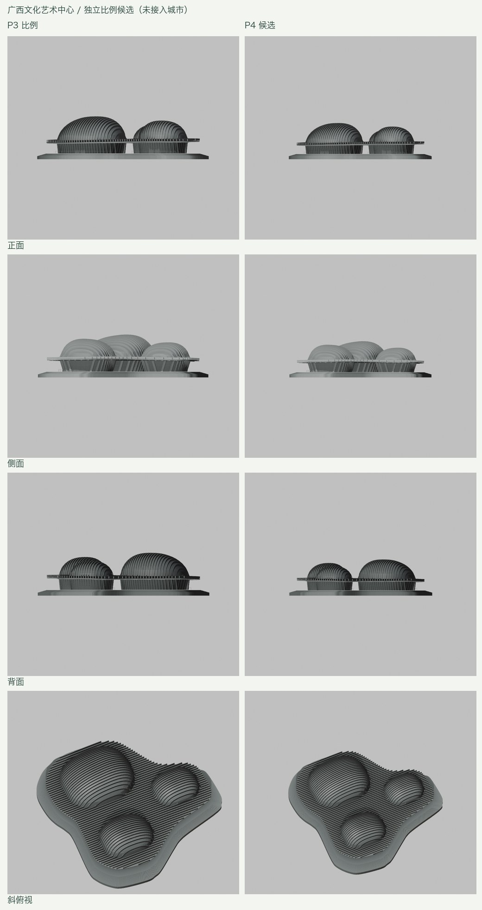
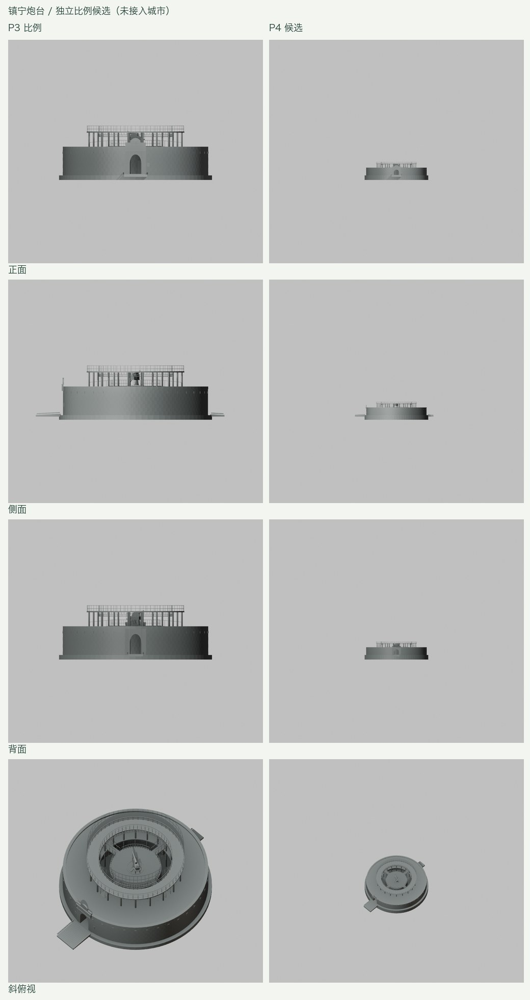
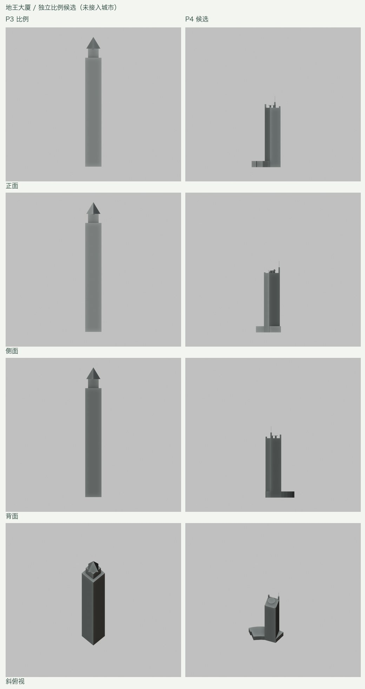
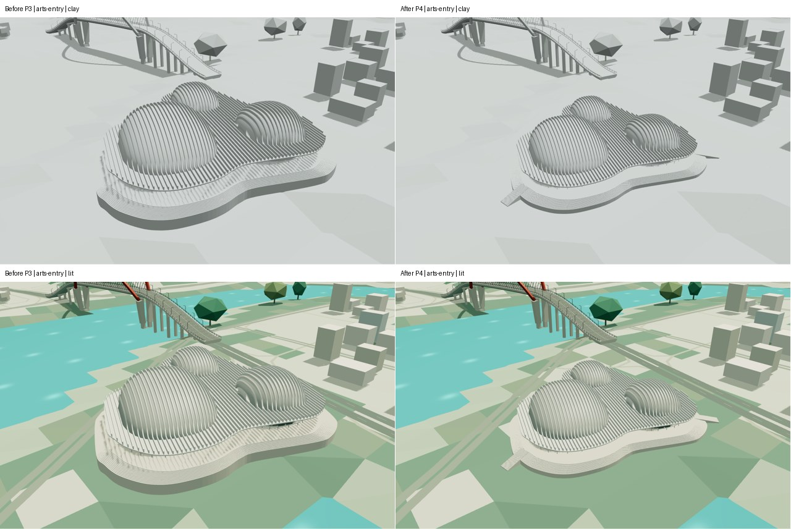
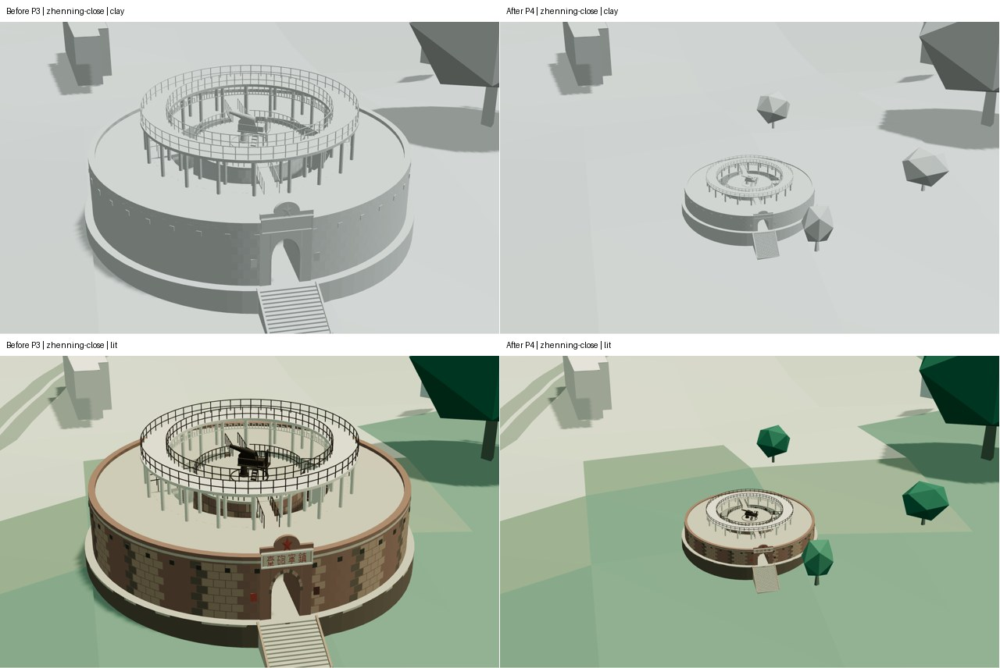
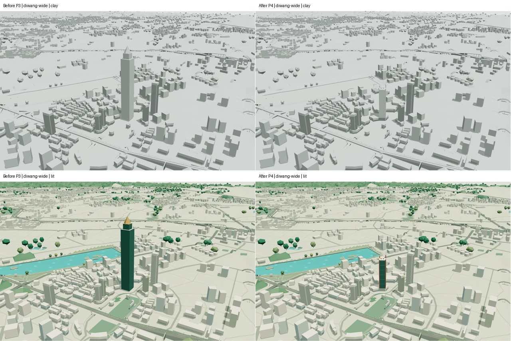
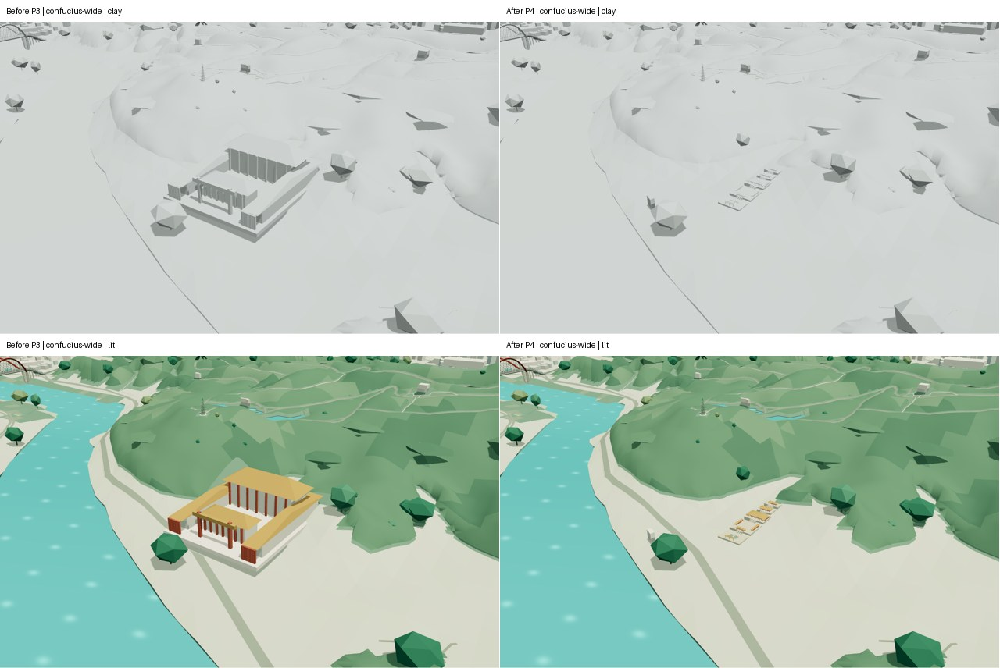

# P4：代表性地标比例与场地校准

日期：2026-09-12。对应[完整计划](URBAN_STRUCTURE_PLAN.md) P4。

**状态：P4 已完成正式接入与验收。** 艺术中心、镇宁炮台、地王大厦及孔庙已更新完整 `.blend` 和两档 GLB，通过实际导出检查、固定镜头、交互与性能对照。下方三组独立候选图及冻结地形审计为接入前的历史证据；正式交付记录见后文。P5 尚未实施。

## 已准备的来源与候选

[来源说明](../data/landmark-calibration-source.json)、[五个原始 OSM 要素](../data/landmark-calibration-osm.json)、[生成参数](../data/landmark-calibration-plan.json)分开保存。OSM 要素来自既有 `2026-09-08T06:56:02Z` 主城快照，不覆盖整个数据库；位置沿用现有目录。尺寸均按每场景单位 100 m 换算。

来源/参数 JSON 的 `status` 保留候选准备时的状态；当前城市场景实施与验收进度以本页及完整计划为准。

| 地标 | P3 比例问题 | 当前候选 | 尚不能视为实测的内容 |
| --- | --- | --- | --- |
| 艺术中心 | 平面和高度共同乘 1.2 | 恢复 1.0；沿用 OSM 屋盖边界、三厅布局与格栅 | 三厅曲面、格栅构件、外扩 12% 的台基与台阶 |
| 镇宁炮台 | 水平乘 2.4，高度再乘 1.55 | 两倍率均恢复 1.0；环墙主体外径按文献 39 m | OSM 外包仅约 27.90×29.74 m，不能将两者当作相同测量边界 |
| 地王大厦 | 独立几何总高约 506 m，尖锥楼顶，无映射裙楼 | 总高 276 m，沿 OSM 塔楼方向与裙楼轮廓建模，增加偏置角柱和圆形顶平台 | 分段高度、角柱细节/朝向、平台半径和立面条带 |

### 艺术中心

[gmp 官方项目页](https://www.gmp.de/en/projects/3231/guangxi-culture-arts-center)提供三厅布局、共同屋盖/台基、实景及剖面。官方大剧院剖面的 0–50 m 比例尺支持屋顶至台基上表面约 52 m 的读图估计，本轮采用约 ±3 m 的比较范围，不能称为标注标高或竣工测量。

候选独立参考中的顶点最高处为 56.80 m，其中包含 2.5 m 支承偏移与约 3.6–3.8 m 台基；台基上方主体约 50.5–50.7 m。原始屋盖控制点保持不变，只移除整体倍率。两种候选均为 57,716 个三角面。



### 镇宁炮台

[南宁市融媒体中心 2026 年报道](https://silkroadonthecloud.cn/f/view-A1002001002-2054792774516322304.html)确认环形城堡、南北门及二十间营房。[清华大学出版社试读第 009 页](https://www.tup.com.cn/upload/books/yz/092495-01.pdf)列外径 39 m、中央台高 5 m、直径 13.6 m。文献同时给出的 860 m² 占地、39 m 外径与 OSM 轮廓不是一致的面积/尺度关系，因此保留差异；候选外径采用描述性文献值，OSM 仅用于定位。

含窄石质围边的候选直径约 41 m，含南北台阶的纵向范围约 50.58 m。主体最高构件约 8.565 m，附属细节仍为照片近似。面数保持 19,294。已用实际几何射线验证两处门洞贯通、四座连桥存在、四处斜向庭院开放。



### 地王大厦

本地 OSM way `763861723` 同时给出塔楼轮廓与 `height=276`；way `1284692310` 是七层裙楼。[中建三局二公司原创项目介绍](https://www.thepaper.cn/newsDetail_forward_9515012)确认 276 m，并提供可见平顶平台和偏置高角柱的照片。[广西新闻网 2014 年报道](https://v.gxnews.com.cn/a/9464627?pageno=2&remains=1)也列 276 m 与楼顶直升机停机坪。楼层数存在 58/59 的来源差异，不用层数反推塔楼总高。

候选采用地图方向的玻璃主体、四角立柱、圆形顶平台和细长顶部构件，替换旧尖锥轮廓。裙楼保留原始凹轮廓，暂按七层×3.2 m 估计为 22.4 m。主体 230 m、顶平台 240 m、高角柱 252 m 等中间高度均为照片估计，唯一校准总高为 276 m。

候选 358 面，原独立体块 30 面；这里只能证明几何候选增加 328 面，不能代替全城预算检查。原全城生成器已按名称隐藏对应 OSM 塔楼与裙楼，本轮没有删除公共地理记录或声称修复不存在的重复楼体。



## 实际场地检查改变了后续方案

从冻结 P3 的两档 GLB 解码地形，将每个实际三角面与候选足印相交，在裁切后的顶点计算高程极值；不是只采样建筑中心。孔庙在该次历史检查中使用旧 270×340 m 台基范围作问题诊断，后续实施采用下文的分级院落。

| 场地 | 精细档地形高差 | 流畅档地形高差 | 下一步处理 |
| --- | ---: | ---: | --- |
| 艺术中心候选台基 | 4.83 m | 8.19 m | 两档共同支承、边缘基础及入口台阶；避免缩放后重新悬空 |
| 镇宁炮台候选围边与台阶 | 3.84 m | 3.84 m | 缩小范围后重算平台与入口分段台阶；不能复用旧放大范围的层高 |
| 地王塔楼与裙楼 | 0.51 m | 0.63 m | 按凹形裙楼封闭基础，检查街道和相邻建筑界面 |
| 孔庙旧台基范围 | 48.23 m | 49.46 m | 先校准过大足印，再按建筑与院落分级支承 |

前三处候选均不与映射水域重叠。艺术中心足印与解码地形的微小覆盖差分别约 0.37 / 0.055 m²，保留在记录中；后续接缝验证须区分压缩误差与实际孔洞。[完整场地记录](urban-structure-landmarks/site-audit.json)同时保存来源模型哈希。

孔庙的新来源还支持缩小范围：[落成报道](https://v.gxnews.com.cn/a/3581421?pageno=1&remains=1)列整个场地约 46 亩，建筑面积超过 3,500 m²，而旧模型主台基已达 91,800 m²，约为报道全场面积的三倍。报道列出棂星门、状元门、状元桥、泮池、大成门、大成殿、崇圣祠与明伦堂的顺序；七开间大成殿的前廊龙柱长 5 m。[记者现场报道](https://culture.gxnews.com.cn/staticpages/20110131/newgx4d45f03d-3582783.shtml)确认场地位于山谷谷口。这些事实用于下一步约束布局，不把场地面积直接换成唯一长宽或逐栋足印。

## 接入前候选验证（历史归档）

- 参数生成重复一致，五个 OSM 要素保留源快照哈希及原始标签。
- 艺术中心和炮台原始生成器源码与冻结 P3 指纹相符；增加可选比例参数后，默认生成的顶点及面索引与原实现逐项一致。
- 三个候选均无零面积三角面；地王实际最高顶点符合 276 m；炮台结构射线检查通过。
- 生成并查看正、侧、背及斜俯视同机位对照，共 24 张原始渲染。此处灰模为独立平面参考，不是城市场地的已验收效果。
- 该次候选验证时 P3 完整 `.blend`、两个 GLB 和四份公开数据指纹未变。新增 Python 文件编译与差异空白检查通过。

[候选几何及相机](urban-structure-landmarks/candidate-geometry.json) · [候选检查日志](urban-structure-landmarks/candidate-validation.txt) · [工具指纹](urban-structure-landmarks/tool-hashes.json)

## 正式场地实施与验收

- 艺术中心采用 1.0 倍显示比例，按两档最终地形的共同上包络设置台基，基础底边随地形变化，并增加三个厅前的入口台阶。厅体曲面采样从 96×18 调整为 64×12，独立场地模型为 48,818 面。
- 镇宁炮台使用中性尺寸与重新计算的平台高度；入口台阶按实际落地高程分级，独立场地模型 19,996 面。南北门洞射线与首级踏步检查通过，首级中心处显示地面高差约 26.3 / 24.0 cm。
- 地王大厦接入映射凹形裙房、276 m 总高和偏置圆形顶平台，沿裙房边缘封闭基础，独立场地模型 358 面。
- 孔庙拆除旧大台基，按入口、主院、大成殿、崇圣祠、明伦堂组织五级估计院落，之间以台阶衔接；泮池保持铺装开口和桥面。独立模型 2,812 面。建筑顺序、主殿七开间及 5 m 廊柱有报道依据，院落足印与其余尺寸均明确标为估计。
- 四处场地使用实际生成边界进行道路和植被避让。缩小旧避让范围后恢复周边植被，并保留原有树冠随机取色及流畅档抽样，避免局部新增扰动范围外对象。
- 实际城市预览发现炮台附近原有的约 60–70 m 树木符号遮挡缩小后的堡垒，因此对炮台中心 80 m 内的独立树木采用 0.2 倍显示比例，外侧 50 m 平滑过渡回原比例；这是局部风格参数，不是实测树高。精细档核心区三棵树的显示冠顶约高出地面 14.0–14.2 m；流畅档原抽样在核心区没有独立树木。地形及森林覆盖边界不因这项显示修正改变。
- 已增加正面、背面、入口、院落与宽景固定镜头，孔庙泮池响应水域开关。3 项 Python 确定性/避让测试、独立 Blender 场地检查、网页类型/lint 与 12 项行为测试通过。

独立检查与正式压缩 GLB 检查均已完成。实际导出中，艺术中心为 48,808 面、炮台 19,996 面、地王 358 面、孔庙 2,812 面；两档地标形体一致。艺术中心的导出计数与独立检查相差 10 面，正式预算以解码资产为准。

### 最终城市对照

各图左侧为冻结 P3，右侧为正式 P4；上行为日间灰模，下行为日间完整光照。视角、FOV、画布及显示倍率相同。地王和孔庙使用宽景，完整容纳修改前的高塔和大台基。









对照图为本项目模型渲染；地理数据 © OpenStreetMap contributors，ODbL 1.0，高程来源和署名见[第三方署名](../ATTRIBUTION.md)。

### 实际导出与范围回归

| 项目 | 精细档 | 流畅档 |
| --- | ---: | ---: |
| GLB 字节 | 25,579,860 | 17,637,060 |
| 相对 P3 字节变化 | −51,168 | −51,732 |
| 三角面 | 3,480,403 | 2,373,054 |
| 相对 P3 面数变化 | −5,412 | −5,470 |
| 原有文件预算 | 26,000,000 | 18,000,000 |
| 炮台南门首级中心离地 | 25.83 cm | 25.77 cm |
| 炮台北门首级中心离地 | 22.92 cm | 23.04 cm |

- 公开 `geography.json`、`terrain.json` 相对 P3 逐字节不变。全部地形节点、水面、青秀山园路、龙象塔及已验收的滨水/桥头样板几何与材质不变。
- 五级孔庙院落与实际解码地形相交检查通过，最小显示净空约 1.19 m；基座边墙延伸到地形以下。泮池保持实体开口，院落铺装覆盖检查通过。
- 地王实际总高符合 276 m；裙房、艺术中心台基与两档地形相交检查通过。四处场地均有道路避让覆盖，没有重复或缺失地标节点。
- 范围外普通建筑与独立树木逐材质几何比较误差为 0。森林表面的影响范围按 15 m 避让、40 m 冠层过渡及相邻流畅网格对角线计算，约外扩 224.62 m；此范围外两档森林面与材质也保持一致。流畅档的局部冠层高度插值变化没有被误报为全城植被不变。
- 首轮城市预览发现炮台树冠遮挡与入口断口，修正后重建复验。入口最终使用两档实际三角网格，排除原始双线性插值造成的额外抬高；最后一次修正仅改变 `Landmark_zhenning`，其余模型节点保持一致。

[完整导出测量与哈希](urban-structure-landmarks/exports.json) · [独立场地检查](urban-structure-landmarks/site-geometry.json) · [最终入口修正范围](urban-structure-landmarks/stair-scope.json)

### 网页与性能

- 100 份修改前浏览器记录（含宽景补拍）与 97 份最终记录；覆盖两档画质、灰模、基础颜色、日间光照，以及四处代表镜头的日落/夜间。静止帧、镜头链接恢复及普通首页加载通过。
- 48 份交互记录覆盖四处选择、近景、画质切换和图层开关。孔庙泮池裁切区域的水色像素在精细/流畅档分别由 195 / 214 降至 0，确认水域开关确实隐藏泮池。
- 类型检查、lint、12 项网页行为测试、3 项校准测试、完整资产/地形/道路接口与炮台结构检查通过。实际命令与退出状态见[依赖重建](urban-structure-landmarks/dependency-rebuild.json)和[最终导出复验](urban-structure-landmarks/release-rebuild.json)。
- 独立 ABBA 连续拖动对照共 8 次：两档修改前后帧间隔中位数均约 16.7 ms，P95 为 16.7–16.8 ms，没有超过 50 ms 的样本。精细档载入约 639–691 ms、流畅档约 681–689 ms；样本不足以宣称加载速度提升。这是同机 Headless Chrome、1280×800、DPR1 的短时对照，不是手机真机结论。

[P3 前对照](urban-structure-landmarks/before-browser-report.json) · [P3 宽景补拍](urban-structure-landmarks/before-wide-report.json) · [最终浏览器记录](urban-structure-landmarks/browser-report.json) · [交互与泮池验证](urban-structure-landmarks/interaction-report.json) · [连续操作对照](urban-structure-landmarks/motion-report.json) · [正式工具指纹](urban-structure-landmarks/release-tool-hashes.json)

P4 完成后继续 P5 的分区推广、OSM 轮廓/内洞与未知高度处理。孔庙院落和各地标次级结构仍属于有来源约束的风格化估计，不是竣工测绘复原。

复现当前候选准备：

```sh
work/venv/bin/python scripts/prepare_landmark_calibration.py
blender --background --python-exit-code 1 --python blender/render_landmark_candidates.py
work/venv/bin/python scripts/audit_landmark_sites.py
```

渲染器需要 `work/urban-structure/p4/baseline-sources/` 中与 P3 指纹吻合的两个原始生成器。原始参考照片/剖面仅用于分析，没有打包进模型、网站或本页归档图。
