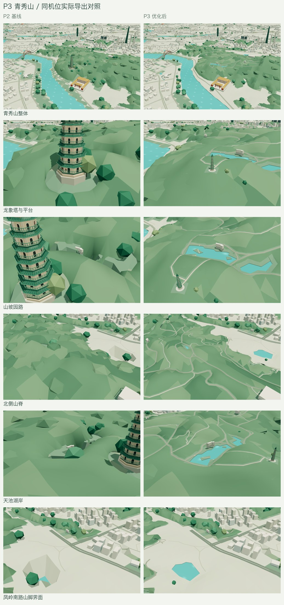
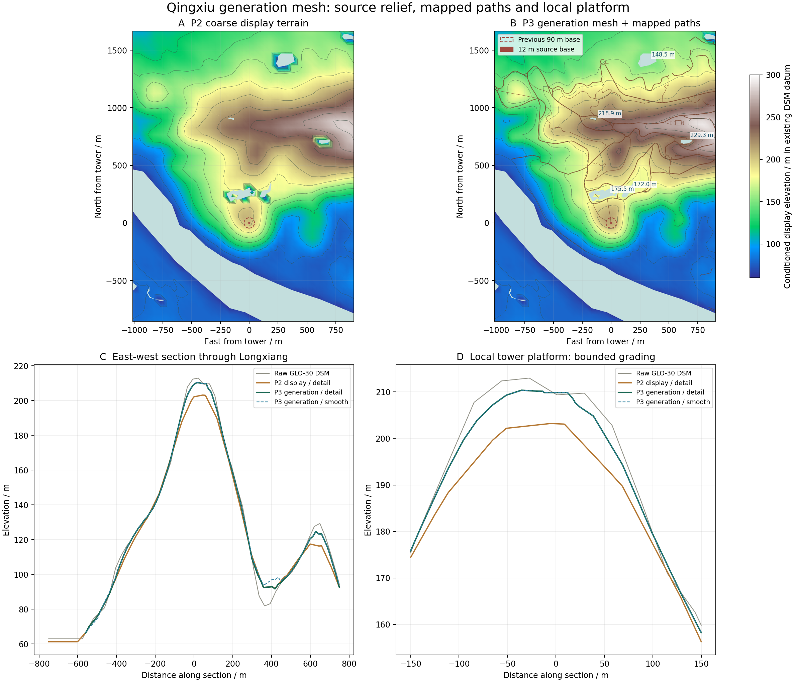
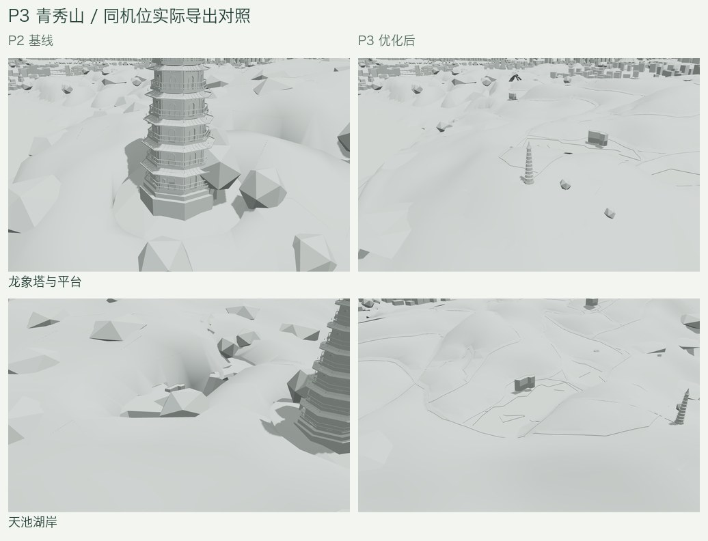

# P3：青秀山山脊、园路与山脚样板

日期：2026-09-12。对应[完整计划](URBAN_STRUCTURE_PLAN.md) P3。**状态：已完成正式接入、完整依赖重建、两档资产与浏览器验收。** 本轮覆盖约 4.152 km² 陆地、76 条来源园路记录、5 个山地湖泊及龙象塔比例与平台。原始高程、全城基准和公开地理/地形数据相对 P2 保持不变。



## 来源与估计边界

- 园路来自独立 OSM 快照 `2026-09-12T10:32:02Z`，共取得 185 条道路/建筑来源要素，见[园路来源](../data/qingxiu-paths-source.json)。与主城 `2026-09-08` 快照分开记录，保留访问限制和道路类别；这些数据不构成通行指引。
- 纳入 76 条裁切后的园路/园内道路记录，长度合计约 21.994 km，铺装面积约 109,215 m²。没有数值宽度标签时，步道暂取 2.5–3 m、步行铺装 5 m、园内服务道路 6 m，均标为估计。`steps` 保留类别与坡向，没有逐级重建踏步。
- 地形使用既有、已验证哈希的 Copernicus GLO-30 原始 DSM。约 30 m 网格及边界插点改善显示，不增加测量精度；DSM 也不能直接解释为裸土地面。原始采样值、显示修正和最终网格分开保存。
- [广西广电局介绍](https://gbdsj.gxzf.gov.cn/jingcaizhuanti/pzgx/pscj/nns/t19011344.shtml)确认青秀山位于邕江畔，并指出最高处为凤凰岭。本样板不把龙象塔所在地强行抬成景区最高峰。
- 龙象塔尺寸采用[广西新闻网 2025 年采访](https://www.gxnews.com.cn/staticpages/20250824/newgx68aa9784-21835953.shtml)中景区公司讲解员给出的八面九层、53.35 m 高、塔基直径 12 m。[2024 年报道](https://v.gxnews.com.cn/a/21514231)为 52.35 m，保留 1 m 来源差异。平台半径 12 m、外侧 25 m 过渡是显示估计。

参数与引用见[样板配置](../data/qingxiu-terrain-source.json)，对应[生成网格](../data/qingxiu-terrain-plan.json)。

## 山体、园路和湖岸的共同表面

生成网格含 20,571 个地形三角面、10,691 个顶点。边界沿两档共有的旧网格对齐，删除对应粗面后替换；陆地只覆盖一次，真实水域保留为孔洞。

网格沿园路、平台和水边界切分，补齐三角化省略的共线边点；103 个面完成共享边修正，极细数值片使用线性高度约束，避免非线性采样将平面接点变成竖向裂缝。两档地形、道路、树木、林冠和地标支承使用对应的最终三角网采样。

山体在补片外缘 120 m 内回到各档原地形，森林边缘以 60 m 范围过渡。园路随坡地起伏，不沿路压平山脊。独立铺装高于其支承面 0.6 m，并沿实际铺装边界封边；该净空是显示参数，不能解释为工程厚度。园路属于道路图层，两档均保留 14,158 个铺装与封边三角面。

原有山地湖泊曾共用邕江水位，使周围地形形成深坑。本轮沿用相同水域平面轮廓，追溯原始 OSM 水域，分别推定水位。见[局部水域来源](../data/qingxiu-water-source.json)。

| 水域 | OSM 要素 | 推定源高程（m） | 水域内原始像素数 |
| --- | --- | ---: | ---: |
| 未命名水域 | way 1393214365 | 229.264 | 3 |
| 未命名水域 | way 839738465 | 148.500 | 15 |
| 荷花池 | way 651997944 | 172.027 | 6 |
| 天池 | relation 4448134 | 175.500 | 17 |
| 相思湖 | way 1393214362 | 218.875 | 0 |

水位通常取水域内原始像素中位数；不足 3 个像素时取内部点双线性采样，相思湖因此使用后者。这是 DSM 支持的显示估计，不是实测湖面标高。岸边目标高于推定源水位 0.8 m，经既有 1.35 倍地形显示放大后约为 1.08 m；在 35 m 内过渡到山势，并在周边 180 m 内恢复受旧统一水位影响的地形。非山地水面继续使用原显示水位。



上图是生成数据剖面，实际导出另有解码审计。纵向值移除 1.35 倍显示放大，便于比较源高程；水域留空而非填零。图表数值见[剖面数据](urban-structure-qingxiu/terrain-sections.json)。

## 林冠、树木与龙象塔

林冠按最终山体边界重新切分，旧林冠面仅用于插值高度和选择颜色，避免两套边界重复相交造成无效面数。园路外留出 4 m、平台外留出 3 m，缓冲严格裁在补片内；新切口在 40 m 内过渡到低冠层。旧塔周围 85 m 大留空中符合林地与既有避让条件的部分恢复低林冠。

样板内部冠层高度缩为旧值的 0.25，边缘渐变回旧值；独立示意树木的宽度、树干和冠层高度同步缩放。这样可避免旧约 71 m 高的示意树木压过校准后的龙象塔。参数属于风格化植被估计，不代表逐株调查。

青秀山林冠精细/流畅面数分别为 14,554 / 13,496。样板外林冠面、配色与树冠保持一致；流畅档先保留原抽样次序再做避让，避免局部删除改变远处树冠。最终林冠计划隔离重复生成逐字节一致，见[重复生成记录](urban-structure-qingxiu/determinism.txt)。

龙象塔由旧约 305 m 高、90 m 塔基直径校准至来源尺寸。实际解码塔体高约 53.35002 m、塔基直径约 12.00033 m；这是模型与参数一致性的检查，不代表测绘精度。重新计算了足印、平台支承、道路障碍、标记和近景镜头。

塔体两档同为 20,444 面，保留九层八面开口、主要曲线檐口、栏杆和塔刹，减少细瓦筋、栏杆立柱、曲面分段并移除微小檐铃。以九层每层八面开口的实际检查替代旧的最低面数代理条件，原面数上限保持不变。



## 实际导出与范围检查

完整 `.blend`、精细/流畅 GLB 和公开概览已同步。原生上下文、地面道路、高架、两档道路实体、细节、接口和最终资产的 15 个依赖步骤全部通过，见[重建记录](urban-structure-qingxiu/rebuild.json)及[完整资产审计](urban-structure-qingxiu/asset-validation.txt)。

- 5 项山体检查通过：源栅格独立采样、原始输入不变、陆地/园路完整覆盖、两档逐面采样与外缘接缝、平台与独立湖岸约束。
- 3 项林冠检查通过：实际三角面覆盖与留空、两档地形支承、范围外面片/配色和树冠抽样一致。
- 实际 GLB 地形顶点相对生成网格最大偏差为精细 2.639 cm、流畅 2.633 cm；园路对应偏差为 0.683 / 0.692 cm，铺装覆盖误差约 0.0625%。
- 独立湖面的压缩水位偏差均小于 0.4 cm。湖面使用 22 位、园路使用 18 位位置量化，防止旧默认精度造成接近米级的水位漂移；公开水域源轮廓未改变。
- 香榭里与青秀山共享一个大建筑网格节点，因此直接裁出楼栋比较。P1 楼栋及共享节点中其余非样板建筑的解码面和材质一致；24 个山体内建筑锚点按新地形生成。P2 护岸、畅游阁、邕江大桥及桥梁细节保持一致。
- 两档分别检查了 30 / 7 株可见独立树木的压缩后高度。全城道路、桥梁、铁路、林冠和既有地标检查通过；地面道路相对实际解码地形的连续最小净空为 0.7595 / 0.7703 m。

实际数字、变化节点与来源哈希见[导出审计](urban-structure-qingxiu/exports.json)。道路经过全网求解与三角化，不宣称范围外道路编码逐字节不变；其正确性由完整审计验证。

| 指标 | P2 | P3 | 增量 |
| --- | ---: | ---: | ---: |
| 精细 GLB 字节 | 25,296,836 | 25,631,028 | +334,192 |
| 流畅 GLB 字节 | 17,327,676 | 17,688,792 | +361,116 |
| 精细三角面 | 3,469,091 | 3,485,815 | +16,724 |
| 流畅三角面 | 2,357,559 | 2,378,524 | +20,965 |

文件预算仍为 26,000,000 / 18,000,000 字节。原非铁路/桥梁/道路实体分组上限保持 1,650,000 / 1,000,000 面，实测 1,623,943 / 997,321 面，见[预算记录](urban-structure-qingxiu/budgets.json)。流畅档该分组余量为 2,679 面，后续推广须先核算增量。

## 网页、性能与后续

类型检查、lint 与 12 项网页行为测试通过；更新山脚机位后另复验了相关相机测试。生产构建完成，六份模型/公开数据与 `public/` 源文件逐字节一致，见[生产资产哈希](urban-structure-qingxiu/production-assets.json)。

生产子路径下完成 113 份参数记录，覆盖 15 个机位、两档画质、三种材质及选定日落/夜景。复看后将山脚机位移到凤岭南路与青秀路交界，另完成 9 份补充记录；前后对照图采用补拍机位。原始运行报告分别保留，见[主浏览器记录](urban-structure-qingxiu/browser.json)与[山脚补拍](urban-structure-qingxiu/foothill-browser.json)。材质恢复、静止帧、镜头链接与普通首页检查通过，控制台错误为零。P2 冻结资产的主对照、晨昏补拍和山脚补拍分别保存来源文件哈希。

另完成 18 份近景与图层记录，验证两档选择/近景和植被、道路、水面、建筑开关，见[交互记录](urban-structure-qingxiu/interaction.json)。关闭水面会停止其动画，因此水层以实际湖面像素消失验证，避免把单帧阴影刷新次数误当成图层结果。

重建、审计及其他浏览器任务结束后，单独运行青秀山同机位连续旋转对照。每档按旧→新→新→旧运行，每次 3.5 秒并确认相机确实移动；前后帧间隔中位数均约 16.7 ms，P95 为 16.7–16.8 ms。有限样本未显示明显操作性能退化，不据此推断手机真机表现或加载提速。记录包含实际路由提供的模型、概览与地标哈希，见[连续操作记录](urban-structure-qingxiu/motion.json)。

已冻结 P3 基线 `work/urban-structure/baseline-p3/`，见[资产指纹](urban-structure-qingxiu/assets.json)和[工具指纹](urban-structure-qingxiu/tool-hashes.json)。原始截图、参数和完整工作日志在 `work/urban-structure/p3/`，归档图只拼接实际截图并加版本标题。

本轮没有复原景区全部建筑和逐株植被。孔庙仅随地形锚点刚性移动约 6 cm，形状保持原样；其既有台基与局部高地衔接问题已记录供 P4 复核。湖面、道路宽度、平台与植被参数中的估计项仍保留，不转述为实测结论。

## 复现入口

先保留 P2 冻结资产和原始栅格，再依次准备山体及林冠。按[地形依赖流程](TERRAIN_RESAMPLING.md)重新捕获原生上下文、地面道路和包含地面道路的上下文，重算高架及两档道路实体，检查接口后生成完整城市。本次没有重采样全城原始数组。

```sh
work/venv/bin/python scripts/prepare_qingxiu_terrain.py
work/venv/bin/python scripts/prepare_forest_canopy.py --stage all
work/venv/bin/python scripts/test_qingxiu_terrain.py
work/venv/bin/python scripts/test_mountain_canopy.py
# 完成完整依赖链与模型导出后：
work/venv/bin/python scripts/check_qingxiu_exports.py
work/venv/bin/python scripts/validate_assets.py
```

下一阶段继续 P4 艺术中心、镇宁炮台和代表性高层地标的来源与比例校准，随后推进 P5 分区推广与 OSM 数据质量改善。
