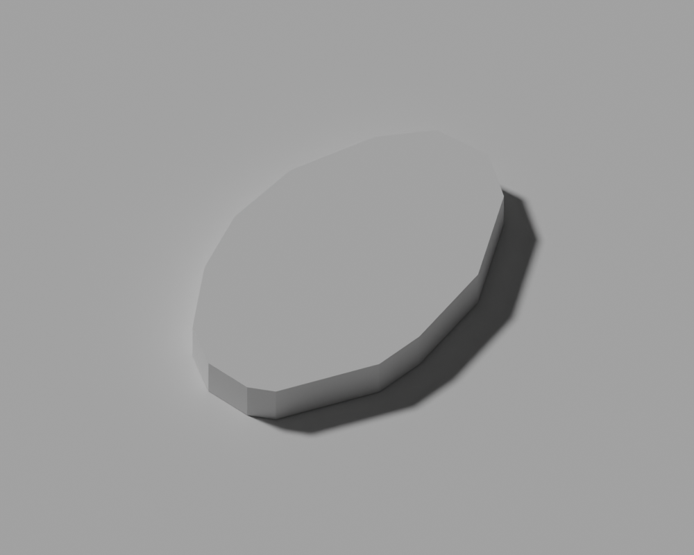

# P5：分区推广与建筑数据质量

最新林冠结果：已定位南湖精细补片与共享采样器不一致，新增修复及实际 Blender 候选检查；常量净空组的连续净空、竖直面及既有容差下覆盖已通过，新组合与整城验收仍在进行。见[连续净空、失败试验与后续步骤](URBAN_STRUCTURE_CANOPY.md)。

## 完整候选导出、建筑检查与林冠失败（2026-09-13）

`summary-fix-staging` 的十二步组合流水线已完成，完整 `.blend` 与两档 GLB 均导出成功，说明复合模板的概览高度倍率兼容修复已通过实际完整构建。候选仍未接入正式资产：完整预算失败，资产验证还发现林冠支承问题。

两档实际压缩城市中的 `Buildings_quality_` 均完成来源绑定、一一对应、法线/材质、建筑图层归属和完整屋顶覆盖检查：每档 1,874 栋、75,801 面、121 个院落开口。与最终支承盘点的 1,875 栋差一栋，是索引 652、`osm/6e25b5e140ca55f9ab6a` 按实际道路限高结果 `None` 被生产消费者省略；不是捕获遗失。125/126 个独立开口的旧统计包含正式可见性与道路筛选之前的对象，不能直接替代本次完整城市统计。这项检查不证明 317 个大高差场地已通过视觉复核。

完整资产验证通过青秀山两档林冠检查后，在后续林冠区域失败。复用生产验证器采样复现：nearby 精细/流畅有 32/62 个失败采样，all 有 2,471/4,038 个失败采样；流畅档最深约切入地形 27.69 m。这些是重心与边中点检查的失败采样数，不是独立树木数量或整个三角面的连续误差上界。原因是局部地形更新后，旧林冠仍按规则网格分面，仅在顶点查询新地面，跨过新坡折的面内仍可能切入地形。

已新增 `prepare_local_canopy.py`，在显式水库范围内按最终原生地形重切候选，保留林地覆盖、院落/清空区、树冠配置和范围外原面。五个回归用例通过，覆盖山脊穿插、院落保留、范围外保持、缺失地面拒绝、毫米接缝及不移动林地边界。直接按 float32 地形裁切的真实试算未通过：all/detail 缺失约 4.0449 m²，且新增约 1.3434 m² 重叠；部分缺口落在毫米以内的原生网格接缝及城市边缘。固定 2 mm 网格取整仍有约 0.9595 m² 缺口，两次试算均未接受。

随后仅对林冠裁切线合并相邻浮点坐标，实际最大单轴调整 0.954 mm，不修改地形或林地覆盖边界。新候选两档覆盖差异小于 0.000001 m²，nearby 和 all 的四组原失败采样均归零；青秀山原计划保持。范围外按原值复制 126,533 / 44,816 个面，林冠总面数净增 30,254 / 34,169。候选保存在 `work/urban-structure/p5/full-city-review/forest-candidate-aligned.json`。这证明了覆盖与生产采样的改善，还未证明实际压缩林冠的连续支承、边缘视觉及整城预算通过；不能据此接入正式模型或宣布 P5 完成。

本轮检查及失败记录见 [完整候选证据](urban-structure-quality/reservoirs/full-city-candidate/manifest.json)。TypeScript 全量类型检查和 lint 已通过；林冠修复后的实际导出、完整道路/地形/资产检查、同机位网页与性能复核仍待完成。

## 当前组合：道路、接路与最终建筑支承（2026-09-13）

在八组水库的当前地形上完成地面道路、高架、两档道路实体、仓储场地接路和最终建筑支承重建。旧道路上下文的输入已过期，因此从当前生产生成器重新捕获 32 个地标网格，再准备新的避让边界；没有直接复用旧障碍物记录。源水库注册表与跨水闸体记录保持。

| 实际检查 | 结果 |
| --- | --- |
| 基础足印测量 | 1,929 个记录；1,928 个有陆地覆盖，唯一不覆盖者是专用玲珑湖跨水闸体 |
| 普通候选的城市可见性 | 1,875 个可见，含 19 个四类模板体量；43 个由地标或铁路规则隐藏；11 座坝走专用分支 |
| 两档道路捕获 | 各 19,697 个楼体范围；全部可见候选包含在内，坝体不进入普通楼体捕获 |
| 最终接路前后楼体范围 | 1,875 个候选的基础底部与屋顶范围变化均为 0 m，并逐栋吻合两档道路捕获 |
| 仓储场坪附近道路 | 原生与实际压缩检查均无穿地；实际压缩最小净空约 0.799 m |
| 接路替换与共享采样 | 每档 16,600 点；28 个范围外网格的顶点、材质和角点法向保持，922 个外部采样点保持 |
| 接路实际压缩 | 每档 4,150 个土体面、330 个铺装/侧壁面逐面对应；土体顶点位移为 0，接路顶点最大位移约 0.012 mm |
| 接路口 | 两档高度误差约 0.927 / 0.748 mm；平面间隙约 0.143 mm；两座仓库足印覆盖且平整 |

证据：[依赖重建命令](urban-structure-quality/reservoirs/final-dependencies/road-rebuild-report.json)、[道路来源与楼体范围](urban-structure-quality/reservoirs/final-dependencies/road-provenance-audit.json)、[最终支承](urban-structure-quality/reservoirs/final-dependencies/final-support-audit.json)、[接路压缩与接触检查](urban-structure-quality/reservoirs/final-dependencies/access-export-audit.json)。

仍有 317 个可见候选的足印高差超过 5 m，已按高差排序形成[场地复核清单](urban-structure-quality/reservoirs/final-dependencies/large-relief-review-queue.json)。覆盖检查通过不能替代基础外观、平台及入口设计的视觉验收。龙门两项坝坡试算已退回，见[取舍记录](URBAN_STRUCTURE_RESERVOIRS.md#龙门坝坡候选取舍2026-09-13)。完整城市构建、26/18 MB 预算与整城视觉/交互验收继续推进，P5 未完成。

完整城市试建另发现两项依赖/兼容问题：竹溪立交细节仍绑定旧高架计划，已重新准备；汇总代码直接读取旧模板的 `displayHeightScale`，导致四类新模板在写出总览前失败。复合体块直接以米存储显示高度，现汇总缺省倍率为 1.0，并保留旧模板的显式倍率。实际五个街区、32 栋模板建筑逐项吻合消费端，两项回归测试通过。见[失败、修复与检查记录](urban-structure-quality/reservoirs/summary-compatibility/checks.json)。源码修改后正在独立 `summary-fix-staging` 重建来源绑定与完整城市；前述已验证 staging 保留，不能把回归测试当作整城导出已经通过。

2026-09-13 最新进展：自定义水面已接入统一动态材质和水域图层开关；两档 14 项浏览器记录、类型检查和 lint 通过，正式数据/模型保持。此检查使用实际生产地形与水面，不替代全城道路、楼体、林冠和最终预算验收。见[网页水面记录](URBAN_STRUCTURE_RESERVOIRS.md#自定义水面网页行为2026-09-13)。

2026-09-13 最新进展：八组水库的无恢复区域已返回原网格，生产地形与原生主干道路上下文实测节省约 3.98 / 4.10 MB；83 项测试和 64 张同机位前后对照完成。保留岸带、坝体和源高程保持，原网格内部插值差异有单独记录。正式完整城市及其他建筑/道路支承仍待验收。 见[本轮实现、对照与剩余范围](URBAN_STRUCTURE_RESERVOIRS.md#无恢复区域原网格保留2026-09-13)。

2026-09-13 专用结构进展：专用跨水结构已在生产分支中生成，11 座源坝不再进入普通楼体和道路建筑体积；79 项测试、两档实际结构压缩及 14 个视角复核完成。全城其他建筑的最终支承/道路捕获仍待完成。见[来源与当前验收](URBAN_STRUCTURE_RESERVOIRS.md#玲珑湖专用结构生产接入2026-09-13)。


2026-09-13 当前组合进展：八组水库共同运行时已生成两档生产地形，76 项测试和 36 个视角复核完成；场坪与地形前置依赖已重新准备。陡峭坝肩及岸坡、玲珑湖专用结构接入、最终道路/建筑/植被仍待完成。见[共同运行时](URBAN_STRUCTURE_RESERVOIRS.md#多水库共同运行时与依赖重建2026-09-13)。


2026-09-13 当前进展：玲珑湖独立两档湖岸与估计跨水结构已通过当前候选检查，66 项测试及 14 个视角复核完成；八组原生候选域互不重叠。尚未启用多水库整城运行时，正式 P4 资产保持。见[玲珑湖来源与验收](URBAN_STRUCTURE_RESERVOIRS.md#玲珑湖独立湖岸与跨水结构2026-09-13)。


2026-09-13 当前进展：东南 139/140、211/212 在两档原生与实际解码模型中共享边高差为零，212 的八岛保留，三个隔岸邻水保持原岸边高程。59 项测试、42 个固定视角完成；七组候选替换域无重叠。正式城市尚未接入，仍需坡度校准及 P5 全量验收。详见[相接水面闭合与隔岸邻水保持](URBAN_STRUCTURE_RESERVOIRS.md#相接水面闭合与隔岸邻水保持2026-09-13)。

2026-09-13 最新补充：龙门 470、西侧 543/548 完成独立两档原生/压缩检查，当前域内受影响邻水无遗漏；东南 139/211 的数据候选完成，但与 140/212 的直接水面接口尚未接好，完整岸边检查失败。新增全域邻水审计及接入检查，局部细化降低两湖显示高程插值误差，55 项测试和 46 个视角完成。正式资产保持；见[实际结果与未完成项](URBAN_STRUCTURE_RESERVOIRS.md#邻池补齐连接处细化与接入检查2026-09-13)。

2026-09-13 邻水补充：八个邻水源岸线与三组独立两档候选完成原生/压缩检查；两个连续水域的水面与岸坡已共享全部边界分段，51 项测试及 36 个视角复核完成。扩大范围后另发现五个受影响邻水，龙门坝肩及楞塘上湖连接处仍需校准。正式资产与活跃天雹 staging 保持；详见[当前结果、证据及剩余范围](URBAN_STRUCTURE_RESERVOIRS.md#八个邻水候选与共享岸边分段2026-09-13)。

2026-09-13 最新进展：已完成其余八坝的源岸线候选，七座陆上坝形成六组独立两档模型；42 项针对性测试、实际原生/压缩几何和 26 个视角复核通过当前候选范围检查。八个邻水界面、玲珑湖跨水坝、多水库接入、全城预算与浏览器验收仍未完成，见[完整记录](URBAN_STRUCTURE_RESERVOIRS.md#其余八坝的源岸线与六组地形候选2026-09-13)。正式资产保持 P4，P5 保持实施中。

状态：实施中。当前完成建筑数据候选、普通建筑内洞消费端及独立压缩几何检查，以及[住宅/商业/校园/工业首批模板候选](URBAN_STRUCTURE_ROLLOUT.md)，尚未接入正式城市资产。场地支承、模板正式接入，以及滨水、地形规则推广，仍属于本阶段必需范围。

最新进展：[天雹共享地形与城市生成器接入](URBAN_STRUCTURE_RESERVOIRS.md#天雹共享地形与城市生成器接入2026-09-13)已在隔离目录启用；两档实际地形/岸墙共 31,521 面与压缩上下文一一对应，五个原生湖面保留七个岛洞。共享高度、范围外 RNG、重叠补片及坝体排除的针对性检查通过。完整城市、其余水坝及最终预算仍待完成。

[天雹岸线候选](URBAN_STRUCTURE_RESERVOIRS.md#天雹源岸线候选2026-09-13)已恢复主库源岸线和三坝足印，保留七个岛洞，增加 120 个水面三角面；序列化及九项岸线测试通过。现已替换 staging 活跃数据，正式目录仍保持 P4。

[水坝全量盘点](URBAN_STRUCTURE_RESERVOIRS.md)发现 staging 全部建筑中有 11 个水坝，历史记录的 3 个仅是新候选子集，另 8 个仍沿用旧普通楼房分支。7 个水库得到未应用的 DSM 显示水位候选，不能把旧 16 m 回退高度当作坝高。

[源岸线恢复与实际支承验证](URBAN_STRUCTURE_SHORELINES.md)已完成三处水域和两栋源足印恢复，实际两档地形中 1,921 个足印均通过现有覆盖容差；1,918 栋可处理建筑与水面通过独立压缩检查。下文关于两个临水缺口及三个候选坝体的诊断为此前范围记录。完整水坝范围、场地设计及完整城市集成仍待完成。

## 建筑放置与道路一致性（2026-09-13）

主源码已加入 `building_placement.py`，普通质量候选与复合体量共用完整足印支承：楼层底面取两档最高支承以上 0.2 m，基础底部取最低支承以下 0.5 m。道路准备使用同一体量范围，并复用 `CityVisibility`。基础延伸只解决几何覆盖，不证明入口、平台或挡墙的设计成立。

道路结果现在保存全部捕获建筑的索引、稳定 ID、底部与屋顶高度，包括没有发生限高的建筑；同时绑定捕获脚本、城市生成器、放置规则和完整高度清单。最终生成建筑前逐栋核对，超过 5 mm 的支承变化要求重新准备，不能只检查被限高的记录。被道路隐藏的候选也先校验来源。捕获阶段拒绝依赖最终道路结果的支承计划，以免形成循环依赖。

依赖顺序为：**基础地形 → 基础足印支承 → 道路准备与实体求解 → 接路与最终地形 → 最终足印支承 → 建筑核对及城市导出**。上下游支承分别冻结保存；最终支承不能回流作为道路捕获输入。

| 实际检查范围 | 结果 |
| --- | --- |
| 独立 Blender 放置导出 | 1,916 个可处理候选，含 19 个模板体量；77,662 个实际三角面 |
| 实际 GLB 解码 | 三角面一一对应、材质与绕序保持；顶点最大偏移 0.02615 m、角点法向最大差 0.11543° |
| 院落开口 | 126 个，含校园模板的 1 个开口 |
| 全候选大高差复核标记 | 322 个；不是已通过场地验收 |
| 按城市可见性筛选 | 43 个被场地或铁路规则隐藏；1,873 个可见候选完成基础/最终支承体量对照 |
| 基础与接路后体量差 | 最大值 0 m，19 个模板均在对照内；可见候选中有 316 个大高差复核标记 |
| 尚未处理 | 3 个水坝、2 个临水足印；完整道路捕获与最终城市仍待完成 |

证据：[实际导出](urban-structure-quality/building-placement/export-report.json)、[实际压缩检查](urban-structure-quality/building-placement/export-audit.json)、[基础/最终体量对照](urban-structure-quality/building-placement/road-envelope-audit.json)、[11 项测试与编译检查](urban-structure-quality/building-placement/checks.json)。五项正式数据/模型文件已重新逐字节散列核对，[仍匹配 P4](urban-structure-quality/building-placement/formal-assets-unchanged.json)。

这些证据有明确边界：独立导出来自冻结 staging 中的建筑消费端与实际支承；本轮体量对照使用当前主源码中的共享规则。新的主城市构建分支和完整道路捕获尚未在 staging 重新执行，不能把独立导出或体量一致视为整城接入完成。

### 两处支承缺口的岸线来源诊断

进一步对照原始 OSM 快照，缺口主要来自旧水域轮廓的 7.5 m 简化；另一栋楼还受到建筑轮廓简化影响。下表为模型平面面积，源几何也经过项目投影和 10 cm 存储精度处理，不是实测面积。

| 建筑 | 候选建筑与显示水域重叠 | 候选建筑与源水域重叠 | 源建筑与源水域重叠 |
| --- | ---: | ---: | ---: |
| 霁霖阁饭店，OSM way 651997945 | 44.637 m² | 0 m² | 0 m² |
| 未命名建筑，OSM way 923687037 | 88.877 m² | 0.152 m² | 0 m² |

饭店邻接天池（relation 4448134）；未命名建筑邻接两个池塘（way 923687040、923687041）。应恢复这些岸线及第二栋楼的源足印关系，然后重建地形和支承。现有数据不支持直接为它们添加水上桩基或用补土掩盖缺口。

三个水坝的源标签均包含 `building=dam` 与 `waterway=dam`，旧 16 m 高度来自普通楼层回退，不能当作坝高。前两个邻接天雹水库，第三个邻接未命名水库；应采用单独的坝体、库岸与地形处理。完整来源、重叠面积及源轮廓保存在[岸线诊断](urban-structure-quality/building-placement/shoreline-diagnosis.json)。本轮诊断尚未改动水域、建筑足印或地形。

复现本轮体量对照与岸线诊断：

```sh
work/venv/bin/python scripts/audit_building_road_envelopes.py \
  --scene-root work/urban-structure/p5/staging \
  --base-support work/urban-structure/p5/staging/work/p5/retaining-base-support.json \
  --final-support work/urban-structure/p5/staging/work/p5/retaining-access-support.json \
  --output work/urban-structure/p5/building-road-envelope-audit.json
work/venv/bin/python scripts/audit_building_shorelines.py \
  --geography work/urban-structure/p5/staging/public/data/geography.json \
  --support work/urban-structure/p5/staging/work/p5/retaining-access-support.json \
  --osm work/geodata/osm.json \
  --envelope-audit work/urban-structure/p5/building-road-envelope-audit.json \
  --output work/urban-structure/p5/building-shoreline-diagnosis.json
```

2026-09-13 已进入隔离的 P5 城市生成流程：仓储场坪通过两档原生与实际压缩检查，两座仓库完整足印在新地面上的高差均为零。详见[场坪实际接入记录](URBAN_STRUCTURE_GRADING.md)。道路依赖与接路继续重建；其他用途的高差、两个临水足印、四类体量和普通建筑支承仍需接入验收。正式资产保持 P4。

## 建筑支承计划读取（2026-09-13）

新增 `blender/building_support_plan.py`。准备脚本可通过 `--context-sources` 把测量结果绑定到当前地形上下文、地理、地形和相关构建来源；读取时同时校验两档 GLB 哈希、完整足印哈希以及两档实际高程范围。旧测量不能只改路径后用于新模型，地面覆盖不足也不能退回建筑中心点采样。

隔离 P5 的实际计划共有 1,921 个记录，读取器接受 1,919 个，并拒绝两个已知临水足印；四类模板的 19 个完整足印范围均成功读取。见[实际读取与拒绝记录](urban-structure-quality/grading/integration/support-reader-audit.json)。四项读取器测试验证了两档范围合并、足印变化、覆盖不足、伪造范围及过期来源/模型；原有七项地面测量测试继续通过。

仓库预览已使用该读取器与 `build_compound`，主城市构建器的 P5 复合体量分支、普通建筑完整支承及对应道路限高仍须接入。该读取器只验证测量来源和覆盖，不会把住宅/商业的较大足印高差自动解释为可接受的高基础墙。

## 普通建筑内洞消费端（2026-09-13）

`blender/mapped_buildings.py` 已接入城市生成器的 `qualityGeometry` 分支，生成外墙、院落内墙及保留开口的屋顶。精确建筑按整栋归入空间分块，以免同一栋楼跨越不同 Draco 量化网格；其独立子批次使用 18 位位置精度，并挂在原 `Buildings` 图层下。P4 数据没有该标记，不启用该分支；正式资产尚未替换。

实际压缩试验发现并处理了三类问题：旧 14 位量化使候选顶点最多偏移约 0.49 m；先三角化再存为 float32 会造成近共线屋顶重叠；按每个面分块会在同一屋顶上引入量化接缝。现在先在 Blender 存储精度下生成 `meshRoofTriangles`，通过翻转凸四边形内部对角线改善瘦长三角形，再以整栋分块导出。边界顶点、院落和来源轮廓不变，旧版缺少该字段的质量候选会要求重新准备。

| 独立消费端检查 | 结果 |
| --- | --- |
| 实际生成记录 | 1,902 栋，包含最终可能被基础设施隐藏的记录 |
| 院落开口 | 97 栋建筑、125 个内环全部保留 |
| 原生与 Draco 三角面 | 77,430 面一一对应，材质与绕序保持 |
| 压缩顶点最大偏移 | 0.02472 m；检查上限 0.05 m |
| 角点法向最大差 | 0.1348°；检查上限 0.5° |
| 屋顶覆盖 | 逐栋双向覆盖、院落内部无封盖、无退化/反向屋顶，重叠面积小于数值容差 |
| 独立候选 GLB | 650,312 字节；比最初 14 位原型增加 195,296 字节 |

该体积增加必须计入最终预算；不能只引用地形节省的 194,600 字节。二者是不同独立场景的试验值，均不代表整城最终净增减。原生覆盖按 5 mm、解码覆盖按 5 cm 边界容差检查，屋顶重叠数值容差为 0.00001 m²。

证据：[消费端与候选摘要](urban-structure-quality/mapped-consumer/summary.json)、[原生/压缩检查](urban-structure-quality/mapped-consumer/audit.json)、[全量数据检查](urban-structure-quality/mapped-consumer/candidate-data-audit.json)。14 项建筑数据、7 项消费端及 6 项压缩对应测试通过；共享 Batch 改动后，两档默认地形数组与调色随机状态仍与重构前一致，见[默认生成回归](urban-structure-quality/mapped-consumer/default-terrain-parity.json)。

最新单独建筑候选为 `work/urban-structure/p5/quality-stable-mesh-candidate.json`；合并四类模板后为 `work/urban-structure/p5/rollout/stable-mesh-candidate.json`。已逐字段确认：相对此前合并候选，仅新增 `meshRoofTriangles`，足印、高度、模板布局、范围外数据均一致。此前候选和审核记录保留为历史证据。

已保存环形建筑与资源环境与材料学院两组同机位灰模对照，见[预览记录](urban-structure-quality/mapped-consumer/previews.json)。这些是原生消费端在平基底上的几何对照，不是实际城市场地验收。




**本节记录的是较早的平基底试验。** 后续共享放置与实际支承进展见上文；陡坡建筑入口、异常场地、基础设施与正式资产仍未完成验收。

复现消费端（工作目录为项目根目录；输出为候选文件）：

```sh
work/venv/bin/python scripts/prepare_building_quality.py --input work/urban-structure/baseline-p4/public/data/geography.json --output work/urban-structure/p5/quality-stable-mesh-candidate.json
/opt/homebrew/bin/blender --background --factory-startup --python blender/check_mapped_buildings.py -- --candidate work/urban-structure/p5/quality-stable-mesh-candidate.json --output work/urban-structure/p5/mapped-final-consumer
work/venv/bin/python scripts/check_mapped_building_exports.py --directory work/urban-structure/p5/mapped-final-consumer --candidate work/urban-structure/p5/quality-stable-mesh-candidate.json
work/venv/bin/python scripts/test_building_quality.py
work/venv/bin/python scripts/test_mapped_buildings.py
work/venv/bin/python scripts/test_reduced_terrain_exports.py
```

最新进展：[仓储场坪与过渡地形候选](URBAN_STRUCTURE_GRADING.md)已形成两仓共用平台，并按 P4 实际道路边界生成西侧车道、替换其下方地形。新增五项接路检查、原七项场坪回归及十二张含道路的独立预览通过；陡峭边缘、最终道路依赖重建和正式场景接入仍待处理。

## 当前候选

输入为不可覆盖的 `work/urban-structure/baseline-p4/public/data/geography.json` 和既有 OSM 快照 `work/geodata/osm.json`。来源时间为 2026-09-08T06:56:02Z，输入及脚本指纹见[候选数据审计](urban-structure-quality/candidate-data-audit.json)。候选文件位于 `work/urban-structure/p5/quality-candidate.json`，未替换 `public/data/geography.json`。

| 内容 | 当前候选结果 |
| --- | --- |
| 检查的 OSM 建筑 | 6,035 条 |
| 轮廓改变 | 1,808 条 |
| 含内洞的建筑 | 97 条；候选屋顶三角形保留开口 |
| 需要三维消费端处理 | 1,902 条，包括轮廓、高度变化与内洞 |
| 保留有来源高度 | 556 条，已有高度数值不变 |
| 邻近同用途高度估计 | 126 条，其中 90 条改变数值、36 条仍为原值 |
| 缺少足够依据的估计 | 5,353 条，继续保留旧值及明确的回退原因 |

这些计数描述输入记录，不等于最终可见建筑数量。地标、铁路和道路仍会隐藏部分普通建筑。二维候选改善也不代表三维场景已经改善。

## 轮廓规则

[规则配置](../data/building-quality-source.json)将小于 400 m²、普通、至少 10,000 m² 的建筑简化容差分别设为 0.25、0.75、1.5 m；具名建筑和部分文化/教育用途上限为 0.5 m。结果须保持内环数量及有效几何，简化前后对称差面积不得超过来源面积的 2%。未达标时递减容差，不能靠放宽误差门槛接受结果。

候选按冻结输入自身的坐标中心与边界投影，保留原建筑 ID、数组顺序和来源引用。旧补楼、道路、水域、树木及其他非建筑字段未改变。配色回放读取变化前的建筑，防止足印改变导致可见性判定和随机数消费偏移。

[同尺度轮廓对照](urban-structure-quality/footprint-comparison.svg)按每行相同范围展示旧轮廓、来源与候选，覆盖院落、复杂校园、高顶点轮廓和小型建筑。它用于检查平面变化，不是正式模型截图。

## 高度规则

仅使用原始快照中有高度或楼层标签的邻近同用途建筑作为依据；估计结果不加入后续候选的依据池。范围为 500 m，至少 3 个不同 OSM 来源，最多取最近 7 个来源。多部件记录只计一个来源；排除自身、过远来源和高度差异过大的组别。

接受估计时使用高度中位数，记录来源引用、来源高度和距离；未知用途、邻居不足或邻居高度比超过 2.5 时保留旧值。显示用的建筑高度放大在模型端处理，不写入来源高度。OSM 标签与邻域推断均不属于测绘验证。

## 验证结果

- 12 项针对性测试通过：小型窄翼与凹角、内洞屋顶覆盖、误差收紧、分级容差、无效高度、已知值保留、禁止估计级联、来源去重、自身与距离排除、用途与离散度回退、稳定排序、冻结输入投影与范围保持。
- 原有 4 项住宅样板测试通过，包含配色槽位、重复生成、避让、庭院和地面支承。
- 全量检查 6,035 条候选：源轮廓误差、内环数量、屋顶覆盖与无重复覆盖、已知高度、估计来源证据、ID/顺序、非建筑字段保持通过；扩大后的映射外环与旧程序补楼相交数为 0。
- 两次完整候选生成逐字节一致，见[重复生成记录](urban-structure-quality/determinism.json)。轮廓对照已在浏览器渲染并复核；这不属于三维场景验收。
- `git diff --check` 与相关 Python 文件编译检查通过。
- 正式地理/地形数据和两档 GLB 与 P4 基线一致。未执行 P5 三维导出、道路依赖重建、正式场景视觉/交互或运行性能验收。

## 资源约束与接入前工作

新增[几何预算试算与接受条件](URBAN_STRUCTURE_BUDGET.md)：压缩/原生地形角度合并未通过接入条件，已修正自叠合引起的高程误差误判并通过七项解析测试。该工作尚未为正式资产释放预算。

2026-09-13 新增误差受限的逐点简化：5/10/20 cm 流畅候选分别减少 17,546 / 26,132 / 34,524 个面，三档均通过独立原生几何审计，新增 12 项测试通过。20 cm 档保留作下一步统一地面采样与依附物重建的候选；两组同机位局部预览已形成，尚未正式导出或完成城市验收。

当前 P4 资产的实际 glTF 索引计数见[基线预算](urban-structure-quality/baseline-budget.json)：精细/流畅版非基础设施面数为 1,618,541 / 991,859，上限严格小于 1,650,000 / 1,000,000。到排他上限的余量为 31,459 / 8,141 个三角面。文件余量分别为 420,140 / 362,940 字节。

按全部候选足印直接挤出外墙、内墙和屋顶，预计从 90,497 增至 125,108 个三角面，净增 34,611。这是未应用可见性筛选、未加入地面支承的几何估计，不能直接加到正式模型总量上；它已足以说明必须在接入前核算和优化几何分配。保留原预算，不能以关闭院落或放宽来源误差来掩盖成本。

后续按下列范围继续，完成前不将 P5 标为结束：

1. 内洞屋顶已完成独立消费端检查，继续实现基于最终两档地形的地面支承和异常场地处理，以实际可见导出测量净面数；在保留轮廓特征、组团和既有样板的前提下优化资源分配。
2. 住宅、商业、校园、工业首批候选已生成，见[范围与体量检查](URBAN_STRUCTURE_ROLLOUT.md)；继续核对实际场地并接入正式模型，完成各用途模板验收。
3. 按小批次推广已经验证的滨水与地形方法，每批保存来源、影响范围、前后对照和范围外回归。
4. 按完整依赖链重建地理、道路、铁路、林冠等数据与可编辑模型、两档 GLB；不得只修改输入哈希后复用不匹配的中间结果。
5. 完成实际压缩几何、资源预算、固定镜头、图层/选择/画质切换和同条件性能检查；同步最终覆盖清单、限制与公开资产。

## 实际地形与可见性盘点（2026-09-12）

新增 [接入盘点摘要](urban-structure-quality/integration-inventory-summary.json)。输入为四类街区合并候选、P4 两档实际压缩模型、原道路/铁路排除清单。`prepare_building_support.py` 解码实际地形三角面，按完整足印（含内洞）裁切并求高程极值；没有用建筑中心点或未显示的双线性高程代替实际地面。仅允许 5 cm 的压缩接缝容差，更大的覆盖缺口单独列出。

| 项目 | 盘点结果 |
| --- | --- |
| 测量足印 | 1,921 个：1,902 个映射候选、19 个新模板体量 |
| 应用现有避让后可见候选 | 1,877 个 |
| 可见且有完整地形覆盖 | 1,875 个；覆盖通过不等于入口或平台设计通过 |
| 可见但地形覆盖不完整 | 2 个 |
| 可见足印内高差超过 5 m | 322 个，需区分用途和场地原因 |
| 可见基础挤出净增 | 33,810 个三角面，包含四类模板替换；仍是接入前估计 |
| 既有建筑因足印变化而改变可见性 | 0 个，按当前地标与 P4 基础设施排除规则 |

道路和铁路索引先映射到 **P4 建筑稳定 ID**，再用于候选，避免删除程序楼后错位。掩码与 P4 地理哈希匹配，但它们并未针对新足印、平台和高度重新计算；这次盘点不能替代正式依赖重建。两档中的任一隐藏标记均生效，正数限高取更低值。

地形覆盖不完整的两个记录为 `osm/way/651997945`（霁霖阁饭店）及 `osm/way/923687037`（未命名建筑）。候选足印分别与现有映射水域重叠约 44.64 / 88.88 m²，与实际地面缺口量级一致，因此不能简单把地形洞填满；需要核对临水建筑及岸边结构。原始快照还确认高差最大的两个长足印同时标记 `building=dam` 和 `waterway=dam`，不能把水坝按普通住宅场坪整体压平。

四类模板中，两处仓储足印的两档联合高差约 15.47 / 16.02 m，住宅最高约 7.40 m、商业约 6.16 m、校园约 4.25 m。这些值基于旧 P4 地形，下一步优先建立仓储场坪与过渡地形，再处理其他模板的平台、入口和道路连接；新城市用地掩码也会改变显示地形，必须重新测量。高基础裙墙本身不能作为场地问题已解决的证据。

可见性逻辑已提取到 `blender/city_visibility.py`，供城市生成与离线盘点共用。验证使用固定提交 `73edbb7` 的原始排除谓词和现有 P4 场地多边形规则，覆盖全部当前建筑、铁路隐藏、具名替换、边界及其两侧微小偏移。测试发现并修复了坐标乘法重排引起的边界判定变化。新模块也加入后续道路捕获的来源指纹。

当前验证包括 3 项可见性、7 项地形支承和 4 项接入盘点测试。正式 P5 导出、场坪、滨水扩展、资源优化及浏览器验收仍未完成。

复现新增盘点：

```sh
work/venv/bin/python scripts/prepare_building_support.py \
  --geography work/urban-structure/p5/rollout/candidate.json \
  --detail work/urban-structure/baseline-p4/public/models/nanning-city.glb \
  --smooth work/urban-structure/baseline-p4/public/models/nanning-city-mobile.glb \
  --output work/urban-structure/p5/rollout/support-p4-terrain.json
work/venv/bin/python scripts/audit_building_integration.py \
  --before work/urban-structure/baseline-p4/public/data/geography.json \
  --candidate work/urban-structure/p5/rollout/candidate.json \
  --support work/urban-structure/p5/rollout/support-p4-terrain.json \
  --output work/urban-structure/p5/rollout/integration-inventory.json \
  --summary docs/urban-structure-quality/integration-inventory-summary.json
work/venv/bin/python scripts/test_city_visibility.py
work/venv/bin/python scripts/test_building_support.py
work/venv/bin/python scripts/test_building_integration.py
```

## 复现候选

在仓库根目录运行，Python 环境需包含本项目已有的 Shapely、NumPy、mapbox-earcut 等依赖：

```sh
work/venv/bin/python scripts/prepare_building_quality.py \
  --input work/urban-structure/baseline-p4/public/data/geography.json \
  --output work/urban-structure/p5/quality-candidate.json
work/venv/bin/python scripts/test_building_quality.py
work/venv/bin/python scripts/test_urban_blocks.py
work/venv/bin/python scripts/check_building_quality.py \
  --before work/urban-structure/baseline-p4/public/data/geography.json \
  --candidate work/urban-structure/p5/quality-candidate.json \
  --snapshot work/geodata/osm.json \
  --output docs/urban-structure-quality/candidate-data-audit.json
work/venv/bin/python scripts/plot_building_quality.py \
  --before work/urban-structure/baseline-p4/public/data/geography.json \
  --candidate work/urban-structure/p5/quality-candidate.json \
  --snapshot work/geodata/osm.json \
  --output docs/urban-structure-quality/footprint-comparison.svg
```

以上命令仅处理候选与审计产物，不构建正式模型。

## 林冠边界与检查工具后续（2026-09-13）

南湖采样组合已完成 12 步重建，原始完整模型约 30.33 / 22.51 MB。新的完整资产检查发现微小林冠碎面；同机位浏览器发现原生 T 形接点形成的白缝。已完成源候选清理、相邻边界分割，以及四组实际林冠连续净空和覆盖检查。新来源绑定的整城组合仍在重建，不能将独立原生通过视作正式 P5 完成。

检查页已增加植被开关、链接恢复和参数记录。三项检查页测试、类型、lint、`npm run build:pages` 通过；八张实际浏览器对照验证关闭、刷新恢复、重新开启，恢复画面哈希一致。龙门原机位中央首先命中前景树木；无遮挡复查后坝肩折面与凹槽仍待核对。[详细结果及后续](URBAN_STRUCTURE_CANOPY.md#整城组合与南湖边界裂口2026-09-13)。

## 完整候选导出精度与待重建范围（2026-09-13）

林冠边界补齐后的 `conforming-integration` 已完成 12 步完整组合；六组原生林冠检查通过，完整资产校验随后在文件预算处停止。独立解码实际 GLB 后四组林冠仍未通过覆盖与净空，进一步试验证明林冠默认量化和地形边界量化均需处理。现有 24 个浏览器对照仍见其他细白缝，不能以原生检查替代最终网格验收。

四组保留原始位置的独立林冠导出已通过位置零偏移、面数、材质、绕序、法线和净空检查；对旧地形的覆盖仍失败。当前普通地形 24 位精度与林冠原位编码组合正在 `precision-rebuild` 从源数据重建。首轮直接导出被旧建筑支承来源检查拒绝，拒绝记录已保留。

旧完整候选共享位置编码后仍超预算；新的精细档地形减面试算虽减少 61,160 面，但尚未组合。详细结果见[林冠精度](URBAN_STRUCTURE_CANOPY.md#实际压缩林冠与地形边界精度2026-09-13)、[预算](URBAN_STRUCTURE_BUDGET.md#林冠边界修复后的完整候选预算2026-09-13)及[归档清单](urban-structure-quality/reservoirs/canopy-export-precision/manifest.json)。最终压缩网格、道路桥梁、317 个高差场地、四类模板的完整场景、滨水/山体推广、交互和性能检查仍须继续，P5 未完成。

## 精度组合验收与道路预期范围诊断（2026-09-13）

`precision-rebuild` 全部 12 步成功，四组 nearby/all 实际压缩林冠通过覆盖与净空检查；24 份完整模型浏览器记录无脚本错误，部分细白缝仍需全域边界共点处理。该共点候选的组合预览消除了所检南湖东侧两条细白缝，但三组独立导出尚未通过严格面数/法线对应，仍未接入正式资产。

对新精度完整资产单独运行道路校验，detail 连续道路/地形和标线/道路检查通过，随后在“导出超出预期铺装边界”处失败；链式桥梁校验未执行。后续诊断使用来源校验通过的当前接路计划：两档各有约 **479.222 m²** 超出旧道路预期范围，加入已声明的约 **481.622 m²** 新中智慧园接路后，超出面积均为零。这证明当前失败与校验器遗漏新增接路范围有关；尚未修改校验器，也未将局部范围诊断记成完整道路验收。

下一步将来源绑定的接路范围纳入道路验收，并补齐该范围的水域、建筑、植被避让及实际支承检查，保持原有容差；再完成桥梁与其他整城检查。预算仍未通过，青秀山压缩模型、317 个高差场地、四类模板、滨水/山体推广、完整网页交互与性能均继续保留。参见[本批模型与验证清单](urban-structure-quality/reservoirs/precision-complete/manifest.json)。


## 完整道路与桥梁验收补齐（2026-09-13）

接续上一节的范围诊断，地面道路校验现接受明确的 `--scene-root` 与 `--site-access-plan`，通过接路计划的输入指纹验证当前来源，并核对两档声明、实际节点、材料、铺装和侧墙。旧城市没有新增接路时仍可不传该计划；声明了接路却未提供来源时直接拒绝。

两档完整地面道路校验均已通过。新中智慧园接路各有 **260 个铺装面、70 个侧墙面**，与来源逐面一一对应；最大位置偏差 **0.011921 mm**，铺装面几何法线最大偏差分别为 **0.004259° / 0.008515°**，侧墙方向保持。来源与实际铺装均检查水域、建筑、地标、林冠及保留树冠避让；完整地形支承在既有 **2 mm** 覆盖容差外的缺失面积为零。

接路在院落边缘按设计接触准备后的土面，单独使用既有 **0.2 mm** 导出位置上限判断接触误差；smooth 的最小计算净空为 **−0.000687 mm**。普通道路仍执行严格正净空要求，detail/smooth 最小净空分别为 **0.0462 / 0.4788 m**，标线相对道路最小净空为 **0.1978 / 0.1979 m**。原道路范围、重叠和量化裂缝门槛均保留。

独立桥梁检查也已通过：**13 座桥梁、28 段替换道路**，两档主体结构各 152,342 面，细节分别 162,678 / 55,742 面。该结果仅覆盖道路与桥梁，不等于预算和整城资产验收通过。

新增六项接路验收回归通过，覆盖缺失节点、错误声明、移动铺装或侧墙、反向面、支承空洞及超限穿土；既有四项接路来源测试、Python 编译和差异检查通过。原始失败与修复后完整记录见[本批归档](urban-structure-quality/reservoirs/road-access-canopy-diagnosis/manifest.json)。P5 的林冠导出、预算、青秀山实际压缩模型、场地及整城网页验收继续保留。

复现本批道路检查：

```sh
work/venv/bin/python scripts/validate_ground_roads.py \
  --scene-root work/urban-structure/p5/reservoirs/integration/budget/canopy-conforming-staging \
  --site-access-plan work/urban-structure/p5/reservoirs/integration/budget/canopy-conforming-staging/work/p5/precision-rebuild/access-plan.json
```
