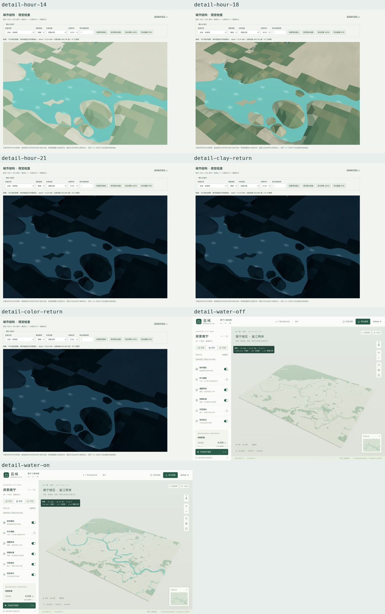
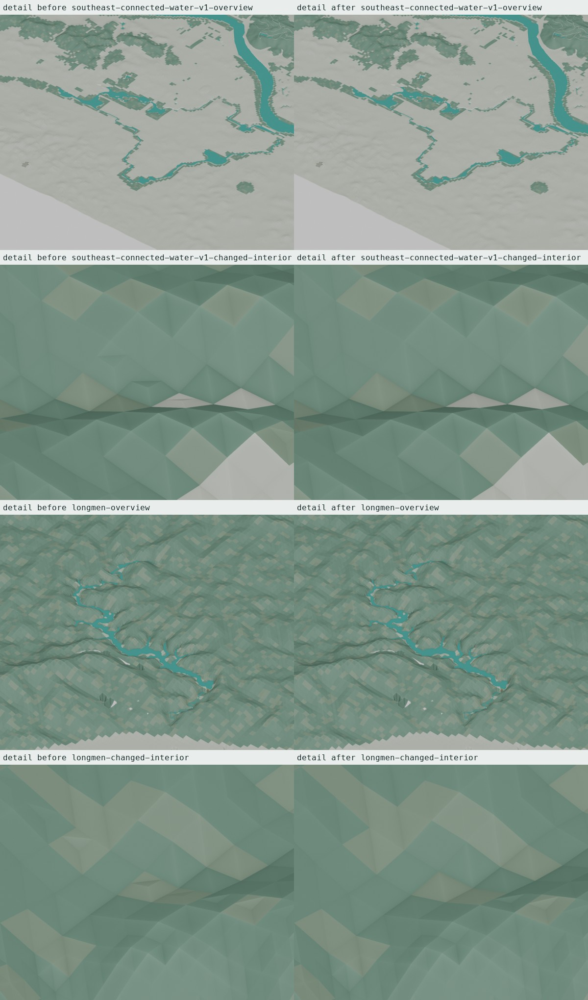
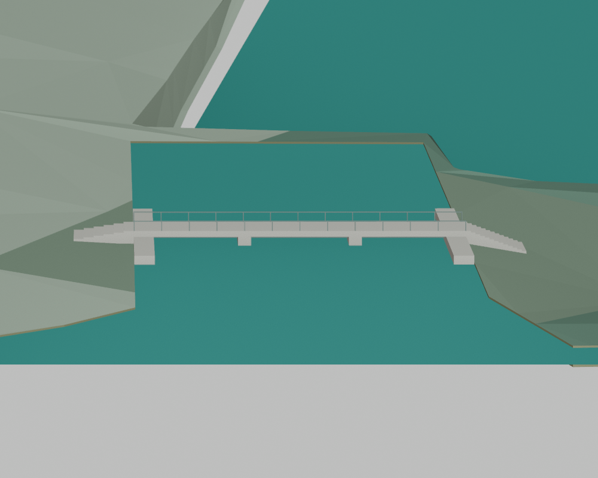
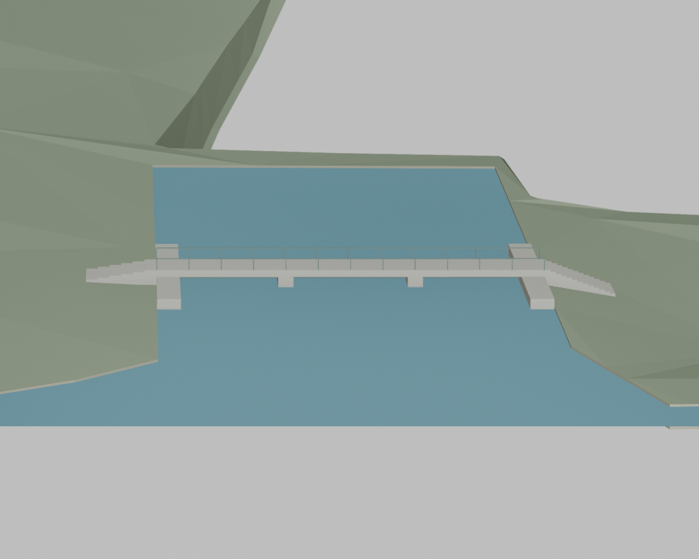
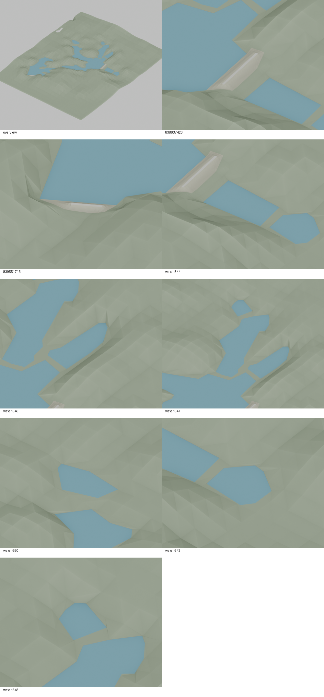
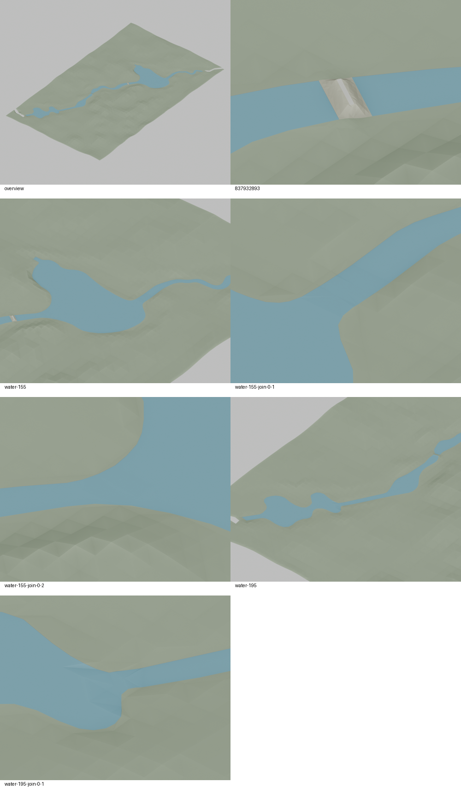
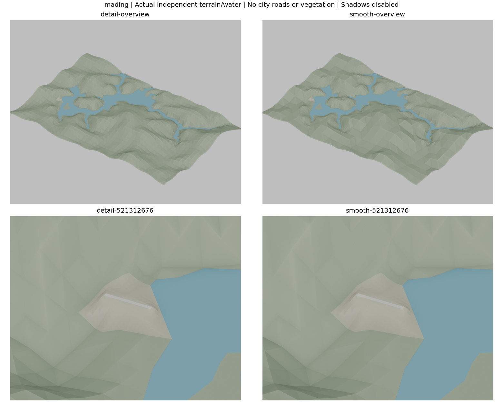
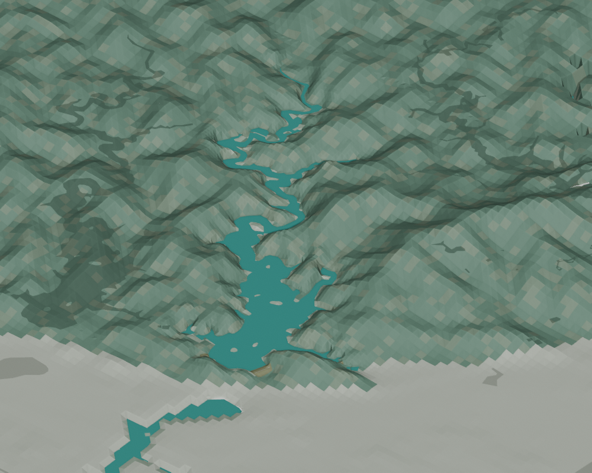
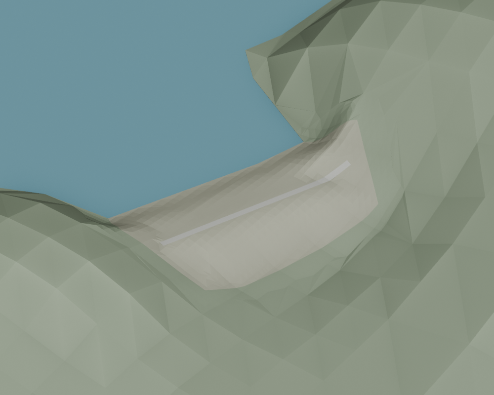

# P5：水坝全量盘点与水库高程来源

## 龙门坝坡候选取舍（2026-09-13）

两项试算均未接入。现有候选在源坝足印内存在陡坡，线性衔接与缩窄估计坝顶都降低了部分面积上的坡度，却使局部最大坡度上升。统计限定为水平投影面积至少 1 m² 的坝坡三角面；下表为含 1.35 倍地形夸张的显示升高/水平距离，不是工程坡比。

| 方案 | 最大显示坡度 | 证据范围 | 决定 |
| --- | ---: | --- | --- |
| 当前 4 m 坝顶、端部退让 5 m | 10.1583 | 两档实际原生模型 | 保留当前候选，陡坡视觉复核仍待完成 |
| 同坝顶的线性衔接 | 10.5074 | 两档实际原生试算 | 不接入 |
| 3 m 坝顶、端部退让 7 m | 10.8577 | 全权重坝面目标场试算，尚未原生导出 | 不接入 |

源水域与坝足印保持。坝顶宽度、退让和局部水位均继续标为显示估计，不据此认定工程坝型。线性试算模型早于其后一次边界容差调整，归档只比较实际原生数组，不能把后来的计划文件当作该模型的对应来源。

见[判定、输入哈希与局部最陡面坐标](urban-structure-quality/reservoirs/longmen-slope-trials/decision.json)及[复现脚本](urban-structure-quality/reservoirs/longmen-slope-trials/decision_audit.py)。下一步先完成当前候选的道路、场地和建筑组合，再在完整场景中复核陡坡；该决定不构成坡面视觉验收通过。

## 自定义水面网页行为（2026-09-13）

`scene.ts` 现在让 `Water` 与 `Reservoir_water_custom` 共用一个动态水材质，统一更新水面时间和昼夜参数；自定义水面也加入“河流湖泊”图层开关。两个节点均不投射水面阴影，既有材质释放与检查模式恢复机制继续使用。

验证从当前生产地形快照导出两档真实地形/水面 GLB，通过本地浏览器请求替换加载，正式模型文件保持。检查页验证 14:00、18:00、21:00 的两类水面共用着色程序并接收一致的昼夜参数；灰模、基础颜色返回完整光照后仍恢复该行为。主页通过实际控件切换两档画质和水域图层，关闭后额外触发一次场景重绘，水面绘制次数仍为零，重新打开后两类水面恢复。精细档记录到约 0.68 秒的水面动画推进。

共完成 14 项浏览器记录与 14 张截图，无浏览器错误；`npm run typecheck` 及受影响源码/检查脚本的 lint 通过。Vinext 的 `/_next/mcp` 返回 404，未获得 Next 专用框架内省；本机未安装 agent-browser，沿用已有 Playwright/Chrome 执行真实页面检查。



[浏览器记录](urban-structure-quality/reservoirs/water-web/browser-report.json)、[模型来源](urban-structure-quality/reservoirs/water-web/models.json)、[静态检查](urban-structure-quality/reservoirs/water-web/checks.json)、[视觉范围](urban-structure-quality/reservoirs/water-web/visual-review.json)及[流畅档截图](urban-structure-quality/reservoirs/water-web/smooth-contact.jpg)已归档。截图中的 10.24 / 6.62 MB 来自只含地形与水面的测试 GLB，不是完整城市预算。尚未纳入完整楼体、街道、林冠、底座、专用水闸和最终组合性能，本次不替代 P5 总体验收。

## 无恢复区域原网格保留（2026-09-13）

八组水库已在新的隔离运行时重新准备，启用 `preserveInactiveBaseCells`。仅选择完整的 2×2 原网格单元：全部顶点修复权重为零、不涉及坝体材质、不接触源水域，而且不切开已有三角面。连续单元合并为矩形排除范围，沿用已有替换域与共享采样机制。

实际恢复 3,542 个单元，移除 113,650 个密集陆地三角面，补回精细 / 流畅各 28,336 / 7,084 个原网格面。八组剩余陆地合计 79,582 面，岸壁仍为 21,976 面；水面、坝体参数、保留顶点的高程及修复权重逐项保持。清单仍包含 28 个目标水体和全部 11 座坝的专用归属。

| 实际地形与原生主干道路上下文 | 精细档 | 流畅档 |
| --- | ---: | ---: |
| 优化前 GLB（字节） | 17,922,364 | 14,433,156 |
| 优化后 GLB（字节） | 13,946,872 | 10,328,428 |
| 实测节省（字节） | 3,975,492 | 4,104,728 |
| 优化后全部地形三角面 | 724,734 | 314,622 |
| 地形净减少三角面 | 85,314 | 106,566 |

这些文件包含实际地形和原生主要道路，尚未包含完整楼体、地面街道、林冠、底座和专用水闸生成分支，因此不能据此认定最终城市 26 MB / 18 MB 预算通过。前后比较来自同一多水库运行时的实际上下文，不与旧单天雹阶段的不同范围文件直接相减。

**形状变化的边界：**零修复权重代表顶点沿用原地形，旧密集三角形仍可能跨过原网格对角线，使格子内部插值不同。恢复原网格后，被移除面中心处的最大采样变化为精细 3.632819 m、流畅 5.578127 m；这不是对旧密集面的毫米级近似。所有被移除顶点仍匹配原网格高度，最大差约 0.012 mm；保留的原生面和材质完全一致。原始 DEM、显示基准、水位估计与活跃岸带没有改动。

生产检查现在同时覆盖外边界和新出现的内部排除边界，每档检查 12,063 个接缝位置，最大高差精细 0.788 mm、流畅 0.387 mm。两档 101,558 个水库地形/岸壁压缩面与原生数组逐面对应，顶点偏移为零；28 个水体的实际面、32 个岛洞和岸边接口继续通过检查。

裁剪过程另修复了窄三角面漏删：对已处于原生格点上的三角形再次做多边形吸附，会把有效细面折叠为空几何。相交检测现直接使用已有格点坐标并保留分数交点；回归测试覆盖这种反例，以及源水体、坝体、活跃高程、既有排除范围和内部接缝。83 项针对性测试通过。

已复核 64 张同机位画面，包含两档、八组的总览和各组插值变化最大位置的近景，共 32 组前后对照。近景中的额外小折面减少，未见新增开缝；湖岸与坝体形态保持。龙门等处原有陡坡仍可见，未将网格恢复当作坡度问题已解决。



[实测汇总](urban-structure-quality/reservoirs/inactive-base-cells/summary.json)、[生产原生检查](urban-structure-quality/reservoirs/inactive-base-cells/native-report.json)、[压缩检查](urban-structure-quality/reservoirs/inactive-base-cells/runtime-audit.json)、[83 项测试](urban-structure-quality/reservoirs/inactive-base-cells/checks.json)、[视觉记录](urban-structure-quality/reservoirs/inactive-base-cells/visual-review.json)及各组独立导出检查已归档。正式五项 P4 数据/模型与前一多水库运行时保持，当前工作副本为 `work/urban-structure/p5/reservoirs/integration/budget/staging`。

下一步继续陡坡校准、`Reservoir_water_custom` 网页水材质和图层行为，以及最终道路、接路、建筑支承、四类模板、植被与完整城市验收。复制到新运行时的旧下游道路/接路/减面文件不因本次地形验收而自动获得有效性；须基于当前最终地面重新生成并检查。

## 玲珑湖专用结构生产接入（2026-09-13）

专用跨水结构已加入多水库清单，来源文件及所属玲珑湖计划均校验散列。当前激活的坝体排除清单覆盖全部 11 个源对象：10 座陆上坝采用地形坝体，玲珑湖采用独立水闸体量。重复结构、同一坝体同时归入两类模型、错误水域归属和过期来源都会拒绝生成。

`build_city.py` 的普通建筑生成结束后调用 `build_water_controls`，专用节点挂在 `Buildings` 下，保留原建筑图层行为。参数化结构先用两档实际原生陆地确定可支承位置，再查询包含场地/减面处理的最终城市地面；不以原生高度替代缺失的最终支承。记录中有 115 组两档支承查询，源岸线舍入修正的最大距离约 0.467 mm。

本轮执行了真实生产普通建筑循环：同一个源普通建筑，分别单独生成、与全部 11 座源坝共同生成，顶点、面及材质记录完全一致。实际道路建筑体积捕获同样只保留该普通建筑。这个检查证明这些坝不会重新变成楼房或限高盒体；尚未替代全城其他建筑的最终支承与道路捕获。

| 当前验证范围 | 结果 |
| --- | --- |
| 生产专用结构 | 两档各 672 面；几何数组完全一致 |
| 实际 GLB | 精细 19,492 / 流畅 19,496 字节 |
| 压缩几何 | 顶点偏移 0；最大角点法向差约 0.108° |
| 图层层级 | GLB 保留 `Buildings → Reservoir_control_linglong_sluice_v1`，无额外变换 |
| 过水开口 | 三个估计闸孔各三个射线点均通过 |
| 足印与台阶 | 5 mm 边界容差外的主体越界及台阶盖水面积均为 0 |
| 测试与视角 | 79 项针对性测试通过；14 个生产地形视角经三张联系表复核 |



平台、台阶与两岸地形相接；邻水间的陡坡仍然可见。此处展示生产地形、水面和结构分支，不含完整道路、建筑、林冠、底座及最终浏览器光照。70 m 显示水位、三个闸孔及构件尺寸仍是已记录的估计，不能升级为实测结论。

[汇总](urban-structure-quality/reservoirs/water-control-runtime/summary.json)、[精细实际审计](urban-structure-quality/reservoirs/water-control-runtime/detail-audit.json)、[流畅实际审计](urban-structure-quality/reservoirs/water-control-runtime/smooth-audit.json)、[测试](urban-structure-quality/reservoirs/water-control-runtime/checks.json)、[视觉范围](urban-structure-quality/reservoirs/water-control-runtime/visual-review.json)及[激活清单](urban-structure-quality/reservoirs/water-control-runtime/registry.json)已归档。正式五项数据/模型仍匹配 P4；生产源码和独立 staging 已接入，正式完整城市尚未导出。

同时完成[非恢复区域网格盘点](urban-structure-quality/reservoirs/water-control-runtime/inactive-cells-audit.json)：3,484 个远离全部水域、仅涉及零恢复权重普通地形的 2×2 单元，触及 113,558 个密集三角面。这只是待验证的优化机会；恢复原格子还会增加精细/流畅各 27,872 / 6,968 面，实际边界、原生格点和压缩结果须重新检查，不能把盘点数当作已节省面数或字节。

下一步先评估保留无恢复区域原网格，校准陡峭坝肩/岸坡，再重建最终道路、接路、建筑支承、植被与减面。网页目前只对名为 `Water` 的对象设置动态水材质和水域图层，生产中的 `Reservoir_water_custom` 仍需一并接入该行为；此项在正式发布和浏览器验收前必须完成。完整 26 MB / 18 MB 预算及 P5 总体验收仍未完成。


## 多水库共同运行时与依赖重建（2026-09-13）

新增显式水库清单与 `ReservoirGroup`，城市地形、水位/地面采样、道路准备及运行时检查共同消费全部计划。每份计划保留自己的网格、排除格子和材质分组；清单绑定每个计划文件及其实际城市输入，拒绝重叠格子、重复水域/坝体、冲突分组名、过期来源以及清单和旧单计划同时启用。共享边采样差超过 5 mm 时直接失败。

八份来源已在独立目录 `work/urban-structure/p5/reservoirs/integration/staging` 重新准备。当前覆盖 28 个水域、10 座陆上坝体及 5,513 个 2×2 原网格单元。龙门排除区引用天雹完整矩形，只删除与自身相交的格子；不能要求排除矩形整体位于龙门之内。玲珑湖跨水结构仍需接入清单并从普通建筑分支排除，当前这 10 座坝不包含它。

首次生产地形捕获被过期场坪来源拒绝，保留了[失败记录](urban-structure-quality/reservoirs/integration/initial-native.log)。后续执行完整依赖准备，没有改写旧散列来绕过检查。地形重采样的原始 `heights` 及 63.3 m 基准保持不变；岸线掩膜改变 24 个显示网格点，它们所有相邻格子均被局部水库地形替换，见[高程变化](urban-structure-quality/reservoirs/integration/terrain-reprepare-audit.json)与[格子归属](urban-structure-quality/reservoirs/integration/changed-grid-ownership.json)。

[76 项针对性测试](urban-structure-quality/reservoirs/integration/checks.json)通过，包含多个真实采样器/网格输出、排除区、共享边冲突与来源失效反例。[旧候选格子审计](urban-structure-quality/reservoirs/integration/candidate-cell-audit.json)与[第一次清单读取](urban-structure-quality/reservoirs/integration/initial-registry-activation.json)说明读入和归属范围，不能代替生产原生/压缩验收。

林冠、道路前置计划、地形上下文及场坪已在新目录重新准备。场坪的未加场坪输入模型独立保存在 `work/terrain-resample/ungraded-context`，后续地形导出不覆盖这些输入；地形上下文清单也纳入全部原生地形依赖。

两档生产原生捕获均包含 193,232 个陆地面和 21,976 个岸墙面，共 215,208 面；每档 772,928 个采样点与实际共享地面相符。每档 8,832 个内部补片外边界采样点的最大误差约 0.788 / 0.387 mm。城市水面循环实际输出每档 22,192 面，包括未启用水库计划的其他水面。

[最终原生及压缩审计](urban-structure-quality/reservoirs/integration/runtime-audit.json)通过：两档水库地形顶点偏移均为 0；28 个水域的 15,135 个预备面逐面匹配实际城市水面输出，32 个岛洞保留，最大水面高程误差约 0.00000475 m。详见[汇总](urban-structure-quality/reservoirs/integration/summary.json)、[原生报告](urban-structure-quality/reservoirs/integration/native-report.json)、[依赖命令](urban-structure-quality/reservoirs/integration/dependency-commands.json)及[视觉范围](urban-structure-quality/reservoirs/integration/visual-review.json)。

实际压缩核对按每份预备水面逐面匹配，纳入中心点落在浮点岸线外的细小面，不再用中心点筛选丢弃这些边缘面。缺面、重复面及同一水面被多份计划认领均被拒绝；相接水体按实际预备水面取高程，不能统一套用单一水位。

36 个固定视角已查看六张联系表，另查看龙门坝与玲珑湖原图。完整地形中的水陆关系已能共同检查，陡峭坝肩、局部岸坡折面以及与未处理水体之间的高差仍可见。当前预览包含生产地形和水面，不含完整道路、普通建筑、林冠及玲珑湖专用水闸，不能标为整城视觉验收完成。

本次含原生主要道路的地形上下文 GLB 为 17,922,364 / 14,433,156 字节；还未包含完整城市，现有 26 MB / 18 MB 预算仍有明显压力。下一步优先接入跨水结构、校准陡坡并控制水库替换网格成本，再推进最终道路/接路、建筑支承、林冠与减面，以及完整模型和浏览器。正式 P4 资产及旧天雹 staging 保留，P5 仍未完成。


## 玲珑湖独立湖岸与跨水结构（2026-09-13）

已完成玲珑湖的两档独立地形、水面和估计水闸候选；尚未接入正式城市。湖岸来源为 relation 13347132，水坝为 way 994979663（建筑 ID `osm/4f21ac17f7b27ba2d93a`）。该源四边形约 674.55 m²，完整位于源水面上，`layer=1`；旧 16 m 是普通建筑回退高度，不能用于推定坝高。

[湖岸配置](../data/reservoir-sources/linglong.json)采用 70 m 的探索性显示水位。原始 DSM 的湖内取样分布未通过最初稳定性筛选，因此该值不能称为实测水位；插值也不提高测量精度。[2018 年公园报道](https://www.chinanews.com/sh/2018/08-01/8586321.shtml)支持玲珑湖南北分区及桥下水闸的类型背景，但不能定位这个 OSM 四边形，也不支持具体孔数、尺寸或平台高度。

[专用结构配置](../data/water-control-sources/linglong.json)保留完整源足印，设置估计底槛、两岸支座、两座中墩、三个闸孔、悬挂闸板和检修平台；两端以 6 m 长的台阶接地。结构跨度约 33.18 m，源足印平均宽约 20.38 m；平台宽 4 m，水上净高至少 1.5 m。南北两端分别 6/13 级台阶，踏步高与宽在配置限制内。这是可复现的类型化解释，仍需可靠图像或工程来源进一步校准。

实际两档原生岸面共同约束结构基础和平台高度。`geometry_on_surfaces` 已放入生产模型模块；在源岸线与 float32 顶点之间最多允许 5 mm 的边缘插值，本例最大约 0.47 mm，缺少真实陆地支承时拒绝生成，不回退到水面高度。

东侧城市裁切处原先把湖岸重新混合到旧地面，导致水陆高度失配。新增显式 `restoreAtCityBoundary`，仅允许真实城市裁切边保持恢复后的高程；内部补片边仍接回旧地形。地面采样同时处理 float64 城市边界与 float32 模型边界之间的微小区间，供后续底座使用。完整城市底座尚未实测。

| 验证范围 | 实际结果 |
| --- | --- |
| 两档湖岸、水面、岸墙 | 每档 7,834 面，GLB 273,164 / 272,492 字节 |
| 专用跨水结构 | 56 个构件、672 面，GLB 19,236 字节 |
| 原生与解码位置 | 湖岸及结构顶点偏移均为 0 |
| 三个闸孔 | 每孔三个实际网格射线点保留水上开口 |
| 足印及接岸台阶 | 5 mm 边界容差外的主体越界、台阶盖水面积均为 0 |
| 东侧城市裁切边 | 每档 132 个采样点，最终表面采样误差为 0 |
| 邻水 | 保留水域 4、26 原岸边高程；18 个未选择水域接口无未解决标记 |
| 八组候选域 | 28 对原生替换域面积无重叠，尚非共同运行时验收 |
| 测试与图像 | 66 项针对性测试通过；14 个固定视角、三张联系表及两张原图已复核 |



图像中平台、两座中墩和接岸台阶可辨；隔岸邻水保护区仍有较陡过渡。白色区域为本次没有绘制的其他水面，不代表城市模型中的白色地物。本次独立预览不含完整道路、普通建筑、林冠、正式水材质和底座，不能据此认定整城效果已成立。

[指标与来源指纹](urban-structure-quality/reservoirs/linglong/summary.json)、[实际原生检查](urban-structure-quality/reservoirs/linglong/native-audit.json)、[压缩湖岸](urban-structure-quality/reservoirs/linglong/compressed-audit.json)、[压缩结构](urban-structure-quality/reservoirs/linglong/structure-audit.json)、[命令](urban-structure-quality/reservoirs/linglong/validation-commands.json)、[视觉范围](urban-structure-quality/reservoirs/linglong/visual-review.json)已归档。正式五项数据/模型散列仍匹配 P4。

下一步：统一多水库运行时与唯一水域/坝体归属，将本结构接入并排除旧普通楼体；复核坡面，重建道路、建筑支承、植被及减面依赖，最后验证完整两档资产、预算和浏览器。P5 保持实施中。


2026-09-13。状态：天雹已接入隔离城市共享地形；东南两条相接水面已闭合，龙门与西侧候选保持独立检查通过。玲珑湖跨水结构、多水库接入、坡度校准及完整城市验收仍未完成。

## 相接水面闭合与隔岸邻水保持（2026-09-13）

东南湖区的 139/140、211/212 两条直接相接水面已在独立两档模型中闭合；本节结果取代上一节关于这两条接口检查失败的当前状态。玲珑湖跨水坝、多水库城市接入、坡度校准及整城验收仍未完成。

[十五水域源岸线清单](../data/reservoir-connected-shoreline-source.json)在此前十三水域上补齐 140、212，保留 567 个水域的稳定索引和岛洞。212 的八个岛洞全部保留。候选水面由同一冻结输入的 9,954 面增至 10,615 面，9,398 个范围外原水面保持；恢复后落入水域的树 1568、9936 被移除，无建筑改动。源数据、恢复历史及候选哈希见[数据审计](urban-structure-quality/reservoirs/connected/audit.json)。140/212 的源分区 DSM 估计与像元数量另见[采样证据](urban-structure-quality/reservoirs/connected/source-level-evidence.json)，稀疏像元与插值均不代表实测运行水位。

直接相接水域共享源分区的显示高程函数和相同的边分段，各自网格仍严格限定在自己的源足印内。水面接口上不生成岸墙。隔着陆地的 143、229、263 保持原岸边高程：在不接触所选水岸的有界带内逐渐恢复原地形，并保留两档原网格的三角面分界。全域检查中的其余未选水域 0、228、253、255 也未受到岸边高程修改；当前域内未解决接口清单为空。[配置](../data/reservoir-sources/connected/southeast.json)明确区分直接连接和隔岸保护，不再仅按距离递归扩大水域范围。

实际导出检查曾发现 212 一处岛岸偏差约 4.05 m：含多个环的边界投影/插值组合取到了外环上相距约 430 m 的点。已改为直接查询全部边界中的最近点，增加岛边和岛内采样反例，保持原有 1 mm 岸顶相对高程检查。

| 实际检查 | 精细档 | 流畅档 |
| --- | ---: | ---: |
| 陆地 / 水面 / 岸墙三角面 | 82,702 / 11,657 / 8,056 | 82,702 / 11,657 / 8,056 |
| 总三角面 | 102,415 | 102,415 |
| GLB 字节 | 3,739,340 | 3,709,012 |
| 139/140、211/212 的共享边数 | 22、20 | 22、20 |
| 直接水面连接最大高差 | 0 m | 0 m |
| 三个受保护邻水岸边相对原网格的最大偏差 | 0.000378 m | 0.000189 m |
| 压缩顶点最大偏移 | 0 m | 0 m |

[原生审计](urban-structure-quality/reservoirs/connected/southeast-native-audit.json)、[原生导出与受保护岸边](urban-structure-quality/reservoirs/connected/southeast-native-report.json)、[实际解码审计](urban-structure-quality/reservoirs/connected/southeast-compressed-audit.json)均通过。解码检查现在要求顶点精确匹配，并直接复核解码后的水岸边与水面连接。此前 5 mm 容差可能把相邻极小三角面配错，产生小于 1.1 mm 的虚假“压缩偏移”；精确匹配证实位置没有变化，未修改导出模型来掩盖误差。

当前东南、龙门、西侧、马定、银岭、至村及天雹七组原生替换域的 21 对组合无面积重叠，见[替换域检查](urban-structure-quality/reservoirs/connected/domain-audit.json)。这不等于多补片运行时已经接入；现有天雹 staging 及五项正式 P4 资产保持原哈希。

59 项针对性测试通过。42 个固定两档视角已通过七张联系表检查，其中两处连接和一处岛岸另查看原尺寸图。两条连接处无可见裂缝或横向岸墙，八岛均呈现为水中的陆地；部分岸坡、岛体和坝肩仍有明显折面。渲染只含候选地形与所选水面，白色邻水孔洞是省略的未选水面，尚未展示城市道路、植被、正式水材质或完整场景。见[视觉复核及限制](urban-structure-quality/reservoirs/connected/visual-review.json)、[测试](urban-structure-quality/reservoirs/connected/checks.json)及[汇总](urban-structure-quality/reservoirs/connected/summary.json)。


下一步保持已闭合的共享边，处理玲珑湖 layer=1 跨水坝的专用结构及可见坡度问题，再统一接入多水库计划、原地形材质与水面采样。随后按依赖顺序重建道路、场地、建筑支承、接路、林冠和减面，完成两档整城资产、26 MB / 18 MB 预算及浏览器验收。上述独立 GLB 包含将被替换的原区域，不能作为整城净增量或预算通过证据。

复现本轮候选与检查：

```sh
work/venv/bin/python work/urban-structure/p5/reservoirs/connected/prepare_sources.py
work/venv/bin/python scripts/prepare_building_shorelines.py \
  --input work/urban-structure/p5/reservoirs/connected/input.json \
  --source data/reservoir-connected-shoreline-source.json \
  --record-key reservoirNeighborRestoration \
  --output work/urban-structure/p5/reservoirs/connected/candidate.json
work/venv/bin/python scripts/check_building_shorelines.py \
  --before work/urban-structure/p5/reservoirs/connected/input.json \
  --after work/urban-structure/p5/reservoirs/connected/candidate.json \
  --source data/reservoir-connected-shoreline-source.json \
  --record-key reservoirNeighborRestoration \
  --output work/urban-structure/p5/reservoirs/connected/audit.json
work/venv/bin/python work/urban-structure/p5/reservoirs/connected/prepare_plan.py
work/venv/bin/python work/urban-structure/p5/reservoirs/connected/run_native_validation.py southeast
work/venv/bin/python work/urban-structure/p5/reservoirs/connected/prepare_views.py
```

额外相机清单绑定当前 plan 哈希，渲染调用 `blender/render_reservoir_terrain.py --extra-views`，完整参数同本节模型目录中的执行记录。运行器在任一步失败后立即返回非零退出码，不执行后续步骤。


## 邻池补齐、连接处细化与接入检查（2026-09-13）

承接上一轮五个新增接口，完成 470、543、548、139、211 的源分区核对和候选数据。前八个邻水和本轮五个水域合为[十三水域恢复清单](../data/reservoir-neighbor-closure-source.json)，仍从冻结的六组 rollout geography 准备，保留三批旧恢复记录。水域总数 567、各水域索引及岛洞不变；水面由 9,954 增至 10,469 面，其中 9,540 个范围外旧面保持。仍只移除已记录的树 9936，未新增建筑或树木改动。[完整数据审计](urban-structure-quality/reservoirs/closure/audit.json)通过。

470 的 DSM 显示估计为 157.5 m，543 为 82 m，548 为 88 m。139 的五个源分区包含 relation 13397933 的第 1–3 部分及两个连接水域；211 的五个分区包含玉象湖、碧象湖与连接水域。各部分单独取样、记录来源和稀疏性；不以整个 MultiPolygon 的统计代表单一部分。见[分区原始像元统计](urban-structure-quality/reservoirs/closure/source-level-evidence.json)。这些值仍不是工程运行水位。

新增准备阶段的全域邻水审计：检查实际 float32 替换域内所有未选水域，记录岸边节点恢复权重、与所选水面共享边长度及未解决清单。没有采样到边界不能被当作安全；直接相接水面即使岸边陆地恢复权重为零，也需单独处理。运行时缺少该审计或仍有未解决接口时拒绝启用。新增三个空间反例及运行时拒绝测试，防止独立模型成功导出就被接入整城。现有 staging 仍使用先前工具；下一次复制新运行时必须重新准备天雹及其他计划。

| 本轮组 | 新增水域 | 当前域内未解决接口 | 两档原生/压缩状态 | 每档实际总面数 | 精细 / 流畅 GLB 字节 |
| --- | --- | --- | --- | ---: | ---: |
| 龙门 | 470 | 无 | 通过 | 20,950 | 765,668 / 759,916 |
| 西侧池塘 | 543、548 | 无 | 通过 | 8,651 | 325,240 / 323,784 |
| 东南湖区 | 139、211 | 140、212 | 完整岸边检查失败；未执行新压缩审计 | 不作为已验收统计 | 3,108,540 / 3,080,096（仅导出） |

龙门和西侧池塘压缩后的顶点偏移为零，面、材质和绕序一一对应；普通陆地面分别为 17,601 / 7,510。其余七个龙门邻水、两个西侧邻水的边界恢复权重为零，仍保留完整城市接口复核。六组与天雹的实际替换域无面积重叠。[逐组报告与执行记录](urban-structure-quality/reservoirs/closure/summary.json)、[全部邻水盘点](urban-structure-quality/reservoirs/closure/patch-water-audit.json)已归档。

水面增加可选的 5 m 局部网格，覆盖各源分区显示高程相互混合的区域，远处保持 30 m 网格。细化区额外覆盖两个原生坐标格的边缘余量，消除坐标对齐后遗漏的极窄粗网格条带；这不提高 DSM 测量精度。对同一批物理位置分别查询旧、新原生三角网，再对照相同显示高程函数：

| 水域 | 共同采样点 | 原最大插值偏差 | 新最大插值偏差 | 原 / 新水面三角面 |
| --- | ---: | ---: | ---: | ---: |
| 楞塘中湖及连接水域 155 | 2,079 | 0.6852 m | 0.04793 m | 1,125 / 2,017 |
| 楞塘上湖及连接水域 195 | 1,091 | 1.0353 m | 0.16275 m | 702 / 1,055 |

另有 5 / 3 个点因落在其中一份原生边界外而跳过，未将其计入共同样本。这里是抽样插值对照，并非全表面误差上界，更非真实水位误差。两湖当前两档实际覆盖与岸边逐边检查均通过，但不能替代整个东南组的检查。[完整采样与局部检查](urban-structure-quality/reservoirs/closure/water-refinement-comparison.json)保留所有计数和输入哈希。过程中 195 曾得到约 0.095 m 的中间结果；上表是边缘余量修正后的最终构建，替代中间数值。

东南组的失败已定位：139 与未选水域 140 共享约 92.35 m 边界，211 与未选水域 212 共享约 74.41 m 边界；这些是水面接水面的接口，不能用岸墙封住或放宽陆地边检查。已找到[后续源分区](urban-structure-quality/reservoirs/closure/connected-source-evidence.json)：140 对应 way 998455616 与 relation 13397933 第 4 部分；212 对应 way 999445101、relation 13407378、relation 13407386。下一步需恢复其源轮廓，为直接相接水面建立一致的高程与边分段，同时保留地理索引。

不宜仅按 150 m 距离递归扩大 DSM 恢复区：空间盘点表明这种策略会经其他湖区扩至邕江。应明确相接水面的共同约束，以及隔着陆地的既有邻水界面如何保持或衔接，再复核影响范围。当前 140 与 143 相距约 80 m，212 与 229 相距约 23 m；这类干地间隔不等于水面直接连通。

55 项针对性测试及差异格式检查通过，46 个两档固定视角已查看。新池塘在两档中均出现，195 的连接处较旧视角平顺；龙门坝肩折面仍明显，显示水位与坡度仍待校准，东南两处未导出的相接水域仍为空白。正式五项 P4 资产和活跃天雹 staging 保持。[测试](urban-structure-quality/reservoirs/closure/checks.json)、[正式资产核对](urban-structure-quality/reservoirs/closure/formal-assets-unchanged.json)和失败日志均已保存。



P5 继续：东南连接水域、坝肩校准、玲珑湖专用结构、多水库运行时、道路/支承/林冠重建、减面及预算、完整城市和浏览器验收均未完成。独立产物位于 `work/urban-structure/p5/reservoirs/closure/`；“closure”是工作目录名，不表示全项目或东南接口已经闭合。

## 八个邻水候选与共享岸边分段（2026-09-13）

本轮承接六组水库候选，处理龙门 438/472、西侧池塘 544/546/547/550、东南湖区 155/195 的源岸线和显示水位。数据仍独立保存，正式 P4 五项资产和活跃天雹 staging 未替换。[源岸线清单](../data/reservoir-neighbor-shoreline-source.json)、[数据审计](urban-structure-quality/reservoirs/neighbors/audit.json)与[实际导出汇总](urban-structure-quality/reservoirs/neighbors/summary.json)记录范围和来源。

恢复后仍为 567 个水域，保持索引和岛洞；地理水面三角面从 9,954 增至 10,207，其中 9,738 个范围外旧面保持。仅移除一棵新落入水域 195 的程序树（本轮输入索引 9936），其余树和三批旧恢复记录保持。已有建筑未变化；新增水域中的九处公园记录按实际边界裁切。

水域 155 是三个相接源分区的并集，195 是两个源分区的并集。155 中 relation 13397933 仅使用选中的 MultiPolygon 第 0 部分，并单独取样，不能拿整个关系的统计代表该部分。源面之间共享边界，当前来源没有证实连接处存在坝体；候选以连续显示水面表达，不增设假定挡水墙。各分区 DSM 统计和所用参数见[选中源分区证据](urban-structure-quality/reservoirs/neighbors/source-level-evidence.json)。30 m 过渡宽度与水面网格间距均是展示参数，源高程不等于工程水位，连续坡面也不代表水力模型已验证。

实际导出曾出现水面与岸坡各自覆盖正确、共享边分段却不同的问题：水面生成时将已经对齐到 float32 格点的岸边重新与原边界相交，丢失了部分节点。现在两侧直接使用同一次 polygonize 的区域，保留相同分段；采样、岸墙与水面渲染读取实际水面三角网。新增斜岸反例和逐边检查，不能只用总覆盖面积证明接缝正确。

| 新候选组 | 每档陆地面 | 每档含水面/岸墙总面 | 精细 GLB 字节 | 流畅 GLB 字节 |
| --- | ---: | ---: | ---: | ---: |
| 龙门及两个邻水 | 15,061 | 18,205 | 664,036 | 659,332 |
| 西侧主库及四个邻池 | 7,509 | 8,575 | 321,956 | 320,396 |
| 东南主库及两个连续水域 | 17,724 | 21,694 | 792,116 | 786,192 |
| 合计 | 40,294 | 48,474 | 1,778,108 | 1,765,920 |

三组两档原生覆盖与实际 GLB 解码均通过：实际面一一对应、材质和绕序保持，压缩顶点偏移为零。155 的 501 条和 195 的 394 条原生水边与陆地逐边一致，最大岸顶净距误差分别为 0.00000217 / 0.00000679 m 以下，预期显示净距为 0.2025 m。以上数值只描述生成几何一致性，不表示地理测量精度。

龙门为容纳南侧邻水扩展为 L 形替换域；保留天雹对应的基础网格单元，移除部分和新边界的恢复权重均为零。比较统一 float32 坐标后的实际替换域，六组与天雹均无面积重叠；不能将未量化 bounds 与实际边界混用，否则会报告虚假的亚米级面积条带。

本轮 51 项水库、源岸线及道路建筑体积测试通过，12 条导出/审计/基础渲染和三条额外渲染命令成功，36 个两档固定视角已检查。[测试](urban-structure-quality/reservoirs/neighbors/checks.json)、[补片与邻水盘点](urban-structure-quality/reservoirs/neighbors/patch-water-audit.json)、[正式资产哈希](urban-structure-quality/reservoirs/neighbors/formal-assets-unchanged.json)均已归档。

视觉检查仍有未完成项：龙门坝肩及流畅档周边坡面折面明显；楞塘上湖 195 的连接处存在可见水面折面，分区水位与过渡坡度仍需校准。独立图中的白色水体形缺口为尚未导出的其他水域，不能据此认为它们在完整城市中已经正确接上。



扩大范围后再次全量搜索，另有五个未选水域的岸边恢复权重大于零：**龙门 470、西侧 543/548、东南 139/211**。下一轮必须按其实际源分区处理，并在改变范围后再次检查所有邻水，直至没有遗漏的受影响界面。其余权重为零的水域仍需完整城市接口复核；玲珑湖专用跨水坝、多水库运行时、道路/支承/林冠重建、减面组合、预算及网页验收继续保持待完成。

独立模型位于 `work/urban-structure/p5/reservoirs/neighbors/{longmen,west-pools,southeast}/native/`。本节替代这三组旧候选的最新证据；旧六组记录保留为历史，不能在源码变更后沿用其来源绑定作为新构建证明。

## 其余八坝的源岸线与六组地形候选（2026-09-13）

已完成八座坝的源岸线/足印候选，以及其中七座陆上坝的六组独立两档模型。正式城市仍保持 P4，隔离城市仍只启用天雹；本节候选尚未替换活跃 geography 或接入完整城市。玲珑湖坝的源标签含 `layer=1`，源足印有 674.55 m² 位于源湖面上，保留跨水关系，另行生成专用结构；禁止送入会减去水面的土坝地形分支。

[岸线来源清单](../data/reservoir-rollout-shoreline-source.json)恢复八个主水域和八座坝的源边界；对已合并水域 155 仅裁去其与源陆上坝相交的 0.26 m²，保留其余整个水体。交点采用九位存储小数以避免再次移位，源坐标精度仍为 0.1 m。七座陆上坝最终与水面无面积重叠，水域总数和各自岛洞数量保持。

用地裁切遇到一处旧自相交公园边界，叠合结果含零面积线段；现仅输出有效面，并复核裁切面积与范围外覆盖。逐项记录并移除两棵新落入源水面的程序树（旧索引 5110、6631），其余 10,998 棵树的位置和顺序保持，树数统计同步更新。此前两批岸线恢复记录均保持。

全量序列化检查通过：水面由 9,188 增为 9,954 面，8,045 个未涉及三角面逐项与顺序保持；水面覆盖差为零、未检出超过容差的面积重叠。见[候选检查](urban-structure-quality/reservoirs/rollout/audit.json)、[准备记录](urban-structure-quality/reservoirs/rollout/prepare-report.json)和[八坝平面对照](urban-structure-quality/reservoirs/rollout/shorelines.png)。

[六组来源配置](../data/reservoir-sources/rollout.json)分别使用主库的原始 DSM 像元统计。马定 161 m、银岭 109 m、龙门 150 m、西部两库各 88 m、峙村河 140 m 为通过此前稳定性筛选的显示估计；东南无名库采用内缩 10 m 的 38 个像元中位数约 76.974 m，明确标为异质、稀疏的估计。所有值均不是工程运行水位。坝顶带宽 4 m、最低坝顶高于对应水面 4 m、端部退让一般 10 m；龙门因足印较窄采用 5 m 端部退让。这些均为足印内的显示参数，不使用旧 16 m 楼房回退值。

马定水库已被现有城市北界裁断，补片余量显式裁到同一两档网格边界。西部相邻两坝共用一个补片。龙门最初与天雹补片重叠约 0.187 km²，现删除龙门南缘 909 个未改高程的三角面与 512 个未使用顶点；新边界 106 个顶点的恢复权重均为零，其余所有顶点的目标高程、原始高程和权重完全保持。六组补片相互之间及与天雹均无面积重叠，见[边缘裁切验证](urban-structure-quality/reservoirs/rollout/inactive-border-check.json)。

| 独立候选 | 地形面 | 含岸墙/目标水面的总面数（每档） | 精细 GLB 字节 | 流畅 GLB 字节 |
| --- | ---: | ---: | ---: | ---: |
| 马定 | 11,073 | 13,195 | 483,456 | 480,668 |
| 东南无名库 | 3,029 | 3,382 | 128,632 | 127,804 |
| 银岭 | 10,873 | 12,524 | 462,640 | 460,224 |
| 龙门 | 11,456 | 13,685 | 501,120 | 497,748 |
| 西部两库 | 6,537 | 7,355 | 275,784 | 274,328 |
| 峙村河 | 30,277 | 32,770 | 1,212,976 | 1,200,344 |

六组共每档 82,911 面、精细 3,064,608 字节、流畅 3,041,116 字节，包含整个矩形陆地补片，不能直接作为整城净增量。它们尚未删除城市旧面、旧水面和普通坝楼，且未组合新减面结果；完整 26 MB / 18 MB 预算仍待验证。

实际压缩检查发现，30 位分材质位置量化仍可使共享边缘产生微小重叠：西部候选约 0.000239 m²、峙村河约 0.005943 m²，超过原有容差。水库节点现在关闭位置量化，保留 Draco 拓扑及其他属性压缩；原生数组逐项不变。六组两档的全部顶点偏移均为零，材质、绕序和面的一一对应保持；最大角点法向差低于 0.226°，最大外边界高差低于 0.788 mm。覆盖、岛洞及无面积重叠检查全部通过。该编码变化只在主目录源码，尚未复制到活跃 staging 重新导出天雹；之前的天雹报告仍对应原 30 位编码。

[汇总与实际来源核对](urban-structure-quality/reservoirs/rollout/summary.json)、[前三组执行记录](urban-structure-quality/reservoirs/rollout/validation-commands-mading.json)、[后三组执行记录](urban-structure-quality/reservoirs/rollout/validation-commands-longmen.json)包含两档可编辑 `.blend`、GLB、原生数组和检查结果。42 项针对性测试及 `git diff --check` 通过，见[检查命令及日志](urban-structure-quality/reservoirs/rollout/checks.json)。

26 个固定视角均已查看。相机目标高度来自实际地形顶点，避免不同水库仍指向固定高度；关闭 Workbench 阴影后，马定跨过地面和水面的浅色斜条消失，射线检查和原生数组确认其属于阴影伪影。视图仍保留材质与凹凸明暗，不代表浏览器完整光照验收。龙门、峙村河坝肩的明显折面还需在完整场景中复核；邻池的灰白空白是本次独立导出尚未绘制的水体，不应视为已完成的水陆界面。见[视觉记录](urban-structure-quality/reservoirs/rollout/visual-review.json)。



下一步的具体范围：

1. 完成八个已有非零地形恢复权重的邻水界面：龙门 438/472、东南 155/195、西部 544/546/547/550。新增[补片水域与源像元清单](urban-structure-quality/reservoirs/rollout/patch-water-audit.json)覆盖整个补片，另有八个权重为零的邻水保留原接口复核。
2. 东南水域 155 对应三个源水域，像元中位数分别约 73.5、69、74.6 m；195 对应两个源水域，约 86.25、81.11 m。它们是当前合并水面的来源证据，不能任选一个数覆盖整片。需恢复分区/共享边界并分别记录显示高程，再验证原水域外范围与下游。
3. 完成玲珑湖跨水坝的专用结构及水面关系，再把所有水坝从普通建筑/道路建筑体积捕获中排除。
4. 建立无重叠的多水库计划接入，恢复各普通坡面的原城市材质，并更新天雹到同一位置编码。重建地形、水面、道路、林冠、建筑支承、接路与减面，完成两档整城预算及浏览器验收。P5 仍保持实施中。

复现时以 `data/reservoir-sources/rollout.json` 的六组配置和冻结 `work/urban-structure/p5/reservoirs/rollout/candidate.json` 为输入。每组先执行 `scripts/prepare_reservoir_terrain.py`，再依次执行 `blender/check_reservoir_terrain.py`、`scripts/check_reservoir_terrain.py`、`scripts/check_reservoir_exports.py` 和 `blender/render_reservoir_terrain.py --adaptive-height --no-shadows`；完整绝对路径参数见上述执行记录。正式五项资产哈希仍匹配 P4，见[保持检查](urban-structure-quality/reservoirs/rollout/formal-assets-unchanged.json)。

## 天雹共享地形与城市生成器接入（2026-09-13）

已在 `work/urban-structure/p5/staging` 启用源岸线候选，使用实际活跃 geography、terrain 和来源配置重新准备 `data/reservoir-terrain-plan.json`。修改前归档了 211 个数据与生成器文件，位于 `work/p5/before-tianbao-runtime/`，逐文件复制哈希一致。正式目录的两档 GLB、可编辑城市和地理/高程数据仍保持 P4。

新增 `reservoir_runtime.py`：只有存在并通过当前目录来源校验的计划才启用；原始 `ReservoirTerrain` 仍可独立使用。城市地形删除对应基础格子，生成水库地形与岸墙；保留替换区外高度、原配色随机序列，遇到南湖、滨水、山体或场坪补片重叠则报错。实际原生 float32 网格按输入与画质缓存，由道路、建筑和林冠的共享高度接口采样；水域使用对应独立湖面高度，岛洞继续使用陆地面。

三座天雹源坝 ID 从普通建筑生成和道路避让的建筑体积捕获中排除，排除前验证用途、源引用及足印。地面道路生成器按新地形三角面切分铺装，共享采样支持新增的水库面类型。岸墙逻辑从独立检查脚本移入共享消费者，避免检查器与城市使用两套几何。`Terrain_reservoir_` 分组保留 30 位位置压缩。

已重新执行高程、滨水、青秀山、水库、南湖、铁路、高架、民族大道、桥梁、林冠和城市上下文生成，共 11 条命令全部成功。原始高程数组、617×465 网格、63.3 m 基准、0.26 偏移及 1.35 高差放大保持。检查直接运行生产地形语句和城市水面循环，再解码同源全城地形/原生道路上下文中的水库节点：

| 实际检查 | 精细档 | 流畅档 |
| --- | ---: | ---: |
| 水库地形 / 岸墙三角面 | 28,777 / 2,744 | 28,777 / 2,744 |
| 全城原生水面三角面 | 9,188 | 9,188 |
| 其中五个目标水面三角面 | 483 | 483 |
| 原生地形高度查询 | 115,108 | 115,108 |
| 最大采样差 | 2.37×10⁻¹⁰ m 以下 | 2.37×10⁻¹⁰ m 以下 |
| 压缩水库顶点最大偏移 | 0.000024 m 以下 | 0.000024 m 以下 |
| 压缩角点法向最大差 | 0.2211° 以下 | 0.2211° 以下 |

31,521 个实际压缩地形/岸墙面与原生面一一对应，材质与绕序保持；原生陆地及五个水面通过 5 mm 边界容差覆盖检查，未检测到面积重叠，七个岛洞保持。11 项水库测试与 7 项建筑道路体积测试通过。最新检查使用已经恢复仓储场坪的原生上下文；全城 Water 节点目前只验证原生循环，最终压缩水面、完整建筑、接路和减面组合仍待验证。

证据：[原生生产生成器检查](urban-structure-quality/reservoirs/tianbao/runtime/native-report.json)、[实际压缩上下文与水面覆盖](urban-structure-quality/reservoirs/tianbao/runtime/compressed-context-audit.json)、[11 条重建命令](urban-structure-quality/reservoirs/tianbao/runtime/rebuild-report.json)、[针对性测试记录](urban-structure-quality/reservoirs/tianbao/runtime/checks.json)、[正式资产保持](urban-structure-quality/reservoirs/tianbao/runtime/formal-assets-unchanged.json)。

场坪已恢复，新地形上 1,922 个候选足印的两档覆盖支承通过；这只证明足印覆盖，不能证明所有建筑的平台、入口和高差均已处理。

固定生产视角发现整块水库使用专用深绿材质形成了矩形边界，现改为普通坡面沿用各档原地形格子的实际材质，坝坡与坝顶保留专用材质。八个同机位视图已查看，矩形色差消除；修正前后地形和水面顶点逐项完全一致，范围外配色随机序列测试保持。实际外边界每档 1,344 次采样，最大差为精细 0.000304 m、流畅 0.000129 m。见[原生位置与视觉复核](urban-structure-quality/reservoirs/tianbao/runtime/palette-review.json)和[八视角记录](urban-structure-quality/reservoirs/tianbao/runtime/views.json)。



矩形补片还涉及水域 416/459/461/463，它们边界处的新地形权重均为 0，保留原表面及默认水位，没有将五个目标湖面的高程套用过去；这些水陆接口还需单独复核，见[保留水域检查](urban-structure-quality/reservoirs/tianbao/runtime/retained-water-audit.json)。

材质修正后已重新生成 9,039 条地面道路的两档计划、原生地形/道路上下文，以及 1,104 条高架道路、1,586 个桥墩的高度计划；声明的来源哈希逐项匹配当前 staging。见[最终道路重建](urban-structure-quality/reservoirs/tianbao/runtime/final-road-rebuild-report.json)和[依赖核对](urban-structure-quality/reservoirs/tianbao/runtime/final-dependency-check.json)。当前原生支承为道路求解前输入，不含最终道路实体/接路影响。

剩余范围：重建道路实体、最终支承与接路；完成另外八座源坝；组合地形减面后核算整城预算，并完成浏览器、图层/画质、日夜及性能验收。源水位和坝体尺寸仍是此前明确标注的显示估计。下节保留独立候选阶段的证据，不能将其单包体积当作整城净增量。

## 天雹两档地形与专用坝体候选（2026-09-13）

新增 [tianbao-terrain-source.json](../data/tianbao-terrain-source.json)、`prepare_reservoir_terrain.py` 和显式 `ReservoirTerrain` 消费者，产出可编辑 `.blend`、两档 GLB 和原生网格。该消费者不会在导入时启用；本节记录独立候选阶段，最新城市接入状态见上节。

五个水体分开使用显示高程：主库 96 m，水域 464/465/480/485 分别约 90.947/94.468/98.926/96 m。后三个小数不是测量精度：464/465 来自稀疏全域像元中位数；480 使用内缩 10 m 后唯一像元，避免直接使用混入岸坡的全域 107.735 m 中位数；485 使用内缩 10 m 五个同值像元。它们均在配置中明确标为稀疏来源的展示估计，需保留该不确定性。

三座坝体按源足印的长轴形成约 4 m 宽的坝顶带，两端留出估计的 10 m 过渡，最低坝顶目标为主库显示水位以上 4 m（100 m）。坝肩原有地势可高于该最低值；坡面在足印边缘回到同一岸带表面。这里的宽度、退让和坝顶目标均为显示估计，不是工程参数；没有采用原普通建筑 16 m 高度或建筑 1.55 倍放大。

岸线、岛洞、坝体边界、坝顶带及局部网格放在同一节点化平面网络中，采用与 float32 存储一致的坐标网格。基础区域约 30 m 插值、坝体附近约 5 m 网格；不宣称源 DSM 精度提高。源水位附近的岸坡在 30 m 范围内过渡，原始地形在 100 m 内完整恢复、100–150 m 渐变回原显示地形。补片外框按两档城市网格共同边界确定。

首轮灰模发现坝缘陡坎：坝内单独把权重设为 1，坝外却已渐变回低洼的旧显示高程。现已移除该局部覆盖，让坝内外使用同一连续恢复权重；修正后的两档近景已查看，原陡坎消除。旧候选及图片保存在 `work/urban-structure/p5/reservoirs/tianbao/before-continuous-restore/`，不作为通过版本。

| 实际检查 | 精细档 | 流畅档 |
| --- | ---: | ---: |
| 原生地形三角面 | 28,777 | 28,777 |
| 五个水面三角面 | 483 | 483 |
| 岸边闭合墙面四边形 | 1,372 | 1,372 |
| 实际 GLB 总三角面 | 32,004 | 32,004 |
| 实际 GLB 字节 | 921,252 | 911,584 |
| 对基础地形的外边界采样 | 1,344 | 1,344 |
| 最大外边界高差 | 0.000304 m | 0.000129 m |
| 原生消费者采样最大差 | 2.37×10⁻¹⁰ m 以下 | 2.37×10⁻¹⁰ m 以下 |
| 压缩顶点最大偏移 | 0.000382 m 以下 | 0.000382 m 以下 |
| 压缩角点法向最大差 | 0.2211° 以下 | 0.2211° 以下 |

原生及实际解码地形、水面均通过 5 mm 边界容差覆盖检查，未检测到面积重叠，主库七个岛洞保持。32,004 个实际压缩面与原生面按材质、绕序、位置和 Blender 实际角点法向一一对应。压缩使用独立 `Reservoir_` 节点的 30 位位置精度，避免窄面和分材质接缝位移；原有非水库节点规则保持。

以上字节数是包含整个约 11.65 km² 矩形补片、五个水面及岸边墙的独立资产，不是整城净增量。正式接入必须删除对应原网格与旧水面、排除三座普通坝楼，并重新计算减面、道路/接路、林冠及城市预算。该独立导出阶段尚未完成这些步骤；最新隔离接入状态见上节，其余八座坝体仍未完成。

证据：[实际导出报告](urban-structure-quality/reservoirs/tianbao/terrain/export-report.json)、[原生覆盖](urban-structure-quality/reservoirs/tianbao/terrain/native-audit.json)、[实际压缩检查](urban-structure-quality/reservoirs/tianbao/terrain/compressed-audit.json)、[六项测试](urban-structure-quality/reservoirs/tianbao/terrain/tests.log)、[八个固定视角](urban-structure-quality/reservoirs/tianbao/terrain/views.json)。视图来自独立 Workbench 模型，不含完整城市道路和林冠；存在稀疏像元的小池和坝体显示参数仍保留来源限制。



可编辑候选位于 `work/urban-structure/p5/reservoirs/tianbao/native-export/detail.blend` 与 `smooth.blend`。复现入口：

```sh
work/venv/bin/python scripts/prepare_reservoir_terrain.py \
  --geography work/urban-structure/p5/reservoirs/tianbao/candidate.json \
  --terrain work/urban-structure/p5/staging/public/data/terrain.json \
  --source data/tianbao-terrain-source.json \
  --raster work/geodata/Copernicus_DSM_COG_10_N22_00_E108_00_DEM.tif \
  --output work/urban-structure/p5/reservoirs/tianbao/terrain-plan.json
/opt/homebrew/bin/blender --background --python-exit-code 1 \
  --python blender/check_reservoir_terrain.py -- \
  --scene-root /Users/wcqqq1214/Project/nanning-city-atlas/work/urban-structure/p5/staging \
  --plan /Users/wcqqq1214/Project/nanning-city-atlas/work/urban-structure/p5/reservoirs/tianbao/terrain-plan.json \
  --output /Users/wcqqq1214/Project/nanning-city-atlas/work/urban-structure/p5/reservoirs/tianbao/native-export
work/venv/bin/python scripts/check_reservoir_terrain.py \
  --plan work/urban-structure/p5/reservoirs/tianbao/terrain-plan.json \
  --exports work/urban-structure/p5/reservoirs/tianbao/native-export \
  --output work/urban-structure/p5/reservoirs/tianbao/native-audit.json
work/venv/bin/python scripts/check_reservoir_exports.py \
  --plan work/urban-structure/p5/reservoirs/tianbao/terrain-plan.json \
  --directory work/urban-structure/p5/reservoirs/tianbao/native-export \
  --output work/urban-structure/p5/reservoirs/tianbao/compressed-audit.json
work/venv/bin/python scripts/test_reservoir_terrain.py
```

## 天雹源岸线候选（2026-09-13）

在冻结的 `de1a4ee…` P5 地理输入上，生成了独立的天雹岸线候选 `9edee30…`。它恢复 relation 6695828 的源轮廓及三座相邻坝体的源足印，保留水域索引 467 和七个岛洞。源配置见 [tianbao-shoreline-source.json](../data/tianbao-shoreline-source.json)。原先的三处岸线恢复记录逐项保留，通过独立 `reservoirShorelineRestoration` 记录本批修改，不覆盖历史来源。

| 检查项 | 实际结果 |
| --- | --- |
| 水域记录数 | 567，未改变 |
| 天雹水面三角面 | 347 → 467，增加 120 面 |
| 全部水面三角面 | 9,068 → 9,188；其余 8,721 面及顺序不变 |
| 天雹源/旧边界对称差 | 16,755.98 m²；新增水域 8,020.71 m²，退回陆地 8,735.27 m² |
| 三坝与源水域关系 | 共享边界，三处面积重叠均为 0 |
| 新增水域内其他建筑、树干 | 均无新增覆盖 |
| 公园边界 | 只裁正公园记录 34 在新增水域中的 7,988.47 m²；其他用途无修改 |
| 序列化水面覆盖 | 面域与水域对称差为 0；重叠面积数值残差约 −2.73×10⁻⁸ m² |
| 附近道路 | 150 m 搜索带中 2 条道路记录；没有新增中心线穿水，没有中心线穿过坝体足印 |

[序列化审计](urban-structure-quality/reservoirs/tianbao/serialized-audit.json)、[恢复明细](urban-structure-quality/reservoirs/tianbao/restoration.json)、[邻近对象清单](urban-structure-quality/reservoirs/tianbao/interfaces.json)均来自实际候选。[三坝前后平面对照](urban-structure-quality/reservoirs/tianbao/shoreline-comparison.png)已查看：主要消除了第二座坝附近的简化偏移和第三座坝迎水边的狭窄陆地缝。这是平面源几何改善，不是坝体高度或最终场地验收。九项岸线测试通过，包括连续批次保留历史记录和禁止覆盖历史来源。

全水库 150 m 邻近检查补齐了四个小水体，索引 464、465、480、485。其中 480（way 451895558）和 485（way 451895556）不在之前按坝体 100 m 范围查得的清单中。四者的源要素和像元证据见[邻水来源](urban-structure-quality/reservoirs/tianbao/neighbor-sources.json)。464/465 的源水域只有 2/1 个像元；480 的 5 个像元从 95.59 到 111.92 m，内缩 10 m 后仅剩 98.93 m 的一个像元；485 的内缩 10 m 五个像元均为 96 m。它们的高程解释应与主库分开，不能把全部邻水强行设置为 96 m，尤其不能把 480 的全域中位数直接认定为池面。

当前候选尚未复制到 staging 活跃地理，也未进入正式地理、DEM、GLB 或 `.blend`。下一步是为整个局部区域建立分别有依据的水位、岸带过渡和专用坝体几何，再按依赖顺序重建道路、接路与支承。道路清单只检查中心线，不替代道路宽度、桥跨或高程验证。

复现本批：

```sh
work/venv/bin/python scripts/prepare_building_shorelines.py \
  --input work/urban-structure/p5/reservoirs/tianbao/input.json \
  --output work/urban-structure/p5/reservoirs/tianbao/candidate.json \
  --source data/tianbao-shoreline-source.json --record-key reservoirShorelineRestoration
work/venv/bin/python scripts/check_building_shorelines.py \
  --before work/urban-structure/p5/reservoirs/tianbao/input.json \
  --after work/urban-structure/p5/reservoirs/tianbao/candidate.json \
  --source data/tianbao-shoreline-source.json --record-key reservoirShorelineRestoration \
  --output work/urban-structure/p5/reservoirs/tianbao/serialized-audit.json
work/venv/bin/python scripts/test_building_shorelines.py
work/venv/bin/python scripts/audit_reservoir_interfaces.py \
  --before work/urban-structure/p5/reservoirs/tianbao/input.json \
  --after work/urban-structure/p5/reservoirs/tianbao/candidate.json \
  --source data/tianbao-shoreline-source.json \
  --inventory work/urban-structure/p5/reservoirs/source-inventory.json \
  --output work/urban-structure/p5/reservoirs/tianbao/interfaces.json
work/venv/bin/python scripts/plot_building_shorelines.py \
  --before work/urban-structure/p5/reservoirs/tianbao/input.json \
  --after work/urban-structure/p5/reservoirs/tianbao/candidate.json \
  --source data/tianbao-shoreline-source.json \
  --output work/urban-structure/p5/reservoirs/tianbao/shoreline-comparison.png
```

## 范围修正

之前支承检查中的“三个水坝”是 `qualityGeometry` / 复合体量候选子集，并非全城水坝总数。重新遍历当前 staging 的全部建筑及原始 OSM 标签，实际有 **11 个水坝记录**，与快照中的 11 个水坝源要素对应；其中 3 个进入准备后的建筑分支，另外 8 个仍进入旧普通建筑分支。11 个记录均保留旧 16 m 回退高度，该数值不能作为坝高。

盘点按 `use=dam`、源 `building=dam` 或源 `waterway=dam` 的并集筛选，避免候选标记和用途分类漏掉对象。输出源要素、稳定 ID、当前索引、源/显示足印、邻近水体、共享边界及未映射源要素清单。当前未映射源要素为零；这不代表现实中不存在快照未收录的水坝。

| 水坝 OSM way | 邻接水体 | 当前建筑路径 |
| --- | --- | --- |
| 451895605 | 天雹水库 | 新候选 |
| 451895606 | 天雹水库 | 旧普通建筑 |
| 451895607 | 天雹水库 | 新候选 |
| 521312676 | 马定水库 | 旧普通建筑 |
| 837932893 | 两个未命名水体 | 旧普通建筑 |
| 838600925 | 银岭水库 | 旧普通建筑 |
| 838600978 | 龙门水库及邻近狭长水体 | 旧普通建筑 |
| 838637420 | 西侧未命名水库；另有邻近池塘 | 新候选 |
| 839551713 | 西侧另一未命名水库 | 旧普通建筑 |
| 839626497 | 峙村河水库 | 旧普通建筑 |
| 994979663 | 玲珑湖及邻近河流 | 旧普通建筑 |

## 高程证据与候选

使用现有 GLO-30 原始 GeoTIFF，散列必须与 staging 地形来源一致。分别统计源水域边界内、内缩 10 m 和内缩 30 m 的实际像元中心值，保留数量及 min/p10/p25/median/p75/p90/max。源轮廓仍经项目投影和 0.1 m 存储精度处理。

这些是原始 **DSM** 值；原始文件没有经过本项目城区平滑或水域降高。Copernicus 产品本身包含水体平整，因此大面积同值像元是产品高程依据，不是水位监测记录，也不能由此反推坝高、正常蓄水位或设计洪水位。见 [Copernicus 官方产品说明](https://dataspace.copernicus.eu/explore-data/data-collections/copernicus-contributing-missions/collections-description/COP-DEM)。

候选筛选要求：源坝/水共享边界至少 1 m；源水体与唯一显示水体的双向面积覆盖均至少 90%；内缩 30 m 后至少 20 个像元，p90−p10 不超过 0.5 m；三种内缩范围的中位数差不超过 0.5 m。阈值是本次显示建模的筛选条件，不是工程精度标准。通过条件只产生未应用的候选，不能自动启用运行时水位。

| 水库 | 源要素 | 显示水域索引 | 候选高程（m，EGM2008） | 30 m 内缩像元数 |
| --- | --- | ---: | ---: | ---: |
| 天雹 | relation 6695828 | 467 | 96 | 444 |
| 马定 | relation 7541946 | 487 | 161 | 156 |
| 银岭 | relation 11519827 | 542 | 109 | 365 |
| 龙门 | relation 17716870 | 440 | 150 | 55 |
| 西侧未命名水库 A | way 838637419 | 545 | 88 | 35 |
| 西侧未命名水库 B | way 839551720 | 549 | 88 | 21 |
| 峙村河 | way 839626498 | 385 | 140 | 107 |

共盘点 15 个 100 m 内邻近源水体，7 个水库通过候选筛选，关联 9 个水坝。天雹、马定、银岭、龙门和两座西侧水库的 30 m 内缩像元全部同值；峙村河的中位数及 p10–p90 为 140 m，但最大值仍有 143.89 m，保留该异常，不能声称其全部像元同值。

其余对象不强行赋值：way 837932893 相邻水体高程分散，其中 way 999445100 只占显示水域 155 约 3.1%，存在合并关系；玲珑湖内缩 30 m 后 p10–p90 仍约 68.32–73.11 m；几个小池塘内部像元不足。河流 way 839937908 与显示水域也不是一一对应，不能用源要素整体替换显示水域 4 或 5。100 m 邻近关系仅用于找证据，不作为上下游认定。

全城高程基准仍为 63.3 m，场景偏移 0.26，高差展示倍率 1.35。以天雹候选为例，对应 `0.26 + (96 - 63.3) / 100 * 1.35 = 0.70145` 场景单位；不能把绝对高程、相对高差和场景坐标混写。当前尚未改动任何水面高度或地形数组。

## 坝体与库岸的建模顺序

1. 先以天雹完整水体和三座相邻坝体做同一局部样板，恢复共享源岸线，保留岛洞及源足印。水面变化范围内同步核对用地、建筑、道路及植被。
2. 水面与岸带共用有来源的局部显示水位，局部地形替换原网格并接回全城地势。不能只把水抬高而保留低于它的旧岸带，也不能全图修改高程基准。
3. 坝体作为水工/场地结构单独处理，保留源平面范围；区分坝顶、迎水面、背水坡与两端接地。原始 DSM 沿足印长轴的采样只能辅助观察大尺度地势，不能当作坝顶线。缺少实测参数时，显示估计须独立记录来源种类和假设，禁止继续用普通楼房 16 m 或 1.55 倍建筑高度放大。
4. 局部样板完成后，按七个候选水库分批处理其余坝体。另两座坝体及不稳定水体保持明确待办，核查源边界、分池/连通关系及适用的高程来源，不能通过仅处理九座就清空全量范围。
5. 新基础地形、足印支承完成后，重新准备道路和实体，生成接路及最终支承，再核对建筑。新地形使旧减面候选失效，须在最终形状与接缝上重新产生减面计划。
6. 交付完整可编辑模型、两档 GLB、全量坝体覆盖清单及固定镜头检查；核对压缩后坝体/水面/岸带接缝和完整城市预算。独立源图和水位候选均不代表这一步完成。

## 实际验证与证据

- [完整来源与高程清单](urban-structure-quality/reservoirs/source-inventory.json)：11 个坝体、15 个邻近水体、7 个候选，包含原始 OSM 要素与所有输入散列。
- [检查记录](urban-structure-quality/reservoirs/checks.json)：7 项测试通过，覆盖真实像元中心、岛洞、NoData、小水域无像元、解析平面插值、旧分支/源标签漏分、稀疏与不稳定高程拒绝等。解析测试发现并修复了栅格边界窗口被裁剪后的列偏移问题。
- [平面源图](urban-structure-quality/reservoirs/source-map.png)与[长轴高程图](urban-structure-quality/reservoirs/source-profiles.png)已查看。长轴可能穿过足印外部，图上黑线只是最小外接矩形的采样轴；曲线低于候选水位不能证明现实坝顶低于水面。
- [正式文件核对](urban-structure-quality/reservoirs/formal-assets-unchanged.json)：重新计算五项正式地理、地形、模型文件散列，仍匹配 P4。

本轮没有运行城市构建、浏览器或正式资产验收；其通过状态不从历史记录继承。

## 复现

```sh
work/venv/bin/python scripts/audit_reservoir_sources.py \
  --geography work/urban-structure/p5/staging/public/data/geography.json \
  --terrain work/urban-structure/p5/staging/public/data/terrain.json \
  --osm work/geodata/osm.json \
  --raster work/geodata/Copernicus_DSM_COG_10_N22_00_E108_00_DEM.tif \
  --output work/urban-structure/p5/reservoirs/source-inventory.json
work/venv/bin/python scripts/test_reservoir_sources.py
work/venv/bin/python scripts/plot_reservoir_sources.py \
  --inventory work/urban-structure/p5/reservoirs/source-inventory.json \
  --output-directory work/urban-structure/p5/reservoirs
```

输入变化后重新盘点并检查，不通过改散列复用旧结论。当前 source inventory 只描述冻结的 staging 输入，没有作为主城市消费者的启用配置。

## 龙门坝顶轴向退距候选（2026-09-13）

原始 OSM way `838600978` 本身只有三个不同的平面顶点，其三角形足印不是简化算法新造成的。候选保持源坝足印、水域边界和各显示水位，新增可选 `crestEndInsetMode: "axis"`：沿足印内的坝顶轴线退让两端，替代旧参数对整个足印向内缓冲后再截取轴线的方式。默认仍保留旧规则；仅 `work/urban-structure/p5/full-city-review/longmen-axis/source.json` 显式启用新方式。

在现有估计 4 m 坝顶宽度、两端各 5 m 退距下，坝顶等效长度从约 14.65 m 增至 23.38 m，面积从约 58.61 m² 增至 93.54 m²。宽度、高程与退距属于显示估计，尚无已核验的工程尺寸来源。

23 项水库测试通过；前后两档独立 GLB 的解码几何、材质、绕序、法线和覆盖检查通过，保存 16 个固定视角。坝顶更清楚，但坝下深陡坡仍需处理，不能以本次坝顶改善代表龙门整体通过。

严格范围外逐坐标不变检查失败。后续量化表明：两档各 8,742 个范围外面保持相同平面拓扑和材质，仅四个面共享的一处高程变化约 **0.000011921 m**；水面和岸墙数组逐项相同。已保留原失败与量化诊断，没有把较小误差改写成“完全不变”。坝肩数值衔接、陡坡视觉与完整城市接入仍待完成。

[归档清单与候选证据](urban-structure-quality/reservoirs/canopy-export-precision/manifest.json)包含来源、计划、前后实际导出检查、固定视角及 `longmen-axis/scope-quantified.json`。正式资产未采用本候选。

## 龙门坝脚边界约束修复（2026-09-13）

已定位轴向坝顶候选的范围外漂移：浮点格点上的边界分割节点可能略落在源足印内侧，按几何距离计算的坝顶抬升权重因此不完全为零。改为从实际坝坡/坝顶三角网提取外周节点，保持这些节点原来的岸边/地面目标高程；内部坝顶与坝坡的材质分界不视为坝脚。

24 项测试通过。`longmen-boundary` 两档独立导出及严格范围检查通过：各 8,767 个面逐项保持，移除 130 面、新增 142 面的变化限定在源坝范围；水面与岸墙数组完全相同。此前范围外四个面的一个 float32 单位漂移已消除。

新候选保存八个固定视角；已复核坝体斜视，坝顶保持清晰，坝下深陡坡仍在。此修复完成边界约束，不代表陡坡设计或龙门整体视觉验收通过，尚未接入正式城市。[源码、测试、严格范围与导出证据](urban-structure-quality/reservoirs/precision-complete/manifest.json)已归档。
