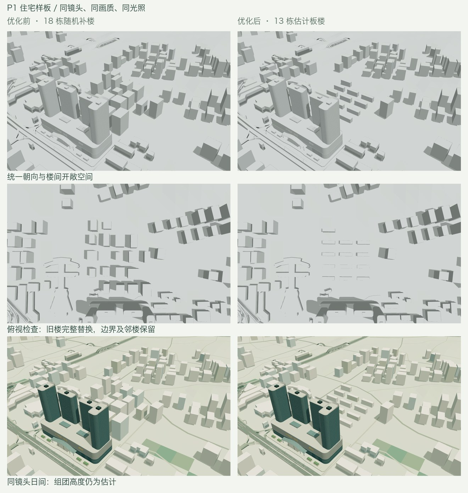

# P1：香榭里住宅组团样板

日期：2026-09-12。对应 [完整计划](URBAN_STRUCTURE_PLAN.md) 的 P1。当前状态：已完成首个住宅体块样板、正式资产重建和验收；内部布局与层数仍为估计。



## 来源与表达边界

OSM way `766539182` 提供住宅公寓用地边界，面积约 8.32 公顷。[迈丘设计的航洋项目介绍](http://www.metrostudio.cn/m/workInfo.aspx?id=653) 与 [南国早报现场报道](https://www.ngzb.com.cn/news/62020.html) 支持小区南门与航洋北广场相邻；记者照片可辨认浅色住宅、阳台横向分层与楼间绿化。两者都不能证明小区内部总平面、准确栋数或完整层数。

因此，本样板是在已知地块内生成有统一组织的板式住宅，**不是香榭里花园的实测复原**。具体估计项集中记录在 [来源配置](../data/block-sources/xiangxieli.json)，正式地理数据也逐栋保留 `layoutSource: estimate`、`heightSource` 和 `blockId`。

## 设计与实现

- 原先 18 栋相交的随机补楼，替换为 13 栋住宅板楼；18 不是实际小区栋数。旧楼的完整足印、稳定标识和原数组位置保留在替换记录中，涵盖 3 栋跨界旧补楼。
- 用 OSM 西侧边界确定统一朝向，足印暂取 60 × 16 m，行距 58 m、列距 84 m；地块外缘、道路与周边建筑的避让会剔除放不下的单元。楼间开敞空间独立记录，不由连续裙房或屋顶覆盖。
- 行组暂取 6–8 层、3 m 层高，即 18–24 m；样板的高度展示倍率为 1.0。其余普通建筑保持原来的 1.55 倍，检查参数导出明确记录这个局部例外。
- 住宅南侧保留开敞接口，不依据被裁切的现场照片臆造商铺足印。建筑总占地约 12,478 m²，约占已知地块的 15.0%；这是模板结果，不能当作真实建筑密度。
- 生成顺序保留旧城市补楼与树木随机序列，再进行局部替换。住宅配色由楼栋标识独立确定；渲染时重放旧配色槽位，避免删改楼栋造成试点外建筑、树木连锁变色。
- 楼脚以不超过 6 m 的间距采样两档显示地形，平层取较高支承面并留 1.2 m 净空，侧壁向较低地面埋入 1.5 m。这里的净空是墙体内部平层与地面的差值，外墙裙部仍连续落到地面下方。屋顶三角化保留内洞，内洞侧壁也生成。
- 道路捕获使用同一楼脚计算和逐楼高度倍率。正式 `geography.json` 包含实际替换后的建筑数组，因此铁路避让、道路限高和其他按索引关联的计划全部重建。

实现入口为 `scripts/prepare_urban_blocks.py` 与 `blender/urban_blocks.py`；`data:prepare` 自动在旧城市生成完成后应用样板。单独预览必须以未应用样板的输入为源，重复应用会报错，避免二次删除或叠加楼栋。

## 验证记录

已通过：

- 4 项住宅检查：同输入重复生成一致；旧建筑几何、高度及其他地理图层不变；水域、公园、道路、周边建筑和样板楼栋相互避让；开敞空间不覆盖建筑；带内洞屋顶覆盖及两档坡面支承。
- 实际重新运行 `prepare_geodata.py` 后逐字段比较：保留建筑足印与高度完全一致；全城水域、公园、道路、树木、建设用地与水面三角形完全一致。地形仅访问日期变化，原始高程、显示高程和地表分类不变。
- TypeScript 与 oxlint 通过。
- 原生 `.blend` 对比：替换范围外 137,790 个建筑面及其材质完全一致，没有新增、缺失或改色。旧 18 栋对应的 108 个面已完整替换。见 [原生几何检查](urban-structure-residential/native-scope.json)。
- GLB 对比：精细档 249 个、流畅档 246 个其他网格节点的压缩几何、材质与变换一致；两档都只改变 `Buildings_3_1`。所有建筑在两档中使用完全相同的压缩几何。13 栋的导出屋顶覆盖率最低 98.4%，其余误差来自原有 Draco 位置量化；楼面相对导出地形的最小间距为精细档 1.207 m、流畅档 1.173 m。外墙裙部仍进入地面，不是悬空楼面。见 [导出检查](urban-structure-residential/exports.json)。
- 全套 `validate_assets.py` 与 `validate_terrain.py` 通过，包含水域/公园/道路避让、地形来源、铁路、桥梁、道路实体和既有地标；21 步依赖重建及检查均成功。见 [重建命令和退出状态](urban-structure-residential/rebuild.json)。
- 12 项网页行为测试通过。生产子路径 `/nanning-city-atlas/` 下完成 63 份参数记录、60 张截图，覆盖两档、全部固定视角、三种材质和住宅/滨水/艺术中心日落夜景；镜头恢复、静止帧一致性及普通首页加载通过，控制台错误为零。已实际查看住宅灰模、俯视、日间和夜景，并检查前后对照。见 [浏览器记录](urban-structure-residential/browser.json)。
- `npm run build:pages` 通过，构建包中的两档模型、高程、地标及概要数据与正式资产哈希一致。

| 模型 | 优化前 | 优化后 | 增量 |
| --- | ---: | ---: | ---: |
| 精细 GLB 字节 | 25,236,380 | 25,237,932 | +1,552 |
| 流畅 GLB 字节 | 17,270,232 | 17,271,840 | +1,608 |
| 精细三角面 | 3,462,527 | 3,463,099 | +572 |
| 流畅三角面 | 2,350,419 | 2,350,991 | +572 |

新增面主要用于沿长立面贴地的墙裙分段，仍在原有资源预算内。完整可编辑 `.blend` 和两档 GLB 已写回正式路径；新的不可覆盖资产基线为 `work/urban-structure/baseline-p1/`，见 [资产指纹](urban-structure-residential/assets.json)。

连续旋转采用同机 Headless Chrome、1280 × 800、DPR 1、住宅日间镜头；通过本地文件路由交替提供冻结旧模型和新模型，两档均按旧→新→新→旧顺序运行，每次持续 3.5 秒，并验证相机实际发生变化。帧间隔中位数前后均为约 16.7 ms；精细档 P95 由约 16.7 ms 到 16.8 ms，流畅档前后约 16.7 ms。这个有限样本未显示明显操作性能退化，不能证明手机真机性能。加载时间保留在记录中，但受文件/着色器缓存和运行顺序影响，不据此宣称加载提速。见 [连续操作记录](urban-structure-residential/motion.json)。

样板完成的是已知地块内的体块组织与支承，不包含实测内部园路、停车场或景观复原。缺少的真实足印与层数继续保留为未解决的资料项，不在后续推广中自动升级为实测数据。

## 复现

```sh
work/venv/bin/python scripts/test_urban_blocks.py
work/venv/bin/python scripts/prepare_urban_blocks.py --input work/urban-structure/baseline-73edbb7/public/data/geography.json --output work/urban-structure/p1/candidate.json
```

正式重建先运行 `data:prepare`，再按 [地形依赖重建](TERRAIN_RESAMPLING.md) 执行，同时在桥梁计划读取新地理数据前运行 `scripts/prepare_bridges.py`。样板没有修改地标水平轮廓，本次可保留既有道路上下文中的地标障碍轮廓。

导出后运行：

```sh
blender -b --python-exit-code 1 --python blender/check_urban_block_scope.py
work/venv/bin/python scripts/check_urban_block_exports.py
node scripts/check-city-motion.mjs
```

完整日志和截图保存在 `work/urban-structure/p1/`，连续操作的带相机核验记录在 `motion-verified/`；关键结果已归档到 `docs/urban-structure-residential/`。[验证工具指纹](urban-structure-residential/tool-hashes.json) 对应本阶段实际使用的源码。
