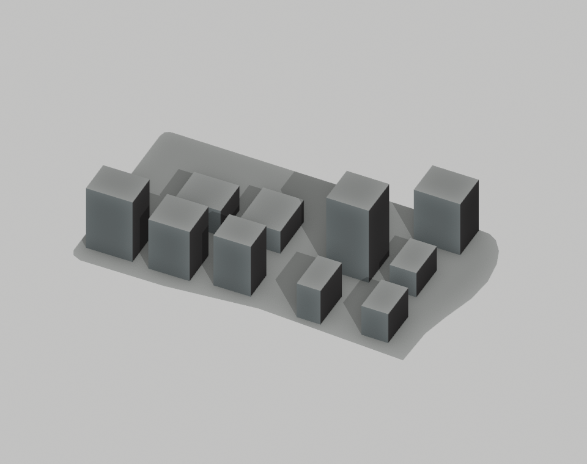
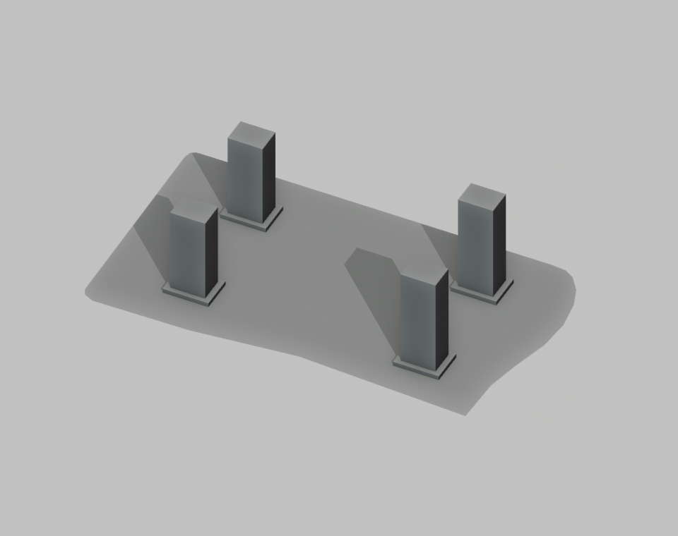
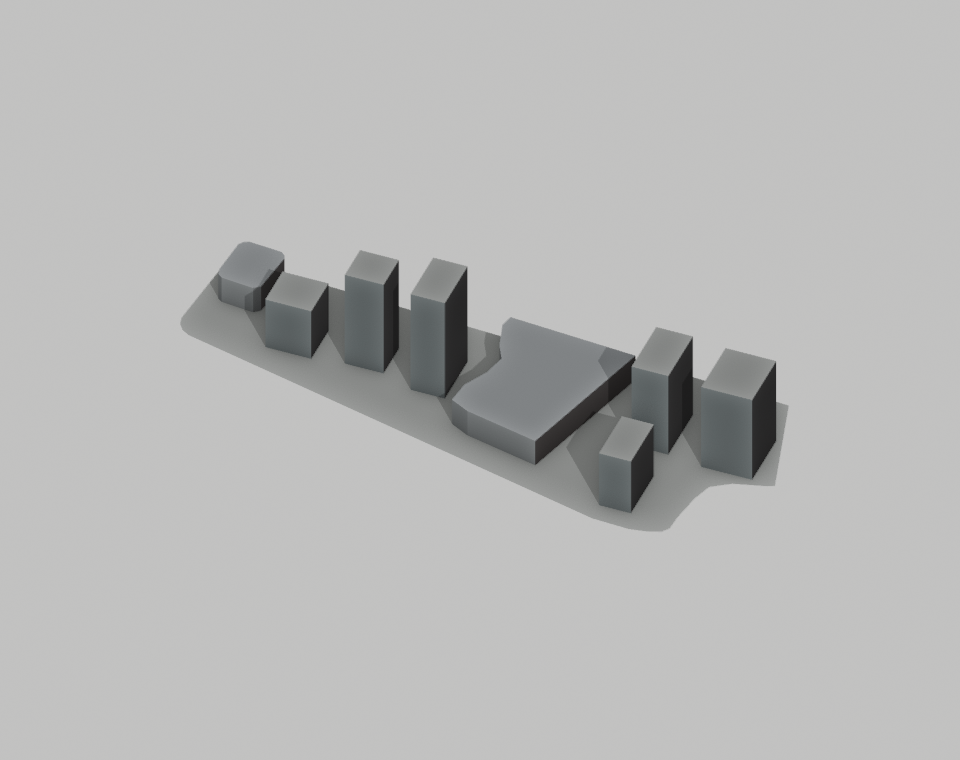
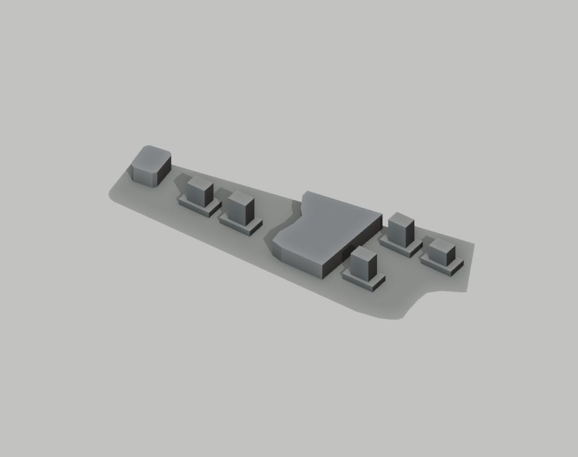
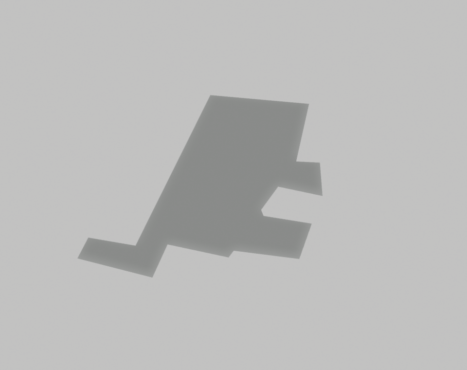
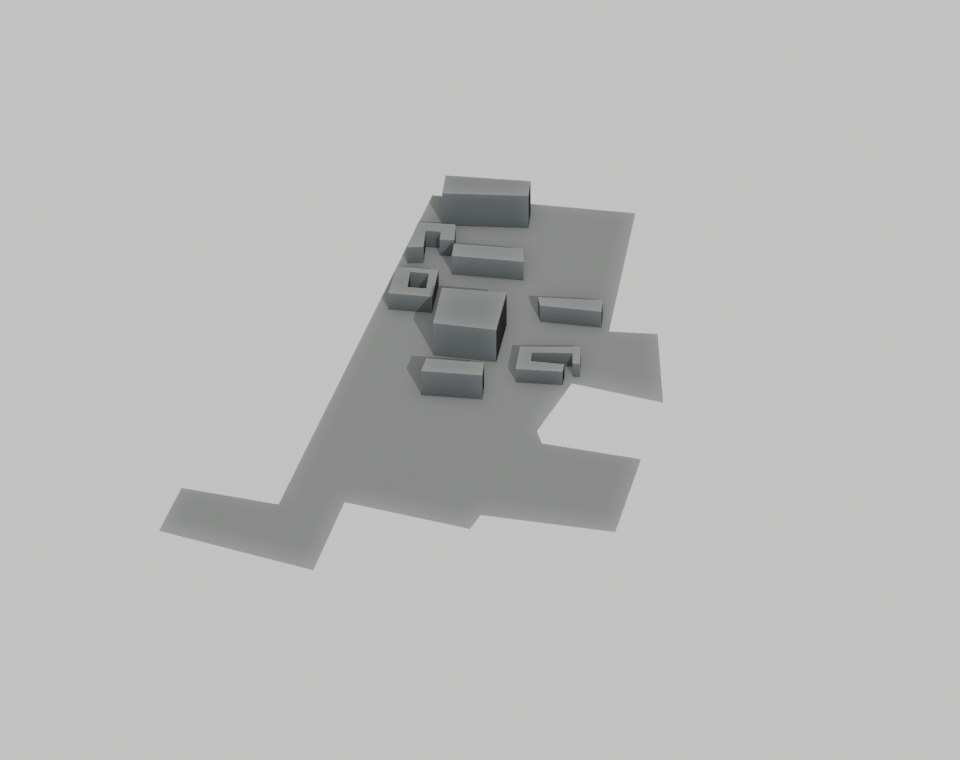
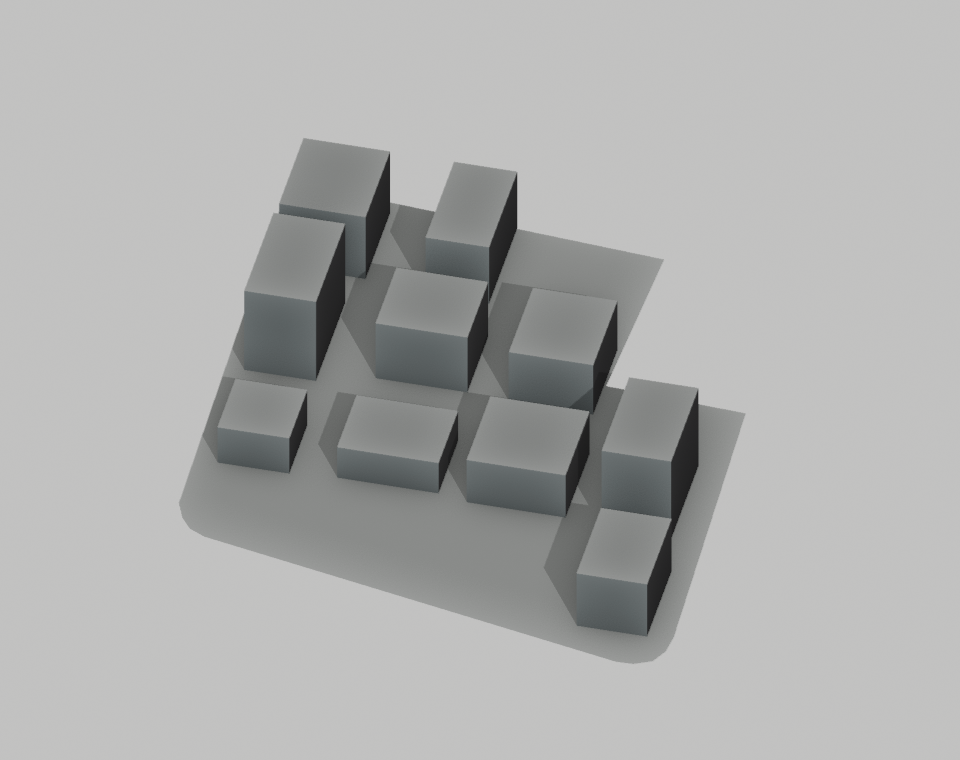

# P5 首批分区模板候选

状态：已生成四类候选、通过候选检查并渲染对照；尚未接入正式城市。当前公共地理/地形与两档 GLB 仍与 P4 基线一致。

2026-09-13 已将 19 个模板加入完整足印共享放置规则，独立实际导出及基础/接路后支承体量对照通过，见[建筑放置与道路一致性](URBAN_STRUCTURE_QUALITY.md#建筑放置与道路一致性2026-09-13)。主城市的新分支与完整道路依赖尚未重新执行，入口、平台设计与完整城市验收继续保留。

2026-09-13 已把普通 OSM 建筑的存储精度屋顶三角面合并到 `work/urban-structure/p5/rollout/stable-mesh-candidate.json`。逐字段比较确认：相对此前四类候选，仅新增 `meshRoofTriangles`，足印、高度、模板和其余数据保持一致。普通建筑消费端及独立压缩结果见[建筑质量记录](URBAN_STRUCTURE_QUALITY.md)；四类模板的场地支承与正式接入仍待完成。

## 来源与范围

配置保存在 [p5-rollout.json](../data/block-sources/p5-rollout.json)，包含 OSM 边界、来源、模板参数、估计范围与输入指纹。楼栋位置与未有层数来源的高度属于类型化估计。

| 类型 | 首批地块 | 来源支持的内容 | 仍属估计或待核对 |
| --- | --- | --- | --- |
| 住宅 | 绿地中央广场海珀璞晖，OSM way 839655821 | 独立住宅用地；[筑境设计项目页](https://www.acctn.com/casexq.html?content=211)实景图显示高层住宅与南侧商业街区关系 | 住宅塔楼具体足印、位置、栋数和高度 |
| 商业办公 | 绿地中央广场，OSM way 577000343 | 同一设计方资料支持办公、低层商业和步行街组合 | 新增体量及其位置；三条既有 OSM 建筑记录保持原样 |
| 校园 | 南宁师范大学明秀校区，OSM way 553196020 | [学校官方校园地图](https://dwxzb.nnnu.edu.cn/info/1085/1152.htm)提供教学组团、院落和运动场相对关系及部分层数 | 2019 年图不证明当前现状；描摹、与 OSM 的配准和 3.2 m 层高为估计 |
| 工业仓储 | 万纬新中智慧园，OSM way 837903835 | [运营方项目介绍](https://www.vx56.com/cn/news/details?newsId=87)确认冷链与高标仓储用途 | OSM 地块约 5.90 ha，与官方介绍的整园约 8.3 ha 不同；不直接套用整园栋数和面积 |

四个 OSM 地块边界合计约 32.22 ha，不等于这些区域已经完整复原。校园本批只处理北侧教学组团，南侧宿舍及运动建筑尚未建模。参考照片和学校地图仅用于本地核对，不进入公开模型或网站。

## 候选结果

| 地块 | 替换旧程序楼 | 新增候选 | 保留映射楼记录 | 候选结构 |
| --- | ---: | ---: | ---: | --- |
| 海珀璞晖住宅 | 10 | 4 | 0 | 成对塔楼、关联高度、低层基座与共享中央留空 |
| 绿地商业办公 | 6 | 5 | 3 | 裙房与退后的办公体量、连续步行空间，围绕已有映射楼安排 |
| 明秀教学组团 | 0 | 8 | 0 | 按图像关系布置教学体量，保留凹角、院落及运动场预留区 |
| 新中智慧园 | 10 | 2 | 0 | 大跨度低矮仓储体量与中间装卸空间 |
| 合计 | 26 | 19 | 3 | 不以增加楼栋数量作为收益指标 |

候选保留全部原有 OSM 建筑；变动仅涉及明确列出的旧程序楼及校园来源用地。完整 ID、替换清单、保留清单、范围、配准调整和正式资产指纹见[候选范围记录](urban-structure-quality/rollout/candidate-scope.json)。

学校地图使用北侧两个可对应的 OSM 边界点进行近似相似变换。约束检查发现部分描摹足印靠近现有边界或道路，因此允许整栋平移最多 12 m、足印等比缩小最多 10%，逐栋记录调整；禁止裁掉翼楼和内洞。培训楼、化学楼仍无法在该限制内满足约束，保留为未接入候选，后续需补充配准依据。

住宅有 2 个拟议位置、商业有 9 个拟议位置因边界/道路/既有楼体约束未采用。它们是算法候选位置，不是被删除的真实楼栋。现有树木与新候选占地无相交，本批无需新增树木隐藏项。

## 同机位体量对照

以下是隔离平地预览，前图来自建筑数据候选中的旧程序楼，后图为本批模板。商业地块内保留的映射楼在两幅图中同时显示。更远的城市环境、真实地形和正式道路模型未包含在这些预览中。

| 地块 | 修改前 | 候选 |
| --- | --- | --- |
| 住宅 |  |  |
| 商业 |  |  |
| 校园 |  |  |
| 仓储 |  |  |

已复核的可见变化：住宅高度和朝向形成关联；商业新体量避开保留楼体；校园出现分组及开敞院落；仓储由零散高低楼盒变为低矮大体量。校园南部仍为空白，不能把这组预览当作整校完成。正式场景仍需检查入口、地面支承和相邻道路关系。

## 几何与验证

[复合体量消费端](../blender/block_massing.py)支持裙房与上部体量，扣除被上部楼体占据的裙房屋面，保留院落；道路限高落在裙房内、裙房顶部或上部体量时均需有完整封顶。当前底层相对调用方提供的地面最大高程留 0.2 m 余量，基础下沉至最小高程以下 0.5 m。正式接入时调用方必须提供整个足印在两档最终地形上的高程范围；本次平地预览没有验证该集成。

隔离模型实际三角面为：住宅 100 → 104，商业 60 → 130，校园 0 → 124，仓储 100 → 20，净增 **118**。保留的映射楼不计入此替换增量。统计来自 Blender 实际三角化，见[渲染与几何报告](urban-structure-quality/rollout/render-report.json)。

这批模板成本较小，但并未解决建筑轮廓候选约 34,611 个三角面的整体增量。既定精细/流畅版文件与分项几何预算保持不变，需要结合实际可见建筑和后续资源优化继续核算。

8 项测试通过，覆盖：

- 替换范围、原 OSM 记录及 P1 样板保持、配色回放、校园用地变更清单。
- 已保存候选与当前来源/生成器一致、重复生成稳定、修改一处参数不改变其他地块建筑。
- 地块退距、水域、公园、道路、其他楼体、保留开放空间避让。
- 四类体量结构、校园配准限制、仓储占地和高度范围。
- 裙房与塔楼可见屋面划分、院落开口及屋顶朝向。
- 限高在不同层位时正确封顶；消费端使用完整的调用方地面范围。

[测试日志](urban-structure-quality/rollout/tests.log)、Python 编译与 `git diff --check` 均通过。正式城市的道路依赖、压缩导出、范围外渲染、交互和性能尚未验收。

## 复现

```sh
work/venv/bin/python scripts/prepare_block_rollout.py \
  --input work/urban-structure/p5/quality-candidate.json \
  --output work/urban-structure/p5/rollout/candidate.json
work/venv/bin/python scripts/test_block_rollout.py
blender --background --factory-startup --python-exit-code 1 \
  --python blender/render_block_rollout.py -- \
  --before work/urban-structure/p5/quality-candidate.json \
  --candidate work/urban-structure/p5/rollout/candidate.json \
  --output work/urban-structure/p5/rollout/renders
```

下一步继续实际地面支承与映射楼内洞消费端、几何预算优化、滨水/地形规则推广，再进行完整依赖重建和两档城市验收。P5 保持实施中。
