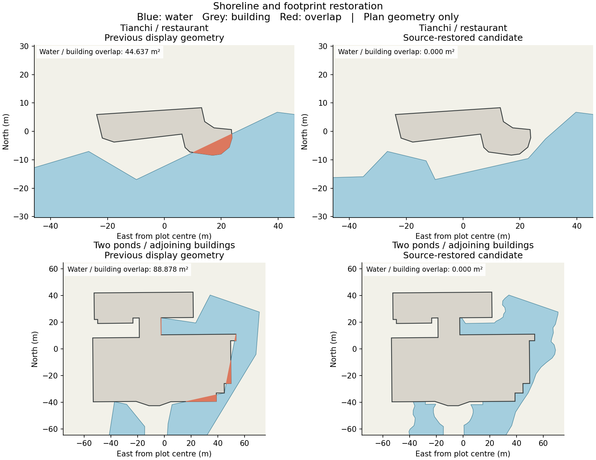

# P5：恢复源岸线与临水建筑支承

2026-09-13。状态：源几何恢复、实际两档地形覆盖、水面及建筑独立压缩检查已完成；完整城市道路、接路与正式交付尚未完成。正式五项数据/模型文件仍匹配 P4，见[本轮重新核对](urban-structure-quality/shorelines/formal-assets-unchanged.json)。

## 原因与处理范围

原始 OSM 岸线与旧显示岸线的差异，是两处建筑支承缺口的主要原因。水域统一采用 7.5 m 简化，抹掉了贴近建筑的局部凹角；两栋相邻建筑的足印简化也改变了共用边缘。源建筑与源水域没有面积重叠，因此本轮恢复源轮廓，没有填水或添加假定的水上桩基。

来源保存在 [building-shoreline-source.json](../data/building-shoreline-source.json)：包含原始 OSM 要素、快照散列、稳定 ID、待替换轮廓散列及限制。源快照时间为 2026-09-08；投影后沿用 10 cm 坐标存储精度，不代表测绘精度提高。

| 对象 | 源要素 | 本轮处理 |
| --- | --- | --- |
| 天池 | relation 4448134 | 恢复完整岸线，保留两个岛洞；水域索引仍为 227 |
| 两个池塘 | way 923687040、923687041 | 恢复贴岸凹角；水域索引仍为 343、339 |
| 两栋相邻建筑 | way 923687037、923687038 | 恢复源足印并重建屋顶三角面，保留 ID、高度及高度来源 |
| 霁霖阁饭店 | way 651997945 | 建筑足印保持；恢复天池岸线后获得约 2.22 m 平面间距 |

第二栋相邻建筑原本没有被列为地形缺口；恢复池塘后检查发现，其简化足印会产生约 0.011 m² 的新增重叠。因此同时恢复它的源足印，没有忽略这项小范围回归。



图中蓝色为水域、灰色为建筑、红色为重叠。该图直接绘制序列化几何，用于解释来源与简化的关系，不是最终城市渲染或地形验收截图。

## 地理候选检查

- 三个水域轮廓恢复后，两个原有建筑重叠分别从约 44.64 / 88.88 m² 降为零；附近建筑没有新增水域重叠，树干没有新增落水点。
- 全城水域仍为 567 个，水面三角形从 8,953 增为 9,068，净增 115 个；其余 8,914 个三角形的坐标、顺序保持。
- 只在新增水域覆盖带内裁正 5 个公园面和 1 个推定用地面，涉及约 1,279.12 / 118.18 m²。交点保留足够小数位，避免再次把交点舍入到岸线另一侧；其他范围几何差低于 0.0001 m² 的数值检查上限。
- 道路、树木、建筑数组顺序、所有建筑高度与高度来源保持；只改动两栋有明确来源的足印及屋顶。源轮廓、岛洞、水面覆盖、重叠、屋顶与范围外数据均通过[序列化候选检查](urban-structure-quality/shorelines/serialized-audit.json)。
- [8 项测试](urban-structure-quality/shorelines/tests.log)通过，覆盖源轮廓、数据与高度保持、三角网覆盖、用地裁正、过期来源、岛洞丢失、重复准备以及独立检查器拒绝几何篡改。

## 依赖重建与实际地形支承

先冻结旧源码、数据及支承文件，再在 staging 中接入候选。原快照保存在 `work/urban-structure/p5/staging/work/p5/before-shorelines/`，不会通过改写散列使旧支承冒充新结果。

天池来源记录经过同一原始要素、投影轮廓和快照散列核对后重新生成，见[来源协调记录](urban-structure-quality/shorelines/qingxiu-source-reconciliation.json)。随后完成地形重采样、南湖、铁路、清厢快速路、民族大道、桥梁、林冠和两档基础地形上下文重建，见[执行记录](urban-structure-quality/shorelines/base-rebuild-report.json)。仓储场坪从新上下文重新准备，再导出含场坪的两档地形。

[实际集成核对](urban-structure-quality/shorelines/integration-summary.json)确认：

- 原始 `heights`、显示 `sceneHeights`、网格 `landcover`、全城高程基准、倍率和源 DEM 散列均保持；此次修正发生在局部边界及三角网。
- 天池推定水位仍为 175.5 m；按恢复后轮廓纳入的源栅格像元从 17 个变为 16 个，水位中位数未变。
- 仓储场坪的拓扑、目标高度保持。原先已覆盖的 1,919 个建筑，支承高程范围最大变化为零。
- 重新解码两档实际 GLB 测量后，**1,921 个候选足印全部通过既定 5 cm 地形覆盖容差**。这里的“通过”仅表示地形覆盖，不代表场地和入口已经设计完成。

| 足印 | 精细档未覆盖面积 | 流畅档未覆盖面积 | 5 cm 容差以外缺口 |
| --- | ---: | ---: | ---: |
| 霁霖阁饭店 | 0 m² | 数值舍入量级 | 0 m² |
| way 923687037 | 0.642 m² | 0.496 m² | 0 m² |
| way 923687038 | 0 m² | 数值舍入量级 | 0 m² |

贴岸足印仍存在压缩后的细小边界缝，不能把容差通过写成逐点完全重合。完整逐栋记录见[实际地形支承](urban-structure-quality/shorelines/actual-terrain-support.json)。

## 实际水面与建筑导出

水面直接执行主城市生成器的 `Water` 语句及正式压缩策略；建筑使用实际测得的足印支承及共享消费端。两者分别独立导出并解码核对。

| 检查 | 结果 |
| --- | --- |
| 水面原生/压缩三角形 | 9,068 个一一对应，材质与绕序保持 |
| 水面最大顶点偏移 | 0.01079 m，低于 0.02 m 检查上限 |
| 恢复水域的岸线及岛洞 | 三个水域均通过；天池两个岛洞保持 |
| 独立水面 GLB | 162,684 字节 |
| 可处理建筑独立导出 | 1,918 栋、77,781 个三角面，含全部 19 个模板体量 |
| 建筑压缩最大顶点偏移 | 0.02615 m，低于 0.05 m 检查上限；126 个院落开口保持 |
| 独立建筑 GLB | 680,652 字节 |

证据：[水面导出](urban-structure-quality/shorelines/water-report.json)、[水面压缩](urban-structure-quality/shorelines/water-audit.json)、[建筑导出](urban-structure-quality/shorelines/buildings-report.json)、[建筑压缩](urban-structure-quality/shorelines/buildings-audit.json)。这些独立文件不是完整城市净增量；最终预算仍须包含道路、地形、植被、特殊结构与减面组合。

三个水坝仍需要专用结构处理；独立建筑导出中的 323 个大高差场地复核标记仍保留。地面道路、带路地形上下文及高架道路上游均已重新准备，见[后续命令记录](urban-structure-quality/shorelines/post-base-rebuild-report.json)。完整道路实体、接路、最终支承、地形减面组合及整城浏览器验收继续推进。

## 地理候选复现

```sh
work/venv/bin/python scripts/prepare_building_shorelines.py \
  --input work/urban-structure/p5/shorelines/input.json \
  --output work/urban-structure/p5/shorelines/candidate.json
work/venv/bin/python scripts/check_building_shorelines.py \
  --before work/urban-structure/p5/shorelines/input.json \
  --after work/urban-structure/p5/shorelines/candidate.json \
  --source data/building-shoreline-source.json \
  --output work/urban-structure/p5/shorelines/serialized-audit.json
work/venv/bin/python scripts/test_building_shorelines.py
```

`prepare_building_shorelines.py` 不覆盖输入，拒绝过期轮廓和重复应用；它只准备地理候选。完整重建还需上述来源协调、地形及基础设施依赖步骤。
