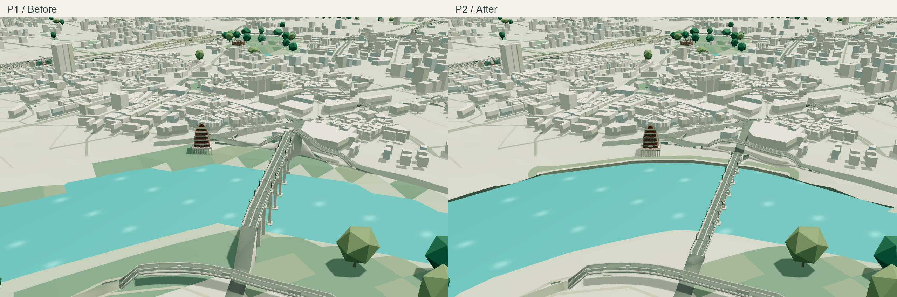
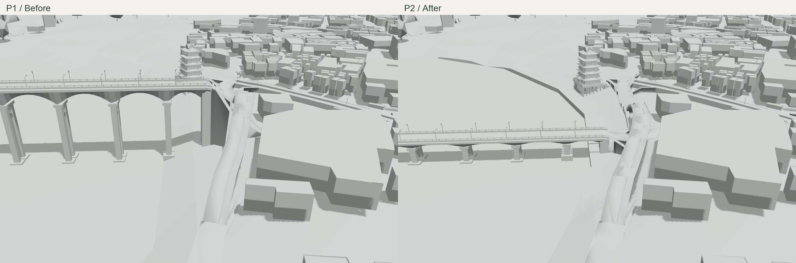
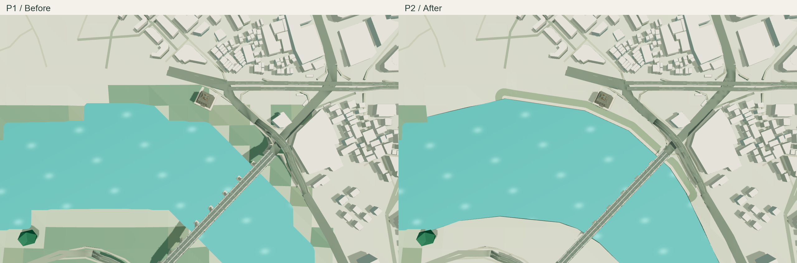

# P2：畅游阁—邕江大桥北岸样板

日期：2026-09-12。对应[完整计划](URBAN_STRUCTURE_PLAN.md) P2。状态：已完成首段连续护岸、地形替换、桥梁高度校准、正式资产重建和验收；断面尺寸及桥梁部分显示参数仍为估计。



## 来源与估计项

选择现有水域北岸的一段连续折线，长 641.59 m。OSM relation `18447332`、北岸 member `1530494329`，快照时间为 2026-09-08；其 `source=landsat`，本次沿用已经发布的简化水边界，不能当作实测护岸线。来源、锚点和断面参数保存在[岸段配置](../data/waterfront-source.json)。

[南宁晚报 / 广西新闻网 2018 年报道](https://v.gxnews.com.cn/a/17858642?pageno=1&remains=1)支持民生广场亲水步道及邕江水、堤、路、景一体整治；[广西新闻网 2026 年报道](https://www.gxnews.com.cn/staticpages/20260723/newgx6a6184e1-21973402.shtml)支持民生码头、畅游阁与邕江大桥的相邻关系。报道不能确定步道、绿带或护岸的准确尺寸。

本次采用一种示意城市硬质护岸：墙顶比现有显示水面高 8 m，步道宽 8.5 m，绿带外边界距岸线 29 m，向内陆在 90 m 范围内渐变，岸段两端在 35 m 内过渡。以上均为显示估计，原始高程、全城基准和水域边界保持不变。

## 连续断面与统一支承

- 生成“水面 → 岸墙 → 连续步道 → 绿带 → 既有城市”的断面。步道是地形面自身的材质分区，不额外叠加一层平板。
- 补片边界沿现有精细/流畅共同网格对齐，删除对应旧面，再以约 15 m 网格裁切岸线。替换矩形约 69.05 ha，扣除河面后的陆地约 41.09 ha；实际整坡集中在所选岸段及其向内陆的过渡带，其余位置继承原有三角形高程。
- 网格先按原始对角线分为三角形，再裁切步道、绿带和水域，避免细分时无意改变原网格平面。补片外缘的高程与各档旧地形相同。
- 护岸墙顶直接复用补片岸边顶点，墙脚进入水面下方。两档均从自己的最终三角网采样道路、建筑、树木和地标支承。
- 地面道路与建筑保留避让；高架桥不作为切断步道的地面障碍。步道覆盖约 5,602.68 m²，连通性检查防止桥梁投影把滨水步行带截成两段。
- 生成器保留被替换地形单元的原随机数消耗，避免局部整坡导致其他建筑、树木配色变化。

入口为 `scripts/prepare_waterfront.py`、`blender/local_terrain.py`，后者由正式建模、道路上下文及地形采样共同使用。地形重采样后会自动刷新滨水计划；道路计划同时记录补片及桥梁实现的输入哈希。

## 邕江大桥与桥头校准

检查发现旧邕江大桥使用统一最低桥面 `1.18`，相对显示水面 `0.26` 高约 92 m；其箱梁也沿用了偏厚的统一示意参数，桥头因而产生夸张的高引道。

[海事局《广西跨内河 IV 级及以上航道桥梁通航净空尺度信息表》](https://www.msa.gov.cn/public/documents/document/mdi0/odiz/~edisp/20241101024823893.pdf)（2024-11-01，表内第 53 项）列出南宁邕江大桥净高 6.0 m、净宽 53.0 m、设计最高通航水位 74.65 m。由后两项中的水位与净高相加，可推得该表基准下的梁底控制高程 80.65 m；该高程基准与当前 DSM 的 EGM2008 是否一致尚未核实，因此这里只用于显示比例约束。

桥梁来源配置新增该桥独立的 `displayProfile`：暂估箱梁基础厚度 3.5 m、支点加厚最大 4.5 m，以现有地形显示映射得到初始最低桥面 `0.529225`。最终桥面还必须高于全桥宽采样的地形、实际梁底厚度和 1.5 m 显示净空，并满足既有纵坡限制。因此导出高度由来源下限与两岸支承共同决定，不能直接解释为实测桥面标高。

其余 12 座桥保留原高度算法。桥头端口随新桥面重新捕获，接桥道路、高架道路及其实体按新端口重算。

## 验证状态

已执行的补片检查覆盖：完整陆地覆盖、无叠面、不盖水、步道连通、两档每个三角形的采样一致性、外缘高程连续、墙顶与岸边共点，以及正式地理/地形数据相对 P1 的逐字节不变性。

已完成新桥面和两档正式导出。GLB 实测护岸墙顶与地形最大接缝为精细档 0.280 cm、流畅档 0.264 cm；步道覆盖相对计划误差约 0.01%。实际桥面相对显示水面高 27.246–31.518 m，两档一致。香榭里 P1 样板网格仍逐字节一致，允许变化的滨水节点以外没有其他非道路节点变化。道路经过全网求解、裁切和三角化，多个节点的编码或细小面片有变化，不宣称范围外道路逐字节不变；其正确性通过全城道路检查验证。见[实际导出检查](urban-structure-waterfront/exports.json)。

已通过 4 项滨水测试，包括原始输入不变、覆盖与连通性、两档逐面采样和边界高程、桥梁全宽支承与纵坡检查。TypeScript、oxlint 和 12 项网页行为测试通过。

生产构建完成，模型及四份公开数据均与 `public/` 源文件逐字节相同。生产子路径下完成 75 份参数记录和 72 张固定截图，覆盖全部 10 个机位、两档画质、三种材质及住宅/滨水/艺术中心日落夜景；材质恢复、静止帧、相机链接恢复与普通首页加载通过，控制台错误为零。旧 P1 冻结资产另有 31 份参数记录和 28 张滨水对照截图，其路由提供的文件哈希单独记录。见[新版浏览器记录](urban-structure-waterfront/browser.json)、[旧版对照记录](urban-structure-waterfront/before-browser.json)和[生产资产哈希](urban-structure-waterfront/production-assets.json)。





| 模型 | P1 | P2 | 增量 |
| --- | ---: | ---: | ---: |
| 精细 GLB 字节 | 25,237,932 | 25,296,836 | +58,904 |
| 流畅 GLB 字节 | 17,271,840 | 17,327,676 | +55,836 |
| 精细三角面 | 3,463,099 | 3,469,091 | +5,992 |
| 流畅三角面 | 2,350,991 | 2,357,559 | +6,568 |

两档均低于原有 26,000,000 / 18,000,000 字节预算，没有放宽预算。

完整资产审计通过，包括两档道路与地形净空、道路互相交叉、标线、桥梁、铁路、林冠及既有地标检查。地面道路相对实际解码地形的连续最小净空为精细档 0.7595 m、流畅档 0.7703 m；新道路端口的模型接缝为 0。

在模型重建和资产审计结束后，单独进行同机、1280 × 800、DPR 1 的滨水日间连续旋转对照。每档按旧→新→新→旧运行，每次 3.5 秒并确认相机确实移动；前后帧间隔中位数均约 16.7 ms，P95 均在 16.7–16.8 ms 范围内。该有限样本没有显示明显操作性能退化；它不是手机真机测试，也不将受缓存和顺序影响的加载时间解释为提速。见[连续操作记录](urban-structure-waterfront/motion.json)。

已保存不可覆盖的 P2 资产基线 `work/urban-structure/baseline-p2/`，供 P3 及后续阶段比较，见[资产指纹](urban-structure-waterfront/assets.json)和[验证工具指纹](urban-structure-waterfront/tool-hashes.json)。完整可编辑 `.blend` 和两档 GLB 均位于正式路径。

本阶段覆盖选定北岸断面、邕江大桥及相连引道的显示衔接；江滨立交仍采用既有 OSM 拓扑和道路求解，步道宽度、箱梁厚度等估计项未升级为实测数据。

## 复现与后续基线

首先保留 P1 冻结资产作为对照，再运行 `scripts/prepare_waterfront.py` 和 `scripts/prepare_bridges.py`。随后按[地形依赖重建流程](TERRAIN_RESAMPLING.md)重新导出地形上下文、捕获地面道路、捕获包含地面道路的上下文、重算高架道路、捕获道路输入、生成两档道路实体与细节、检查接口，最后生成完整城市资产。本次原始高程与地理数据没有变化，未重复执行高程重采样，也未改变既有地标水平障碍轮廓。

本阶段从新地形上下文到完整资产验证的 15 个依赖步骤全部通过，命令、耗时和退出状态见[重建记录](urban-structure-waterfront/rebuild.json)；完整资产检查输出见[资产审计](urban-structure-waterfront/asset-validation.txt)。独立检查入口：

```sh
work/venv/bin/python scripts/test_waterfront.py
work/venv/bin/python scripts/check_waterfront_exports.py
work/venv/bin/python scripts/validate_assets.py
```

网页检查支持逗号分隔的 `CITY_CHECK_VIEW` 与冻结资产目录 `CITY_CHECK_BASELINE_PATH`；冻结资产对照只验证其固定场景，当前发布版本另行验证普通首页。连续操作脚本使用 `CITY_MOTION_VIEW=waterfront` 和 `CITY_BASELINE_PATH=work/urban-structure/baseline-p1`。

完整工作日志、PNG 和相机参数在 `work/urban-structure/p2/`。三份归档对照图直接拼接同分辨率原始截图，只增加前后版本标题，没有重绘场景内容。
