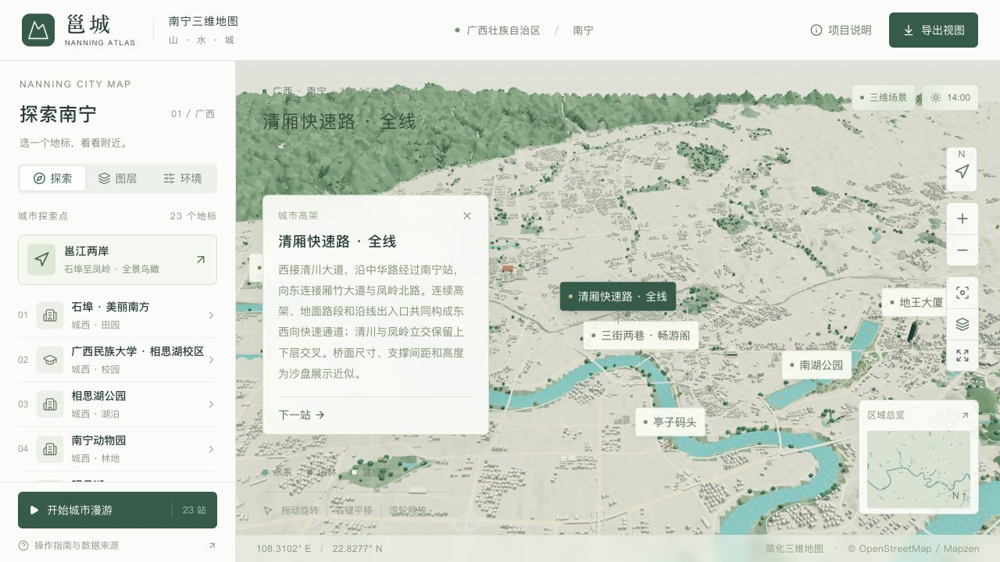

# 清厢快速路 · 全线

已连接西端清川大道与东端厢竹大道、凤岭北路，覆盖当前城市 OSM 快照中全部 **27 个清厢快速路主线路段**。合并双向中心线后约 **14,249.96 m**，并保留 **31 个主线连接点、88 个匝道及引道路段、332 个桥墩**。匝道在分支节点处分成 98 段建模，不能把这些分段数当作实际匝道数量。

探索菜单“清厢快速路 · 全线”使用整体视角，不提供近景入口。主线、匝道、地面引道、支撑、护栏和标线统一归属“道路桥梁”图层。

## 范围与来源

- 工程范围参照[南国早报记者的通车报道](https://www.ngzb.com.cn/news/10144.html)，西接清川大道，东至厢竹大道；[广西新闻网航拍报道](https://v.gxnews.com.cn/a/17298053)用于核对中华路高架及六车道主线的整体形态。
- 主线依据原始 OSM 名称、节点和道路走向，包含两条连续的单行方向链。全部路段 ID 及顺序保存在 `data/viaduct-plan.json` 的 `main.osmIds` 和 `main.chains` 中；不再按中段经度裁切。
- 西端包含清川立交与快速路相连的桥梁接线及地面引道；东端包含凤岭立交与主线连接的各方向匝道、短桥和一处下穿连接。北侧独立的大学路立交及凤岭北路后续主线保留原有城市道路，不属于清厢快速路本次范围。
- `data/viaduct-source.json` 保留 2026-09-08 快照中的原始标签、节点与坐标。主线经度范围为 108.2511082° E 至 108.3743329° E。归属 © OpenStreetMap contributors / ODbL 1.0。

本项目约 14.25 km 为当前地图合并中心线的长度；工程报道的约 13.4 km 使用不同统计范围，不能将模型长度当作实测工程里程。OSM 未提供完整的实测桥宽、高程及桥墩坐标。约 29 m 双向主线宽、7.3 m 匝道宽、34 m 基准墩距以及箱梁和桥墩截面仍是沙盘近似。

## 连续路网与上下层关系

东段包含地面道路与短桥，按 OSM 的 `bridge` 和 `tunnel` 标签区分，不把全线架到同一高度。地面段不生成高架支撑。清川、凤岭立交中的第二层匝道依据 `layer=2` 抬升，一处 `tunnel=yes` 的连接保留下层路面关系。

所有相连匝道共用原始节点高度；主线分合流也连接到同一高度图。纵坡受统一的图传播约束，避免逐段拟合导致接缝。桥面兼顾精细与流畅两档地形的净空。匝道边界与保留的街道在 100 m 范围内共享平滑高度缓冲，多个落地点相邻时仍分别满足连接高度。原始 DEM 不变，显示地形使用 3 倍高度，因此验证输出的坡度、高度不是实测道路参数。

主线两端单行方向的原始节点位置不同，合并路面在端部逐渐收窄；侧向并入口留出护栏开口。匝道中心线仅在主线并入区域作有限横向调整，真实地面落点、内部岔口和道路分段节点保持原坐标。所有替换路段逐一对应原城市路面；原先城市导入器省略的下穿路段从源数据恢复。

桥墩避让建筑、横穿街道及其他层的路面，避免上层支撑穿过下层道路。原有 3 棵落在新增道路范围内的普通树被排除，森林覆盖范围不变。

## 两档模型

两档共享全部路面、箱梁、护栏和支撑。几何简化保留转弯、纵坡变化和分合流开口，最大空间偏差为 0.4 m，最长单段 60 m。结构合并为一个地标对象；标线与路灯合并为一个细部对象，没有逐桥墩增加场景对象，也没有新增纹理或运行时网络依赖。

| 项目 | 精细 | 流畅 |
| --- | --- | --- |
| 全线共享结构 | 50,702 面 | 50,702 面 |
| 标线与路灯 | 18,400 面 | 4,752 面 |
| 整个城市 GLB | 8,858,864 字节 | 6,286,404 字节 |
| 整个城市面数 | 1,222,033 | 898,736 |
| 相对上一版文件增量 | 211,608 字节 | 181,284 字节 |

精细版继续限制在 10 MB / 130 万面。为完整路网增加共享结构后，流畅版上限从 6.2 MB / 86.5 万面调整到 6.4 MB / 91 万面。其他地标主体仍在两档完整保留，详见[手机模型预算](MOBILE.md)。

## 重建与验证

```sh
work/venv/bin/python scripts/prepare_viaduct.py
work/venv/bin/python scripts/prepare_forest_canopy.py --stage all
work/venv/bin/python scripts/validate_viaduct.py
npm run models:build
work/venv/bin/python scripts/validate_assets.py
npm run typecheck
npm run lint
node --test scripts/test-assets.mjs scripts/test-tap-gesture.mjs
npm run build:pages
```

`prepare_viaduct.py --capture` 从本地 `work/geodata/osm.json` 提取全线要素；正常重建使用已保留的源文件。检查要求所有命名主线路段和选定匝道源片段都有模型覆盖、两个方向的原始节点连续、分支高度一致、地面落点不移动，并核对两档地形净空、建筑和桥墩避让、7 处立体交叉以及近景入口关闭。

四份模型与地理目录资源继续共用内容版本号。发布后分别核对线上文件与本地哈希，避免 Pages 旧缓存造成高架缺失。

2026-09-10 已通过上述重建与检查，包括所有源路段覆盖、7 处立体交叉及上层桥墩避让下层路面的检查。实际输出的桥梁最小净空为 21.61 个展示米，最大展示坡度为 12.0%。浏览器核对了精细、流畅两档的整体展示、道路图层开关及近景入口关闭，未记录警告或错误；没有进行真实手机帧率测试。


