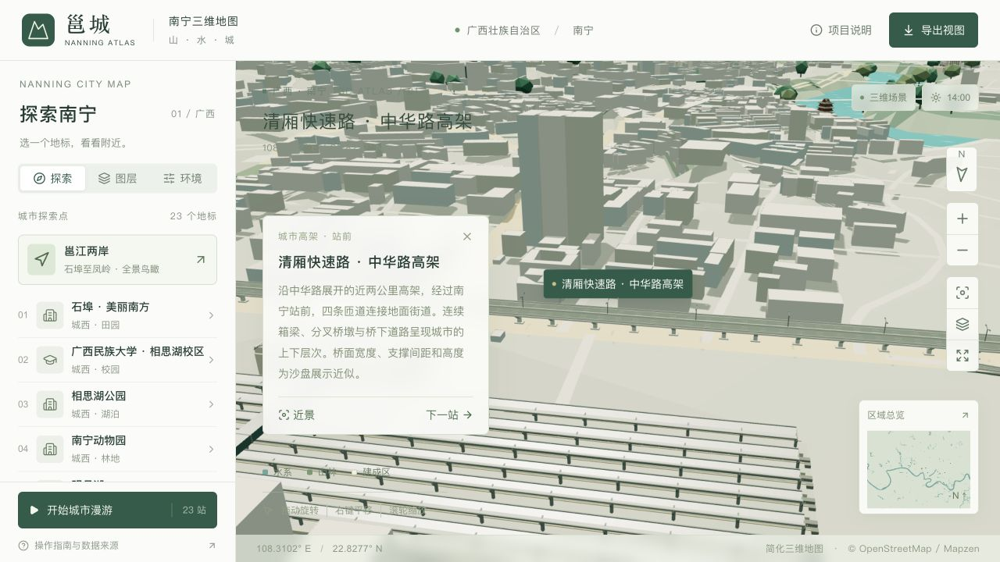

# 清厢快速路 · 中华路高架首段

首期沿中华路覆盖南宁站附近 **1,932.08 m 主线**，包括东西两侧四条上下桥匝道。探索菜单增加“清厢快速路 · 中华路高架”，可直接进入全段和近景；主桥、匝道、桥墩、路灯与标线统一归属“道路桥梁”图层。

## 数据和展示边界

- 主线依据 OSM [way 685249176](https://www.openstreetmap.org/way/685249176) 和 [way 808502317](https://www.openstreetmap.org/way/808502317)。首段东西边界为 108.302056° E 和 108.3184243° E；合并双向道路中心线，保留映射走向。
- 四条匝道依据 way `685249164`、`685249167`、`685249169`、`685249170`，通过原始节点 ID 确认与主线及地面道路的连接。匝道地面端保持原始坐标；分合流附近根据桥面横断面小幅调整中心线，避免道路加宽后桥面互相穿插。
- `data/viaduct-source.json` 保存 2026-09-08 城市快照中相关要素的原始标签、节点和坐标；`data/viaduct-plan.json` 保存投影后的线路、桥墩候选、道路替换片段及输入校验值。归属 © OpenStreetMap contributors / ODbL 1.0。
- [广西新闻网工程线路和航拍报道](https://v.gxnews.com.cn/a/17298053)说明中华路沿既有道路高架，并与南宁站铁路线并行，工程主线采用双向六车道。

OSM 未提供这一段的实测桥宽、桥面高程和桥墩坐标。约 29 m 主桥宽度、约 7.3 m 匝道宽度、34 m 基准墩距、箱梁及分叉墩截面均为沙盘近似，不能作为施工数据。桥面高程为两档显示地形留出净空，同时限制纵向坡度；未改动原始 DEM。主线两端与原有道路的高度连续，匝道落地点与地面道路共用高度采样。

## 结构和开销

连续箱梁包含顶面、斜腹板和底板；双向桥面有中央隔离带、护栏和车道标线。首段共生成 53 个桥墩，位置避让地图建筑、横穿街道和入口，桥下以小型抬高岛界定支撑位置。分合流处打开主线护栏，匝道脱离主桥后再下降。原有两条长主线仅替换首段内的薄路面，首段外道路完整保留。

主桥、四条匝道、护栏及支撑结构在精细和流畅版中相同。细部另行合并为一个对象；流畅版保留稀疏车道标线，精细版增加边线和路灯。无需新纹理、字体或运行时网络请求，也没有为每个桥墩、路灯创建单独的场景对象。

本次没有推广到清厢快速路全线。后续可复用数据准备、截面生成、净空与连接检查，逐段覆盖其他高架和立交；各节点仍须单独确认地图拓扑和上下层关系。

相对车站模型完成时，精细模型增加 **110,468 字节 / 18,482 个三角形**，流畅模型增加 **95,216 字节 / 15,130 个三角形**。高架主体为 14,744 面，两档一致；细部为 3,940 / 588 面。净增值包含替换掉的 202 面普通薄路面。两档仍满足既有 10 MB / 130 万面和 6.2 MB / 86.5 万面的预算。

## 重建和检查

```sh
python3 scripts/prepare_viaduct.py
python3 scripts/prepare_forest_canopy.py --stage all
python3 scripts/validate_viaduct.py
npm run models:build
python3 scripts/validate_assets.py
npm run typecheck
npm run lint
npm run build:pages
```

`prepare_viaduct.py --capture` 仅用于从本地 `work/geodata/osm.json` 重新提取原始要素；常规重建直接使用已保留的源文件。检查涵盖原始节点连接、匝道落点、纵坡、两档地形净空、桥墩避让、首段外道路保留，以及两档结构一致性和模型预算。

2026-09-10 已完成两档 Blender 导出、独立高架几何检查、完整资源校验、TypeScript 检查、lint、5 项点按手势测试和 Pages 静态构建。完整校验同时检查了既有建筑、水面及三个阶段的森林覆盖。

本地浏览器已核对精细和流畅模型的近景：关闭道路图层会一并隐藏主桥、桥墩及细部，关闭建筑图层仍保留高架。两次画质切换后未发现浏览器警告或错误。默认镜头从铁路一侧接近，减少站前高楼对高架的遮挡；以下为精细近景。流畅模式在桌面浏览器中核对，本次未测量真实手机帧率。

上线后在已有 Chrome 页面复现了缓存错配：新代码显示 23 个地标，但旧版 `landmarks.json` 仍只有 22 个，高架无法从列表进入。Pages 为这些固定地址设置了 600 秒缓存。现改为在构建时根据两档 GLB、地标和总览数据的内容计算共同版本号，附加到四类资源请求；内容不变时继续复用缓存。回归测试覆盖新旧版本地址隔离、Pages 子路径和 Draco 解码器目录。


