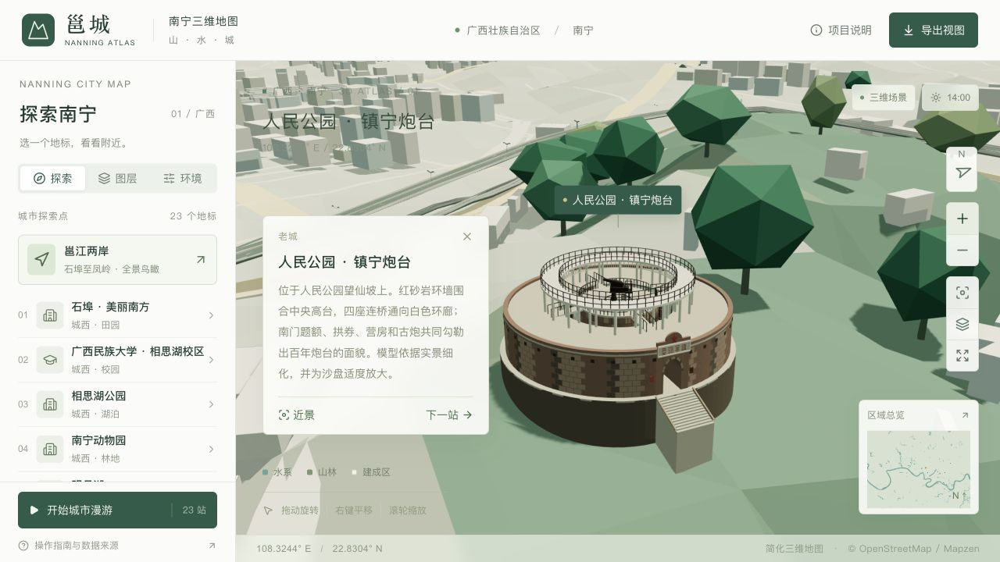

# 镇宁炮台精细模型

2026-09-10：替换人民公园镇宁炮台原有的圆环与方块炮管，保留既有 OSM 定位点，新增完整的建筑外观与庭院结构。

## 外观与来源

- 红砂岩环墙、错缝石块、枪眼、南北拱门及通道。
- 南门曲线门额、红星和按历史从右往左排列的“鎮寧砲臺”题额。文字使用自行绘制的几何笔画，不依赖字体或贴图。
- 中央圆台、四座连桥、二十间营房的拱形门面，以及向内退让的白色环廊、花格和栏杆。
- 古炮的外部炮管、锥形支座、铆接车架、后平台、扶栏、踏步和环形轨道；庭院补入铜钟及两块碑刻的轮廓。

位置继续使用 [OSM way 991635905](https://www.openstreetmap.org/way/991635905)。[南宁市融媒体中心 2026-05-14 报道](https://silkroadonthecloud.cn/f/view-A1002001002-2054792774516322304.html)提供环形城堡、南北两门、营房与古炮的文字及现状照片；[探秘桂北／木公 2018-08-14 图文](https://www.sohu.com/a/247174311_99985148)用于对照南门题额、后门台阶、环廊与炮位关系。访问日期为 2026-09-10。

模型由公开照片中的建筑特征自行绘制，未使用实景贴图、摄影测量或原建筑图纸。外廓、环廊宽度、柱距、材料颜色和构件比例均为展示近似；小型地标按 2.4 倍放大，建筑高度另沿用城市的 1.55 倍夸张。固定古炮仅表达文物外观。

## 地形与画质

生成入口为 `blender/zhenning_landmark.py`，由 `build_city.py` 接入城市。主体合并为一个具名网格，使用 10 种不透明材质；石缝、门额和铆钉以浅表面表达，栏杆省略被连接件遮挡的端面。两档模型保留相同的 19,294 个三角形。相较上一版，精细 GLB 净增 119,484 字节，流畅 GLB 净增 119,748 字节（约 1.9%）。

台基与台阶采样精细、流畅地形的上下边界，基脚延伸到可见地面以下。炮台附近只有 **2 个流畅地形单元**恢复精细采样，净增加 12 个地形三角形；补片边界中点与相邻粗网格保持共线，树木、林冠和基础共用相同的高度插值。原始 DEM 与全市地理数据不变。

地标清理范围从 1.8 × 1.8 缩到 1.2 × 1.5 场景单位，森林计划已重新生成，森林几何与覆盖面积一致。默认镜头从西南侧朝向南门，近景距离与标记高度随新模型缩小；高架仍沿用整体展示。

## 重建与检查

```bash
work/venv/bin/python scripts/prepare_forest_canopy.py --stage all
npm run models:build
blender --background blender/nanning-city.blend --python-exit-code 1 --python scripts/validate_zhenning.py
work/venv/bin/python scripts/validate_assets.py
npm run typecheck
npm run lint
node --test scripts/test-assets.mjs scripts/test-tap-gesture.mjs
npm run build:pages
```

专用检查通过射线验证两座门洞贯通、四座连桥存在、中央庭院没有被封顶；同时检查零面积面、替换范围、地形穿插和补片接缝。全局检查继续约束两档 GLB 的地标结构、地理覆盖与资源预算。

2026-09-10 上述重建、几何检查、全局资源校验、类型检查、lint、7 项交互与缓存测试，以及 Pages 静态构建均已通过。浏览器核对精细与流畅近景、地标文字及缩放，未记录警告或错误。没有进行手机真机帧率测试。

逐网格比较 Draco 数据：精细版仅 `Landmark_zhenning` 改变；流畅版另外改变炮台所在的一个地形批次及相邻树木批次，其余地标、路网和森林网格一致。


